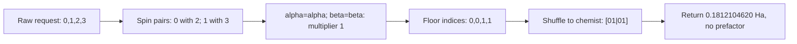

# Chapter 3: From Spatial to Spin-Orbital Integrals

_Every electron has a spin. Every integral must account for it. This chapter doubles the index space and fills in the complete integral tables that drive the encoding pipeline._

## In This Chapter

- **What you'll learn:** How to expand spatial-orbital integrals into spin-orbital one-body and two-body terms, including cross-spin interactions that many implementations forget.
- **Why this matters:** The encoding step operates on spin-orbital creation and annihilation operators. Missing a spin block changes both repulsion energies and configuration couplings; an otherwise correct encoder cannot repair that input.
- **Prerequisites:** Chapters 1–2 (you know the spatial integrals and the notation conventions).

---

## Why We Need Spin-Orbitals

In Chapter 1, we worked with **spatial orbitals** — the molecular orbitals $\sigma_g$ and $\sigma_u$, described by their spatial wavefunctions. There were two of them, and the integrals were $2 \times 2$ matrices and $2 \times 2 \times 2 \times 2$ tensors.

But an electron is not just a spatial wavefunction. It also has **spin**.

### What spin is (and isn't)

Electron spin is intrinsic angular momentum, not the rotation of a small
charged sphere. Its spin quantum number is $s=1/2$; its angular-momentum
magnitude is $\hbar\sqrt{s(s+1)}$. A measurement of the projection along
a chosen axis has two possible outcomes.

For a spin-$1/2$ particle, the projection along the $z$-axis can take only two values:
- $m_s = +1/2$, which we call $\alpha$ or "spin-up" ($\uparrow$)
- $m_s = -1/2$, which we call $\beta$ or "spin-down" ($\downarrow$)

The two possible projections follow from spin-$1/2$ angular momentum.
The chosen axis and the names $\alpha,\beta$ are conventions. These two
orthonormal vectors span the spin state space; an arbitrary spin state can
also be their superposition. It has the same dimension as a qubit, though
the qubits in our encoding store molecular occupation information, not
individual electron spins.

### Why spin doubles the orbital space

The **Pauli exclusion principle** says that no two electrons can occupy exactly the same quantum state. A quantum state is specified by *both* the spatial orbital *and* the spin. So the spatial orbital $\sigma_g$ can hold:
- one electron with spin $\alpha$ (the spin-orbital $\sigma_g, \alpha$)
- one electron with spin $\beta$ (the spin-orbital $\sigma_g, \beta$)
- but NOT two electrons with the same spin

Each spatial orbital produces **two** spin-orbitals. Two spatial orbitals
give four spin-orbitals. Seven spatial orbitals give fourteen. Doubling
each index makes a one-body array four times larger and a four-index
two-body array **sixteen** times larger. Only four of its sixteen spin
blocks can survive the spin selection rules. Storage slots and allowed
entries are different counts.

### Spin-orbit coupling: when spin and space talk to each other

The non-relativistic Coulomb Hamiltonian we use has no explicit spin
operator. The one-body expectation in $\sigma_g\alpha$ therefore equals
that in $\sigma_g\beta$. Antisymmetry still links spatial and spin
structure in the *many-electron state*: singlet and triplet electronic
states need not have the same energy. Spin independence of the operator
does not erase exchange.

This is an approximation. In reality, **spin-orbit coupling** — the interaction between an electron's spin angular momentum and its orbital angular momentum — mixes the spin and spatial degrees of freedom. Hydrogenic estimates often scale roughly as $Z^4$, but molecular trends also depend on electronic structure and bonding. The effect is negligible for H₂ and small for the light-element examples in this book, but it can be significant for heavy atoms such as iodine, lead, and the actinides.

For the molecules in this book (H₂, H₂O), spin-orbit coupling is negligible and we work with the non-relativistic Hamiltonian throughout. This means:
- One-body integrals are diagonal in spin: $\langle \alpha \mid \beta \rangle = 0$
- Two-body integrals conserve each electron's spin independently
- The Hamiltonian commutes with total spin squared and spin projection,
  so eigenstates can be chosen with definite $S$ and $M_S$

When spin-orbit coupling matters (heavy-element chemistry, relativistic quantum chemistry), the spin-orbital structure becomes more complex — spin is no longer a good quantum number, and the integral expansion rules in this chapter must be modified. We won't need that here, but it's worth knowing the boundary of our approximation.

### The upshot for encoding

The second-quantized Hamiltonian

$$\hat{H} = \sum_{pq} h_{pq}\, a_p^\dagger a_q + \frac{1}{2}\sum_{pqrs} \langle pq \mid rs\rangle\, a_p^\dagger a_q^\dagger a_s a_r$$

sums over **spin-orbital** indices $p, q, r, s$. The creation operator $a_p^\dagger$ creates an electron in spin-orbital $p$ — a specific spatial orbital *with a specific spin*. This means we need integral tables indexed by spin-orbitals, not spatial orbitals.

For H₂: 2 spatial orbitals → **4 spin-orbitals**. The one-body integral matrix goes from $2 \times 2$ to $4 \times 4$. The two-body integral tensor goes from $2^4 = 16$ elements to $4^4 = 256$ elements (most of which are zero).

---

## Spin-Orbital Indexing

Each spatial orbital $\mu$ gives rise to two spin-orbitals. We use **interleaved** indexing — alternating $\alpha$ and $\beta$ for each spatial orbital:

| Spin-orbital index $p$ | Spatial orbital | Spin | Notation |
|:---:|:---:|:---:|:---:|
| 0 | $\sigma_g$ (orbital 0) | $\alpha$ | $0\alpha$ |
| 1 | $\sigma_g$ (orbital 0) | $\beta$ | $0\beta$ |
| 2 | $\sigma_u$ (orbital 1) | $\alpha$ | $1\alpha$ |
| 3 | $\sigma_u$ (orbital 1) | $\beta$ | $1\beta$ |

The conversion between spin-orbital index $p$ and spatial orbital/spin:

$$\text{spatial orbital} = \lfloor p/2 \rfloor \qquad \text{spin} = p \bmod 2 \quad (0 = \alpha,\; 1 = \beta)$$

The floor brackets mean integer division rounded down. For $p=3$,
$\lfloor3/2\rfloor=1$ and $3\bmod2=1$, giving spatial orbital 1 with
$\beta$ spin. The value $3/2=1.5$ is not a possible array index. In the
opposite direction, spatial orbital $\mu$ and spin bit $\sigma$ give
$p=2\mu+\sigma$.

> **Convention alert:** Some references use **blocked** indexing ($\alpha$ orbitals first, then all $\beta$), so the ordering would be $0\alpha, 1\alpha, 0\beta, 1\beta$. This book's PySCF-to-FockMap conversion imposes interleaved indexing; PySCF itself does not define one universal spin-orbital ordering for every interface. If your integral source uses a different order, permute the indices before proceeding. This is another silent-error source.

---

## One-Body Expansion

Write the spin-orbital as an actual product function:

$$\psi_p(\mathbf r,s)
=\phi_{\mu_p}(\mathbf r)\omega_{\sigma_p}(s),\qquad
\mu_p=\lfloor p/2\rfloor,\quad \sigma_p=p\bmod2.$$

Integration over the full electron coordinate $x=(\mathbf r,s)$ means
integration over space and summation over the two spin-coordinate values.
With $\omega_0=\alpha$ and $\omega_1=\beta$, orthonormality reads

$$\sum_s\omega_\sigma^*(s)\omega_\tau(s)=\delta_{\sigma\tau},
\qquad
\delta_{\sigma\tau}=
\begin{cases}1&\sigma=\tau,\\0&\sigma\ne\tau.\end{cases}$$

Because $\hat h$ acts on space and leaves spin alone, its matrix element
factorises:

$$
\begin{aligned}
h^{\mathrm{spin}}_{pq}
&=\sum_s\int\phi_{\mu_p}^*(\mathbf r)\omega_{\sigma_p}^*(s)
       \hat h\,\phi_{\mu_q}(\mathbf r)\omega_{\sigma_q}(s)\,d^3\mathbf r\\
&=\underbrace{\int\phi_{\mu_p}^*\hat h\phi_{\mu_q}\,d^3\mathbf r}
      _{h^{\mathrm{spatial}}_{\mu_p\mu_q}}
  \underbrace{\sum_s\omega_{\sigma_p}^*(s)\omega_{\sigma_q}(s)}
      _{\delta_{\sigma_p\sigma_q}}.
\end{aligned}
$$

The spin-orbital one-body integral is straightforward: the spatial integral survives only when the spins match.

$$h^{\text{spin}}_{pq} = h^{\text{spatial}}_{\lfloor p/2 \rfloor,\, \lfloor q/2 \rfloor} \times \delta(\sigma_p, \sigma_q)$$

In words: the one-body integral between spin-orbitals $p$ and $q$ equals the spatial integral between their parent spatial orbitals, *provided they have the same spin*. If the spins differ, the integral is zero.

Why? The one-body Hamiltonian (kinetic energy + electron-nucleus attraction) does not act on spin. The spin part of the wavefunction integrates to $\langle \alpha \mid \alpha \rangle = 1$ or $\langle \beta \mid \beta \rangle = 1$ for same spins, and $\langle \alpha \mid \beta \rangle = 0$ for opposite spins.

### H₂ one-body integrals (spin-orbital basis)

| $p$ | $q$ | $h^{\text{spin}}_{pq}$ (Ha) | How we got it |
|:---:|:---:|:---:|:---|
| 0 ($\sigma_g, \alpha$) | 0 ($\sigma_g, \alpha$) | $-1.2533$ | $h^{\text{spatial}}_{00}$, same spin ✓ |
| 1 ($\sigma_g, \beta$)  | 1 ($\sigma_g, \beta$)  | $-1.2533$ | $h^{\text{spatial}}_{00}$, same spin ✓ |
| 2 ($\sigma_u, \alpha$) | 2 ($\sigma_u, \alpha$) | $-0.4751$ | $h^{\text{spatial}}_{11}$, same spin ✓ |
| 3 ($\sigma_u, \beta$)  | 3 ($\sigma_u, \beta$)  | $-0.4751$ | $h^{\text{spatial}}_{11}$, same spin ✓ |

All off-diagonal entries ($p \neq q$) are zero — either because the spatial integral is zero ($h^{\text{spatial}}_{01} = 0$ by symmetry) or because the spins don't match.

This is the simple case. The two-body expansion is where the subtlety lives.

---

## Two-Body Expansion

The spin-orbital two-body integral in physicist's notation is:

$$\langle pq \mid rs\rangle_{\text{spin}}
=\left[\lfloor p/2\rfloor\,\lfloor r/2\rfloor
\,\big|\,\lfloor q/2\rfloor\,\lfloor s/2\rfloor\right]_{\text{spatial}}
\delta_{\sigma_p\sigma_r}\delta_{\sigma_q\sigma_s}.$$

where we've used the conversion $\langle pq \mid rs\rangle = [pr \mid qs]$ from Chapter 2 to express the result in terms of chemist's spatial integrals.

The derivation is the same separation as for one-body integrals, twice:
the spin-coordinate sum at electron coordinate 1 is
$\sum_{s_1}\omega_{\sigma_p}^*(s_1)\omega_{\sigma_r}(s_1)$;
the sum at coordinate 2 is
$\sum_{s_2}\omega_{\sigma_q}^*(s_2)\omega_{\sigma_s}(s_2)$.
The Coulomb kernel $1/r_{12}$ depends on neither spin coordinate.
It therefore stays inside the spatial integral while the two spin
overlaps become the two deltas.

The key insight: **each electron independently conserves its spin**. Electron 1 (described by indices $p$ and $r$) must have the same spin in both orbitals. Electron 2 (indices $q$ and $s$) must also conserve its spin. But the two electrons **need not have the same spin as each other**.

This means there are **four spin-allowed blocks**. Spatial symmetry or
other selection rules may still make entries within them zero:

| Block | Electron 1 | Electron 2 | Contributes? |
|:---:|:---:|:---:|:---:|
| $\alpha\alpha - \alpha\alpha$ | $\sigma_p = \sigma_r = \alpha$ | $\sigma_q = \sigma_s = \alpha$ | ✓ |
| $\beta\beta - \beta\beta$ | $\sigma_p = \sigma_r = \beta$ | $\sigma_q = \sigma_s = \beta$ | ✓ |
| $\alpha\beta - \alpha\beta$ | $\sigma_p = \sigma_r = \alpha$ | $\sigma_q = \sigma_s = \beta$ | ✓ |
| $\beta\alpha - \beta\alpha$ | $\sigma_p = \sigma_r = \beta$ | $\sigma_q = \sigma_s = \alpha$ | ✓ |

All four blocks contribute. The cross-spin blocks ($\alpha\beta$ and $\beta\alpha$) are the ones that beginners most commonly forget.

> **Common Mistake #1: Omitting cross-spin integrals.** This was our
> first-implementation bug, and it changes the Hamiltonian, not just the
> quality of its solution. In this particular H₂ basis it removes the
> opposite-spin configuration couplings *and* the bonding pair's Coulomb
> repulsion. In larger systems same-spin terms can still be off-diagonal.
> Neither "missing cross-spin" nor "diagonal in an occupation basis" is a
> general synonym for Hartree–Fock.

### Worked example: a cross-spin integral

Consider $\langle 0\alpha,\, 1\beta \mid 0\alpha,\, 1\beta \rangle$. In our index scheme: $p = 0, q = 3, r = 0, s = 3$.

Check spin conservation:
- Electron 1: $\sigma_p = \alpha$, $\sigma_r = \alpha$ → same spin ✓
- Electron 2: $\sigma_q = \beta$, $\sigma_s = \beta$ → same spin ✓

Spatial indices: $\lfloor p/2 \rfloor = 0$, $\lfloor q/2 \rfloor = 1$, $\lfloor r/2 \rfloor = 0$, $\lfloor s/2 \rfloor = 1$.

Convert to chemist's spatial: $[\lfloor p/2 \rfloor \lfloor r/2 \rfloor \mid \lfloor q/2 \rfloor \lfloor s/2 \rfloor] = [00 \mid 11] = 0.6637114014$ Ha.

This integral represents the Coulomb repulsion between a spin-$\alpha$ electron in $\sigma_g$ and a spin-$\beta$ electron in $\sigma_u$. It has nothing to do with spin flips — both electrons keep their original spins — but it is a *cross-spin interaction* because the two electrons have different spins.

### A coupling entry and a forbidden neighbour

Now request $\langle01|23\rangle_{\mathrm{spin}}$. At coordinate 1,
indices 0 and 2 are both $\alpha$; at coordinate 2, indices 1 and 3
are both $\beta$. The spatial lookup is $[01|01]$, so the value is
$0.1812104620$ Ha. Its operator removes modes 2 and 3 and creates modes
0 and 1: a pair moves from the antibonding MO to the bonding MO.

Swap only its two ket indices and request
$\langle01|32\rangle_{\mathrm{spin}}$. Both deltas now vanish:
mode 0 is $\alpha$ but mode 3 is $\beta$, and mode 1 is $\beta$ but
mode 2 is $\alpha$. The *spatial* lookup still has a nonzero value;
the **spin-orbital** integral is zero. Expanding a spatial tensor is not
copying every value into every spin slot.



*Figure 3.1. One spin-orbital lookup, before encoding. Changing the request
to $(0,1,3,2)$ fails the spin test even though floor division reaches the
same spatial orbitals. The half belongs to Hamiltonian assembly, not this
lookup.*

### The smallest missing-block test is an expectation value

For the RHF configuration $|1100\rangle$, the one-body energy is
$2h_{00}^{\mathrm{spatial}}$. Its occupied $\alpha\beta$ pair has
direct repulsion $[00|00]$; exchange between the opposite spin functions
vanishes. Therefore

$$
\begin{aligned}
\langle1100|H_{\mathrm{el}}|1100\rangle
&=2(-1.2533097866)+0.6747559268\\
&\approx-1.8318636465\ \text{Ha}.
\end{aligned}
$$

Deleting all cross-spin entries instead gives
$2h_{00}^{\mathrm{spatial}}\approx-2.5066195733$ Ha on this *same*
determinant. The energy is spuriously lower because the electrons have
stopped repelling one another in that configuration. It is not an
improvement over HF. This test requires no Pauli algebra and no
diagonalisation: it catches a lost interaction at its source.

---

## Counting What Is Actually in the Tensor

Let $m$ be the number of spatial orbitals. There are $2m$ spin-orbitals.
Distinguish four quantities:

| Quantity | One-body array | Two-body array |
|:---|:---:|:---:|
| Dense spatial slots | $m^2$ | $m^4$ |
| Dense spin-orbital slots | $4m^2$ | $16m^4$ |
| Spin-allowed slots | $2m^2$ | $4m^4$ |
| Actually nonzero entries | Depends on spatial data | Depends on spatial data |

For a fixed spatial quartet, there are $2^4=16$ assignments of four
spin bits. The two independent equality constraints leave $2^2=4$
assignments. That is why the dense tensor grows sixteenfold but the
spin-allowed part grows fourfold.

With seven spatial orbitals, water has 196 dense one-body slots but at
most **98 spin-allowed entries**; it has 38,416 dense two-body slots but
at most **9,604 spin-allowed entries**. These are upper bounds before
spatial symmetry and numerical zeros, not measured nonzero counts for a
water geometry. A minimal basis does not force every allowed entry to
be nonzero.

For our H₂ table, two spatial one-body entries and eight spatial
two-body entries are nonzero. The eight two-body entries come from
$1+1+2+4$ positions in the table below. Each expands into four spin
assignments, giving **32 raw two-body entries**, of which 16 are
cross-spin. There are only four distinct nonzero spatial two-body
*values*. Counting values, positions, and spin blocks gives different
answers because they are different questions.

Finally, a nonzero integral need not yield a nonzero operator monomial.
For example, $\langle00|00\rangle_{\mathrm{spin}}$ with all four
indices referring to the *same spin-orbital* can be nonzero as an
integral, but its factor $(a_0^\dagger)^2a_0^2$ vanishes by exclusion.
Keeping such raw entries is consistent with the integral contract;
the operator algebra removes them. Do not pre-emptively replace the
raw tensor by antisymmetrised or collected coefficients and feed it to
a builder that expects raw entries.

---

## The Complete Integral Tables

For reference, here are all the inputs to the encoding pipeline.

### Molecular Parameters

| Parameter | Value |
|:---|:---|
| Bond length $R$ | 0.74 Å = 1.398 Bohr (near equilibrium) |
| Nuclear repulsion $V_{nn}$ | 0.7151043391 Ha (= $1/R$ in atomic units) |
| Spatial orbitals | 2 ($\sigma_g$, $\sigma_u$) |
| Spin-orbitals | 4 |
| Electrons | 2 |
| Two-electron configurations | $\binom{4}{2} = 6$ |

The numerical values below are repository-generated PySCF data, not constants
quoted from a paper. The artifact records the PySCF version, geometry, RHF
orbital basis, tensor convention, and checksum (Sun et al., 2020).
RHF defines the orbitals used for the integrals; it does not require us
to solve the eventual Hamiltonian only at the RHF level.

### Spatial One-Body Integrals $h_{pq}$ (Ha)

|  | $q = 0$ ($\sigma_g$) | $q = 1$ ($\sigma_u$) |
|:---:|:---:|:---:|
| $p = 0$ | $-1.2533097866$ | $0$ |
| $p = 1$ | $0$ | $-0.4750688488$ |

### Spatial Two-Body Integrals $[pq \mid rs]$ (Ha)

| Chemist's integral | Value | Physicist's equivalent |
|:---:|:---:|:---:|
| $[00 \mid 00]$ | $0.6747559268$ | $\langle 00 \mid 00\rangle$ |
| $[11 \mid 11]$ | $0.6976515045$ | $\langle 11 \mid 11\rangle$ |
| $[00 \mid 11] = [11 \mid 00]$ | $0.6637114014$ | $\langle 01 \mid 01\rangle = \langle 10 \mid 10\rangle$ |
| $[01 \mid 01] = [01 \mid 10] = [10 \mid 01] = [10 \mid 10]$ | $0.1812104620$ | $\langle 00 \mid 11\rangle = \langle 01 \mid 10\rangle = \langle 10 \mid 01\rangle = \langle 11 \mid 00\rangle$ |

All other spatial two-body integrals are zero.

> **Note:** We show both conventions side by side so you can verify the conversion $\langle pq \mid rs\rangle = [pr \mid qs]$ from Chapter 2 on every line. If any entry surprises you, stop and work through the index shuffle until it doesn't.

---

## From Tables to Code

The executable companion loads the canonical `0.74` record from the generated
JSON rather than maintaining another literal tensor. Run
`dotnet fsi code/ch03-spin-orbitals.fsx` from the repository root to
load and inspect the complete raw table. The following **contextual excerpt**
shows how later chapters reuse its exported values:

```fsharp
#load "code/ch03-spin-orbitals.fsx"

let h2RawPhysicistIntegrals =
    ``Ch03-spin-orbitals``.h2RawPhysicistIntegrals
let h2RawPhysicistFactory =
    ``Ch03-spin-orbitals``.h2RawPhysicistFactory
```

The displayed tables are rounded views of that machine-readable record.
The repository's data checks compare the raw MO tensors and independently
derive the direct/JW matrix. The canonical 4+32 tensor is
byte-identical to the audited `encodings-research` artifact pinned by commit,
git blob, and SHA-256. FockMap's primary Hamiltonian builders consume raw
`(p,q,r,s) -> <pq|rs>` entries directly and internally assemble
`0.5 * <pq|rs> a^p a^q a_s a_r`.

---

## A Preview of What's Coming

Chapter 6 will pass this raw factory to a Hamiltonian builder and obtain
a `PauliRegisterSequence` — a symbolic sum of qubit operators with complex
coefficients. "Pauli string" is the name of each product operator;
Chapter 4 defines its factors and action before we calculate with them.
The canonical JW result has 15 nonzero terms, including the identity.
Other tutorials may use different geometries, bases, orderings or
reductions; we will derive this particular table rather than importing
one that merely looks familiar.

Before we can encode, we need to understand the target. Chapter 4 introduces the quantum computer's native operations — the language into which we'll translate everything. Without it, phrases like "Pauli weight" and "CNOT cost" are empty.

---

## Key Takeaways

- Each spatial orbital produces two spin-orbitals ($\alpha$ and $\beta$). The spin-orbital index space is twice the spatial index space.
- One-body integrals require same-spin: $h^{\text{spin}}_{pq} = h^{\text{spatial}}_{\lfloor p/2 \rfloor, \lfloor q/2 \rfloor} \times \delta(\sigma_p, \sigma_q)$.
- Two-body integrals require each electron to independently conserve spin: $\delta(\sigma_p, \sigma_r) \times \delta(\sigma_q, \sigma_s)$. This admits **four** spin blocks, including the cross-spin blocks $\alpha\beta$ and $\beta\alpha$.
- Omitting cross-spin integrals removes real interactions. In this H₂ example the HF determinant itself then has the wrong repulsion energy; this is not a Hartree–Fock approximation.
- FockMap expects spin-orbital integrals in physicist's convention with interleaved indexing.

## Common Mistakes

1. **Omitting cross-spin blocks.** The $\alpha\beta$ and $\beta\alpha$ blocks contribute the expected configuration-coupling Pauli terms. Omitting them produces the wrong fermionic matrix and fails the independent FCI reference. If those terms are absent, check the cross-spin expansion first.

2. **Wrong spin-orbital ordering.** Interleaved ($0\alpha, 0\beta, 1\alpha, 1\beta$) vs blocked ($0\alpha, 1\alpha, 0\beta, 1\beta$) indexing produces different integral tables. The eigenvalues are independent of indexing, but the Pauli string structure changes. Always check your convention.

3. **Spatial-to-physicist conversion errors.** This chapter combines two index transformations: spatial→spin-orbital *and* chemist→physicist. It's easy to get one right and the other wrong. Use the dual-convention table above as a cross-check.

## Exercises

1. **Cross-spin counting.** How many non-zero spin-orbital two-body integrals does H₂/STO-3G have in total? How many of those are cross-spin? (Answer: 32 total, 16 cross-spin — exactly half.)

2. **Missing block detection.** Evaluate the canonical HF determinant with and without its opposite-spin Coulomb repulsion. Add $V_{nn}$ in both cases. Explain why the lower result from the damaged tensor is not a better variational solution of the original Hamiltonian.

3. **Blocked indexing.** Rewrite the one-body spin-orbital table using blocked indexing ($0\alpha, 1\alpha, 0\beta, 1\beta$ → indices 0, 1, 2, 3). Which entries of the matrix change? Do the eigenvalues change?

4. **H₂O scale-up.** The all-electron water model has 7 spatial orbitals and 14 spin-orbitals. Compute dense slots and spin-allowed slots separately for both tensors. Can either count alone tell you how many entries are actually nonzero?

5. **Allowed is not nonzero.** Evaluate the spin deltas and spatial keys for $\langle01|23\rangle$, $\langle01|32\rangle$ and $\langle00|00\rangle$, with all indices now spin-orbital indices. Which corresponding operator monomial vanishes even though its raw integral is nonzero?

6. **Spin projection is not total spin.** List the four H₂ determinants with $M_S=0$ from Chapter 1. Explain why keeping equal numbers of $\alpha$ and $\beta$ electrons alone does not select only singlets.

## Further Reading

- Szabo, A. and Ostlund, N. S. *Modern Quantum Chemistry.* §2.3 covers the spin-orbital expansion in detail.
- Crawford, T. D. and Schaefer, H. F. "An Introduction to Coupled Cluster Theory for Computational Chemists." *Reviews in Computational Chemistry*, Vol. 14, 2000. Appendix A gives explicit spin-orbital integral formulae.

---

**Previous:** [Chapter 2 — The Notation Minefield](02-notation.html)

**Next:** [Chapter 4 — The Quantum Computer's Vocabulary](04-qubits-gates-circuits.html)
