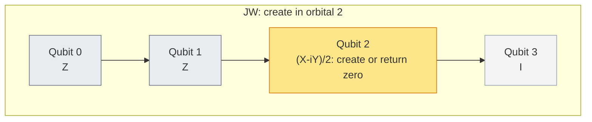
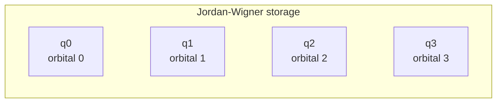
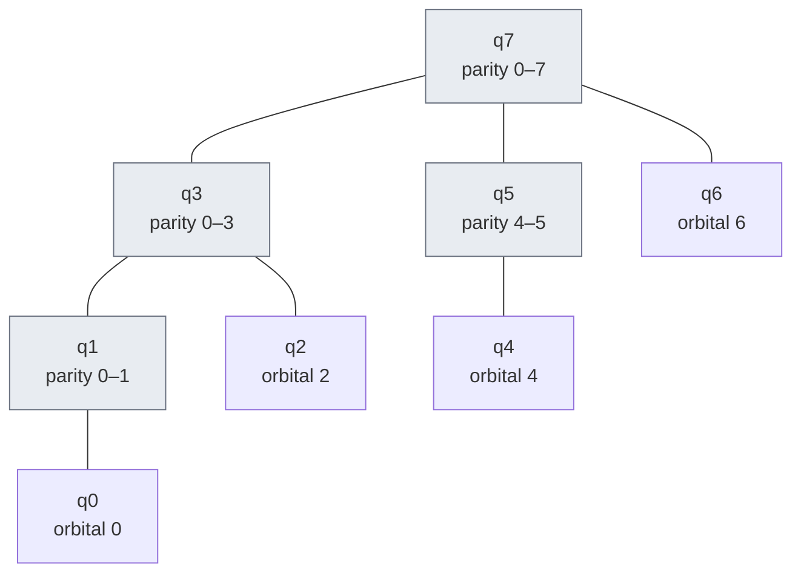
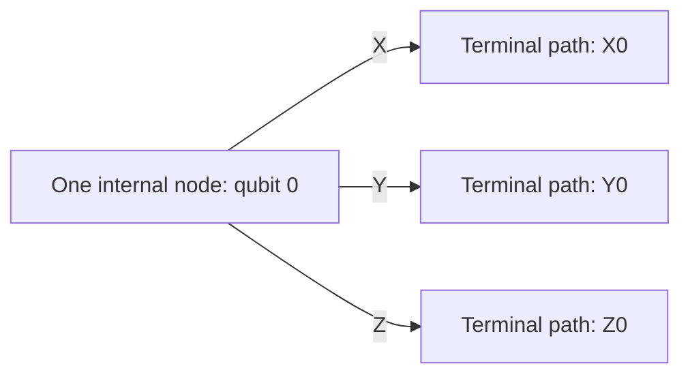
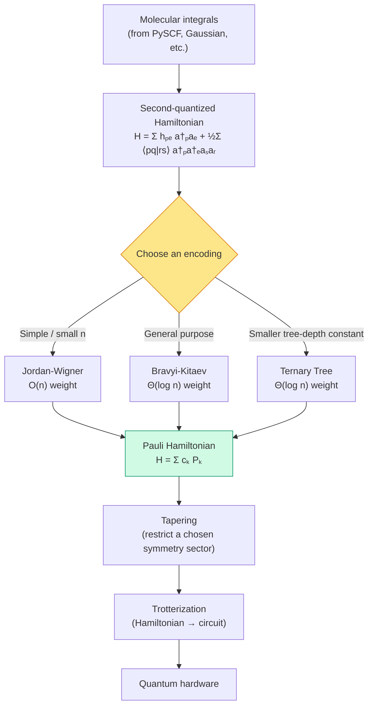

# Chapter 5: A Visual Guide to Encodings

_We have a Hamiltonian written in terms of electrons and orbitals. A quantum computer only has qubits. This chapter explains why the translation is not as obvious as it looks, and introduces three ways to do it._

## In This Chapter

- **What you'll learn:** Why the direct occupation-state map needs signed operators; how to derive the full Jordan–Wigner map; and how Fenwick storage changes parity queries, updates and occupation recovery.
- **Why this matters:** An encoding must preserve fermionic algebra before its weights or circuit costs are worth comparing. Operator weight influences a named compilation model, not feasibility by itself.
- **Prerequisites:** Chapters 1–4, including the operator inset in Chapter 2 and Pauli multiplication, tensor action and label conventions in Chapter 4.

---

## Where We Stand

> **Ordering convention:** In `PauliRegister.Signature`, character position
> $i$ is qubit $i$, so qubit 0 is leftmost: `ABCD` means
> $A_0B_1C_2D_3$. For example,
> $a_2^\dagger=\tfrac12\,\mathrm{ZZXI}-\tfrac{i}{2}\,\mathrm{ZZYI}$.
> Separately, this book displays occupation labels as
> $\lvert n_0n_1n_2n_3\rangle$, also with index 0 leftmost. An occupation
> integer is different: mode $j$ has place value $2^j$. Thus the H₂ HF occupation is
> displayed as $\lvert1100\rangle$ but has integer value
> $2^0+2^1=3$, conventionally printed `0b0011`. To make dense matrix rows use
> that same occupation integer, reverse a displayed signature when forming the
> Kronecker product: $P_{n-1}\otimes\cdots\otimes P_0$. The displayed HF ket
> is therefore matrix row 3. Qiskit-style Pauli labels likewise put
> qubit 0 at the rightmost character; reverse FockMap signatures explicitly at
> that boundary. Always name the index and place-value rule explicitly.

Let's take stock of what the first three chapters gave us.

**Chapter 1** told us the chemistry: a molecule is a collection of charged particles, and its ground-state energy is the lowest eigenvalue of the electronic Hamiltonian. We introduced a finite basis set (STO-3G) that turned the continuous problem into a finite one: 2 spatial orbitals, 4 spin-orbitals, 6 two-electron configurations.

**Chapters 2–3** told us the numbers: one-body integrals $h_{pq}$, two-body integrals $\langle pq \mid rs\rangle$, and the nuclear repulsion constant $V_{nn}$. We navigated the notation minefield, expanded to spin-orbitals, and ended up with a complete set of tables.

But we glossed over something important. Let's go back and address it now.

### The problem with wavefunctions

The *natural* way to describe the quantum state of two electrons in four spin-orbitals is as a superposition of configurations:

$$\lvert \Psi \rangle = c_{1100}\lvert 1100\rangle + c_{1010}\lvert 1010\rangle + c_{1001}\lvert 1001\rangle + \cdots$$

where each $\lvert n_0 n_1 n_2 n_3\rangle$ is an **occupation vector** — a list of 0s and 1s telling us which spin-orbitals have an electron and which don't. The $c$ coefficients are complex amplitudes. Finding the ground state means finding the normalised $c$ values that minimise the energy.

For H₂ with 4 spin-orbitals, this is a vector with 6 components (the 6 two-electron configurations from Chapter 1). We could write down the $6 \times 6$ Hamiltonian matrix, plug in our integrals, and diagonalise it. Done. No quantum computer needed.

For H₂O with 14 spin-orbitals and 10 electrons, the number of configurations is $\binom{14}{10} = 1{,}001$. A $1{,}001 \times 1{,}001$ matrix is trivial for a laptop.

For a model with 50 electrons in 100 spin-orbitals,
$\binom{100}{50}\approx10^{29}$ configurations. Explicit storage of a
generic vector of that size is impractical, let alone its dense matrix.

This is the **exponential wall**: at a fixed filling fraction, the
configuration-space dimension grows exponentially with orbital count.
Classical methods exploit restricted state descriptions, sparse
structure or other approximations. Their usefulness depends on the
problem; a large configuration count alone does not establish a
quantum advantage.

### Why operators instead of wavefunctions

Rather than tracking the full wavefunction vector (exponentially many coefficients), **second quantization** lets us write the Hamiltonian as a polynomial in creation and annihilation operators:

$$\hat{H} = \sum_{pq} h_{pq}\, a_p^\dagger a_q + \frac{1}{2}\sum_{pqrs} \langle pq \mid rs\rangle\, a_p^\dagger a_q^\dagger a_s a_r$$

The operators $a_p^\dagger$ (create an electron in spin-orbital $p$) and $a_p$ (remove one) obey the **canonical anti-commutation relations**:

$$\{a_p^\dagger, a_q\} = \delta_{pq}, \qquad \{a_p^\dagger, a_q^\dagger\} = 0, \qquad \{a_p, a_q\} = 0$$

These three rules encode the Pauli exclusion principle algebraically: you can't create two electrons in the same orbital ($a_p^\dagger a_p^\dagger = 0$), and swapping the order of two creation operators flips a sign ($a_p^\dagger a_q^\dagger = -a_q^\dagger a_p^\dagger$).

The beauty of this formulation is that the Hamiltonian is written as a sum of $O(n^4)$ terms — polynomial in the number of orbitals, not exponential. A classical computer can *write down* the Hamiltonian easily. The hard part is *solving* it — finding the eigenvalues of the operator that this polynomial represents.

### Why quantum computing

A quantum computer can represent occupation superpositions using $n$
qubits for $n$ spin-orbitals. Its $2^n$-dimensional Hilbert space
matches the space of **all** occupations and contains the
$\binom{n}{N_e}$-dimensional sector with $N_e$ electrons.
Representing that sector does not by itself prepare its ground state
or make its energy easy to estimate.

But there's a catch: local qubit operators on **different qubits**
commute, while fermionic ladders on different modes anticommute.
Paulis on the same qubit can anticommute perfectly well; the task is
to arrange their tensor products so that all the required *different-mode*
relations hold. We need a translation that preserves the operator algebra.

That's what this chapter is about.

---

## From the Vacuum to the Signed Ladder Rules

For $n$ modes, **Fock space** contains all occupations, from no
electrons to all $n$ occupied. It is the direct sum of the fixed-particle
sectors, with dimensions $\binom n0,\binom n1,\ldots,\binom nn$.
Their sum is $2^n$. The Hamiltonian here conserves particle number,
but a single creation or annihilation operator moves between sectors.
We need the full space to describe those ladders.

The vacuum is $|\Omega\rangle=|00\cdots0\rangle$, a normalised state
annihilated by every $a_j$. Choose the occupation-state phase convention

$$|n_0\cdots n_{n-1}\rangle
=(a_0^\dagger)^{n_0}(a_1^\dagger)^{n_1}
\cdots(a_{n-1}^\dagger)^{n_{n-1}}|\Omega\rangle.$$

The creation factors are written in increasing mode order.
They still act rightmost first. This definition fixes the signs of
different determinants; changing it would require changing matrix
elements consistently.

To apply $a_j^\dagger$, insert it on the left of that product and
move it rightwards to its ordered position. It passes one creation
operator for every occupied mode below $j$, picking up one minus sign
each time. If mode $j$ is already occupied, it meets another
$a_j^\dagger$ and the result is zero. Define

$$S_j(n)=\sum_{k=0}^{j-1}n_k.$$

Then the complete actions are

$$
\begin{aligned}
a_j^\dagger|n\rangle
&=(1-n_j)(-1)^{S_j(n)}
|n_0\cdots 1_j\cdots n_{n-1}\rangle,\\
a_j|n\rangle
&=n_j(-1)^{S_j(n)}
|n_0\cdots 0_j\cdots n_{n-1}\rangle.
\end{aligned}
$$

For annihilation, pass $a_j$ across the occupied lower modes and use
$a_j a_j^\dagger=I-a_j^\dagger a_j$ at its own position.
The term that would annihilate an empty mode vanishes.
The occupation factors $n_j$ and $1-n_j$ are as important as the
sign. A ladder is not an unconditional bit flip.

| Input and operation | Occupied modes below target | Output |
|:---|:---:|:---|
| $a_3^\dagger\lvert1010\rangle$ | 2 | $+\lvert1011\rangle$ |
| $a_1^\dagger\lvert1010\rangle$ | 1 | $-\lvert1110\rangle$ |
| $a_2\lvert1010\rangle$ | 1 | $-\lvert1000\rangle$ |
| $a_0^\dagger\lvert1010\rangle$ | 0, but target occupied | Zero vector |
| $a_1\lvert1010\rangle$ | 1, but target empty | Zero vector |

For a product, recompute the parity after each operation. For example,

$$a_1^\dagger a_2|1010\rangle
=-a_1^\dagger|1000\rangle=+|1100\rangle.$$

Two minus signs cancel. Applying $a_1^\dagger$ first would visit a
different intermediate occupation; the original parity count cannot
simply be reused.

---

## The Tempting (Incomplete) Idea

At the end of Chapter 1, we noticed something suggestive: the occupation vector $\lvert 1100\rangle$ — the Hartree–Fock ground state of H₂, with both electrons in the bonding orbital $\sigma_g$ — looks exactly like a 4-qubit computational basis state. Four spin-orbitals, four qubits, each qubit storing the occupation of one orbital. Simple.

```mermaid
flowchart TD
    subgraph Orbitals["Chemistry World"]
        direction LR
        O0["σ_g α: ↑"] --- O1["σ_g β: ↓"] --- O2["σ_u α: ∅"] --- O3["σ_u β: ∅"]
    end

    Orbitals -- "occupied ↔ |1⟩<br/>empty ↔ |0⟩" --> Qubits

    subgraph Qubits["Quantum Computer"]
        direction LR
        Q0["Qubit 0: |1⟩"] --- Q1["Qubit 1: |1⟩"] --- Q2["Qubit 2: |0⟩"] --- Q3["Qubit 3: |0⟩"]
    end
```



This mapping is correct for the **basis states**. But it is wrong for the **operators**.

The creation operator $a_2^\dagger$ does not simply flip qubit 2 from
$|0\rangle$ to $|1\rangle$. It must reject an occupied target and
supply the sign from modes 0 and 1. The state map is usable; the
unsigned local operator proposal is not.

If we omit the sign, we change the algebra and therefore the model.
That does not turn the model into Hartree–Fock. HF keeps fermionic
statistics and restricts the trial state; dropping signs changes the
operators themselves.

---

## What Makes Electrons Different from Qubits

When we swap two electrons, the quantum state picks up a factor of $-1$:

$$\lvert A, B\rangle_{\text{fermion}} = -\lvert B, A\rangle_{\text{fermion}}$$

The ordinary qubit SWAP, in contrast, permutes two labelled register
factors without an additional fermionic exchange phase:

$$\mathrm{SWAP}|01\rangle=|10\rangle.$$

It changes the bit positions; it does not leave $|01\rangle$ fixed.
Exchanging identical-electron coordinates in an antisymmetric wavefunction
and swapping distinguishable qubit factors are different operations.

This minus sign is not optional bookkeeping. It affects interference patterns, bonding energies, and reaction rates. A faithful encoding must reproduce it.

> **The fermion sign, operationally:** Consider the occupation state $\lvert 1010\rangle$ (orbitals 0 and 2 occupied). To create an electron in orbital 3, we apply $a_3^\dagger$. The Z-chain scans all orbitals below 3 (orbitals 0, 1, 2): two are occupied, so the sign is $(-1)^2 = +1$. To create an electron in orbital 1, the Z-chain scans orbitals below 1 (only orbital 0): one is occupied, so the sign is $(-1)^1 = -1$. This is the **fermion sign** — the net parity of all occupied orbitals with index below the target position. Every encoding must inject this sign into the qubit representation.

The mathematical statement is the anti-commutation relation:

$$a_p^\dagger a_q^\dagger = -a_q^\dagger a_p^\dagger$$

Creating an electron in orbital $p$ and then orbital $q$ gives the opposite sign from creating in $q$ then $p$. On a qubit register, flipping qubit $p$ then qubit $q$ gives the *same* result as flipping $q$ then $p$. The encoding must bridge this gap.

---

## Jordan–Wigner: The Z-Chain

The Jordan–Wigner encoding (1928) is the oldest and simplest solution. Each qubit directly stores the occupation of one orbital — same as the "tempting idea" — but every creation or annihilation operator carries a **chain of Z gates** that enforces the fermion sign.

### Build the local ladder first

On one occupation qubit the required creation matrix is
$|1\rangle\langle0|$, not $X$: it must send $|0\rangle$ to
$|1\rangle$ but send $|1\rangle$ to zero. Chapter 4's matrices give

$$
\frac{X-iY}{2}
=\begin{pmatrix}0&0\\1&0\end{pmatrix}
=|1\rangle\langle0|,
\qquad
\frac{X+iY}{2}
=\begin{pmatrix}0&1\\0&0\end{pmatrix}
=|0\rangle\langle1|.
$$

The two Pauli contributions cancel on the forbidden input and reinforce
on the allowed input. These matrices are not unitary gates: a unitary
cannot turn a nonzero state into zero. Encoding a ladder as a sum of
Paulis does not mean implementing it by applying the two Paulis in
sequence. Later we build **Hermitian Hamiltonians** from ladders and
exponentiate those Hamiltonians to obtain unitary evolution.

### How the Z-chain works

The $Z$ gate acts on a qubit as a parity detector:
- On $\lvert 0\rangle$ (empty orbital): $Z$ gives $+1$
- On $\lvert 1\rangle$ (occupied orbital): $Z$ gives $-1$

The product of the lower-mode $Z$ eigenvalues is
$(-1)^{S_j(n)}$. Multiply the local ladder by that parity operator:

$$
\boxed{
a_j^\dagger=\left(\prod_{k<j}Z_k\right)\frac{X_j-iY_j}{2},
\qquad
a_j=\left(\prod_{k<j}Z_k\right)\frac{X_j+iY_j}{2}.}
$$

An empty product, at $j=0$, is the identity. All unmentioned qubits
also carry identity factors. This is the full **Jordan–Wigner map**.
Its action is exactly the two signed ladder rules above: the chain
supplies the sign, and the local matrix supplies the occupation test
and change.



*Figure 5.1. Operator factors for creation in mode 2, not a circuit
of sequential gates. The two lower-mode factors supply parity;
the two-term local ladder enforces exclusion. For $|1000\rangle$
the output is $-|1010\rangle$; for $|1010\rangle$ it is zero.*

The parity string grows linearly. Each of the two Pauli strings in
$a_j^\dagger$ has weight $j+1$: $j$ lower-mode $Z$ factors and
one target $X$ or $Y$. This is a statement about an operator sum,
not a count of physically executed $Z$ gates.

### Check the algebra, not just the picture

For the same mode, the chain squares to identity and commutes with
the target factors. The local matrices give

$$a_j^\dagger a_j=\frac{I-Z_j}{2},\qquad
a_j a_j^\dagger=\frac{I+Z_j}{2},$$

whose sum is $I$. Their squares as ladders vanish because a second
creation or removal is forbidden.

For different modes $j<k$, the $k$ ladder's chain contains $Z_j$.
The $j$ ladder's local $X_j\mp iY_j$ anticommutes with that $Z_j$.
All other crossings are between different qubits or equal $Z$
factors and commute. Reversing the two ladders therefore introduces
**exactly one** minus sign. This proves the distinct-mode CAR for
creation/creation, annihilation/annihilation and mixed products.
The long chain is doing precise algebraic work.

### JW Pauli weight for all four orbitals

| Operator | q0 | q1 | q2 | q3 | Weight |
|:---:|:---:|:---:|:---:|:---:|:---:|
| $a_0^\dagger$ | **X/Y** | I | I | I | 1 |
| $a_1^\dagger$ | Z | **X/Y** | I | I | 2 |
| $a_2^\dagger$ | Z | Z | **X/Y** | I | 3 |
| $a_3^\dagger$ | Z | Z | Z | **X/Y** | 4 |

For $n$ spin-orbitals, the worst-case JW ladder operator has weight $n$.
At $n=100$, the last mode carries a 99-qubit parity chain. That is an
operator-level worst case; a molecular circuit cost still depends on which
terms occur and how they compile.

You can see this directly in FockMap:

```fsharp
open Encodings
open Encodings.JordanWigner

// Encode creation operator for orbital 2 under JW (4 qubits)
let a2_dag = jordanWignerTerms Raise 2u 4u
printfn "a₂† = %A" a2_dag
// Output: a₂† = 0.5 ZZXI - (0.5 i) ZZYI
// Weight 3: two Z-chain qubits + one X/Y flip
```

This **contextual F# excerpt**, after loading the pinned package as in
the code-reading bridge, reports two strings of weight 3.
It is symbolic operator output, not an instruction to execute a
creation gate.

### When JW is the right choice

The worst ladder weight is not the weight of every Hamiltonian term.
For $p<q$, multiplication and collection give

$$a_p^\dagger a_q+a_q^\dagger a_p
=\frac12\left(
X_p Z_{p+1}\cdots Z_{q-1}X_q+
Y_p Z_{p+1}\cdots Z_{q-1}Y_q\right).$$

The common lower-mode chains cancel. For adjacent modes 2 and 3
this is $(X_2X_3+Y_2Y_3)/2$, with weight 2 in each term,
even though $a_3^\dagger$ alone has weight 4.
This is why local interaction structure and orbital ordering can make
JW attractive. An orbital's index separation, not merely the atoms'
geometric distance, controls this particular string length.

---

## Bravyi–Kitaev: Partial Parity Sums

### The key insight

The JW Z-chain answers the question: "what is the parity (odd/even count) of electrons in orbitals $0, 1, \ldots, j-1$?" It answers this by checking every orbital individually — an $O(n)$ scan.

What if some qubits pre-computed **partial parity sums**? Then we could answer the question by reading $O(\log n)$ qubits instead of $O(n)$.

This is the Bravyi–Kitaev (BK) encoding. It uses a data structure from computer science — the **Fenwick tree** (binary indexed tree) — to organise partial sums.

Here $O(n)$ means an upper bound proportional to $n$ at large $n$;
$O(\log n)$ means proportional to its logarithm. $\Theta(\log n)$
asserts matching upper and lower orders of growth for the quantity
being discussed. These statements suppress constants and do not give
a precise small-register gate count. We will count **stored bits
queried or changed**, before discussing Pauli weight.

### XOR is addition modulo two

For bits, $x\oplus y$ is 1 when they differ and 0 when they agree:

| $x$ | $y$ | $x\oplus y$ |
|:---:|:---:|:---:|
| 0 | 0 | 0 |
| 0 | 1 | 1 |
| 1 | 0 | 1 |
| 1 | 1 | 0 |

Repeated XOR returns the parity of the number of 1s. In particular
$x\oplus x=0$, so duplicate contributions cancel. The sign corresponding
to parity bit $p$ is $(-1)^p$.

### How BK stores information

In JW, each qubit stores one orbital's occupation:



In BK, qubit $i$ stores a bit $b_i$ that may combine several
occupations. We use $n_i$ for occupations, $b_i$ for stored bits,
and $q_i$ for the register qubit. They are not interchangeable.

Fenwick arithmetic is most transparent with **one-based** integer
$k=i+1$, while all our modes and qubits remain zero-based.
For a positive integer $k$, define $\operatorname{lowbit}(k)$ as
its largest power-of-two divisor. Equivalently, keep only the
lowest set bit in its binary representation:

$$\operatorname{lowbit}(1)=1,\quad
\operatorname{lowbit}(4)=4,\quad
\operatorname{lowbit}(6)=2,\quad
\operatorname{lowbit}(8)=8.$$

For instance, $6=110_2$ ends in a set bit of value 2.
We only call this function on positive integers.
The storage rule is

$$b_{k-1}=\bigoplus_{\ell=k-\operatorname{lowbit}(k)}^{k-1}n_\ell,
\qquad k=1,\ldots,n.$$

Every stored bit covers an interval ending at its own zero-based
index. Use the same eight-mode occupation vector throughout:

$$n=(1,0,1,1,0,1,0,1).$$

| Qubit $i$ | One-based $k$ | lowbit$(k)$ | Occupations XORed into $b_i$ | Value |
|:---:|:---:|:---:|:---|:---:|
| 0 | 1 | 1 | $n_0$ | 1 |
| 1 | 2 | 2 | $n_0,n_1$ | 1 |
| 2 | 3 | 1 | $n_2$ | 1 |
| 3 | 4 | 4 | $n_0,n_1,n_2,n_3$ | 1 |
| 4 | 5 | 1 | $n_4$ | 0 |
| 5 | 6 | 2 | $n_4,n_5$ | 1 |
| 6 | 7 | 1 | $n_6$ | 0 |
| 7 | 8 | 8 | $n_0,\ldots,n_7$ | 1 |

The encoded computational-basis label is therefore $|11110101\rangle$,
not the occupation label $|10110101\rangle$. As always, both labels
have index 0 on the left. Dense rows for the stored qubits use
$\sum_i b_i2^i$; relating them to occupation rows requires the encoding
map. Copying a JW state vector unchanged into a BK calculation is not
a state conversion.

The parent relation follows the **update** step
$k\mapsto k+\operatorname{lowbit}(k)$ while the result is at most 8:



*Figure 5.2. Eight-mode Fenwick storage and update parents. Node 5
covers only occupations 4 and 5; node 6 belongs directly under node 7.
The root has three children. "Binary indexed" describes the index
arithmetic, not a maximum of two children per node.*

### Query: decompose the prefix, do not climb update parents

Let $F(j)=n_0\oplus\cdots\oplus n_{j-1}$, with $F(0)=0$.
This is the parity needed by ladder $j$. Start with $k=j$ and
accumulator 0. While $k>0$, XOR in $b_{k-1}$ and replace
$k$ by $k-\operatorname{lowbit}(k)$.

For mode 7, the trace is:

| $k$ | Read | Covered interval | Accumulated parity |
|:---:|:---:|:---:|:---:|
| 7 | $b_6=0$ | 6 only | 0 |
| 6 | $b_5=1$ | 4–5 | 1 |
| 4 | $b_3=1$ | 0–3 | 0 |
| 0 | Stop | All of 0–6 covered once | 0 |

The intervals are disjoint and together cover the prefix.
Thus $F(7)=b_6\oplus b_5\oplus b_3=0$, agreeing with the four
occupied modes below 7. Following update parents from qubit 7
would not compute this query: qubit 7 stores the parity of *all
eight* modes, including mode 7 itself.

### Update: toggle every stored interval that contains the mode

To change occupation $n_j$, start at $k=j+1$. Toggle $b_{k-1}$,
then set $k\leftarrow k+\operatorname{lowbit}(k)$ until $k>n$.
For $j=6$, visit $k=7,8$, hence qubits 6 and 7.
The original $n_6=0$ becomes 1 and

$$n'=(1,0,1,1,0,1,1,1),\qquad
b'=(1,1,1,1,0,1,1,0).$$

Recomputing every interval from $n'$ gives exactly this stored vector.
For another example, toggling mode 2 would visit $k=3,4,8$,
changing stored qubits 2, 3 and 7. An update does not read the
fermionic sign; it changes the representation after an occupation
change has been allowed.

### Recovery: occupation is the difference of two prefixes

Because every earlier occupation appears twice and cancels,

$$n_j=F(j+1)\oplus F(j).$$

For mode 1, $F(2)=b_1$ and $F(1)=b_0$, so
$n_1=b_1\oplus b_0=1\oplus1=0$.
The stored bit $b_1=1$ does **not** mean mode 1 is occupied.
For mode 3,
$n_3=b_3\oplus b_2\oplus b_1=1$.
One can cancel repeated prefix-query positions before accessing them.

For the original vector the full prefix list is

$$\big(F(0),F(1),\ldots,F(8)\big)=(0,1,1,0,1,1,0,0,1).$$

XOR adjacent entries and all eight original occupations return.
That makes the storage map invertible: no occupation information
was discarded to save parity-query work.

### The three questions every encoding answers

For each orbital $j$, the encoding must answer three questions:

| Question | JW answer | BK answer |
|:---|:---|:---|
| **Parity:** what supplies $(-1)^{F(j)}$? | All lower-mode qubits | Prefix decomposition starting at $k=j$ |
| **Update:** which stored bits change? | Just qubit $j$ | $k=j+1$, then add lowbit until outside the register |
| **Occupation:** is the target occupied? | Read qubit $j$ | XOR the two prefix decompositions and cancel duplicates |

Each operation takes $O(\log n)$ accesses. A query removes one set
binary digit per step. An update moves to progressively larger
power-of-two intervals; its count can include the target and root,
so "at most $\log_2n$" without an additive constant would already
fail for the four-node update $0\to1\to3\to7$ at $n=8$.
Recovery uses at most two such queries.

### From the three sets to one encoded ladder

The data structure must become an operator, not just a faster classical
query. The algorithms above describe what happens to *basis labels*;
they are not instructions to measure the stored qubits in a
superposition. Measurement would generally destroy the coherence we
are trying to preserve. We translate the sign, occupation test and
update into linear operators acting coherently.

For any set $S$ of qubit indices, let $Z_S=\prod_{i\in S}Z_i$
and $X_S=\prod_{i\in S}X_i$. Define:

- $P(j)$: the prefix-query positions for $F(j)$;
- $O(j)$: the positions recovering $n_j$ after duplicate cancellation;
- $U(j)$: all update positions, including the target position.

On a stored basis state, $Z_{P(j)}$ supplies the fermion sign and
$Z_{O(j)}$ has eigenvalue $(-1)^{n_j}$. Therefore
$(I+Z_{O(j)})/2$ keeps an empty target and kills an occupied one.
Finally $X_{U(j)}$ toggles the correct stored bits:

$$
a_j^\dagger\ \longmapsto\
\frac12X_{U(j)}(I+Z_{O(j)})Z_{P(j)},\qquad
a_j\ \longmapsto\
\frac12X_{U(j)}(I-Z_{O(j)})Z_{P(j)}.
$$

The written order matters: apply the diagonal tests and sign first,
then update. These formulae follow from action on every basis state;
linearity extends them to arbitrary superpositions.

At $j=1$ in the eight-mode register,
$P=\{0\}$, $O=\{0,1\}$ and $U=\{1,3,7\}$. Thus

$$
\begin{aligned}
a_1^\dagger
&\longmapsto\frac12X_1X_3X_7(I+Z_0Z_1)Z_0\\
&=\frac12Z_0X_1X_3X_7-\frac{i}{2}Y_1X_3X_7.
\end{aligned}
$$

We used $X_1Z_1=-iY_1$ in the second term.
The two displayed signatures are `ZXIXIIIX` and `IYIXIIIX`,
of weights 4 and 3. For our original occupation, mode 1 is empty
and the lower-mode parity is odd. The operator toggles stored
positions 1, 3 and 7 and supplies a minus sign. It does not merely
flip the bit at qubit 1.

This also explains logarithmic Pauli weight: a string's support
comes from unions of the three logarithmic-size sets. Exact maxima
and Hamiltonian costs require the actual construction and collected
terms; adding set sizes can overcount overlaps.

---

## Tree Encodings: Improving the Logarithmic Constant

### A different construction, not a higher-degree Fenwick tree

The Fenwick root above already has three children. Ternary-tree
fermion mappings are not obtained by replacing a supposed
degree-two Fenwick tree with a degree-three one. They use another
construction: assign qubits to internal tree nodes and use
Pauli-labelled paths to build anticommuting operators.

This is the insight behind the ternary tree encoding (Jiang et al., 2020). Binary- and ternary-tree depths are both $\Theta(\log n)$ because changing the logarithm's base changes only a constant:

$$\log_3 n = \frac{\log_2 n}{\log_2 3}.$$

The ternary construction improves that depth constant and the corresponding exact weight bound; it does not define a smaller asymptotic class.

The objects represented by those paths are **Majorana operators**,
the two Hermitian components of each fermionic ladder:

$$\gamma_{2j}=a_j+a_j^\dagger,\qquad
\gamma_{2j+1}=i(a_j^\dagger-a_j).$$

They satisfy $\gamma_\ell^\dagger=\gamma_\ell$ and
$\{\gamma_\ell,\gamma_m\}=2\delta_{\ell m}I$.
Conversely,
$a_j^\dagger=(\gamma_{2j}-i\gamma_{2j+1})/2$.
For JW, those two components are simply the lower-mode $Z$ chain
ending in $X_j$ or $Y_j$. A tree construction seeks a different
family of mutually anticommuting strings.



*Figure 5.3. A one-qubit path construction. The internal node is a
qubit; the three terminals name Pauli strings, not three orbitals.
Choose $X_0,Y_0$ as a Majorana pair and obtain one fermionic mode
$a_0^\dagger=(X_0-iY_0)/2$. The third string is unused in this pairing.*

At a branching node the labels $X,Y,Z$ anticommute pairwise.
Two terminal paths share a prefix, then choose different labels at
their first divergence; after that they visit disjoint subtrees.
The common prefix cancels in the commutation test and the divergence
contributes one minus sign. That is the mechanism behind the path
construction, not merely a shallower drawing.

Chapter 8 accounts for every node, terminal string and Majorana pairing
in a larger example, and distinguishes the ideal ternary bounds of
Jiang et al. (2020) from the measured FockMap helper construction.
The common logarithmic scaling does not make their finite-size
maxima identical. Chapter 7 also states the supported custom-input
contracts; a plausible tree sketch is not a proof about an API.

---

## The Complete Picture



All six FockMap interfaces produce `PauliRegisterSequence`. When an
implementation passes CAR, direct-matrix, and state-order tests, its Hamiltonian
must preserve the physical spectrum. The Pauli strings, state representation,
weights, measurement bases, and compiled costs can still differ.

---

## One More Thing: Counting Occupations

Write the **number operator** as $\hat n_j=a_j^\dagger a_j$,
distinguishing the operator from the occupation bit $n_j$ in a
basis label. Under JW, the chains cancel and the local multiplication is

$$
\hat n_j=\frac14(X_j-iY_j)(X_j+iY_j)
=\frac14(2I+iX_jY_j-iY_jX_j)
=\frac12(I-Z_j).
$$

The nonidentity term has weight 1 regardless of register size.
Its eigenvalues are 0 on an empty mode and 1 on an occupied one.
For the Fenwick representation just derived,

$$\hat n_j\longmapsto\frac12(I-Z_{O(j)}).$$

At mode 1 this is $(I-Z_0Z_1)/2$, which correctly returns zero
on stored bits $(b_0,b_1)=(1,1)$. Occupation counting can involve
more than the target qubit, but we know exactly which extra qubits.

These constructions give a two-term identity-plus-Pauli expression.
An arbitrary unitary change of encoding need not preserve that
two-term form. Nor is a number operator always much lighter than
each ladder string: both can have logarithmic weight in a parity
representation. Compare the operators actually used by the Hamiltonian.

---

## Choosing an Encoding: What to Compare

Start with JW as an inspectable reference. For parity-based or tree
alternatives, encode the *same* operator and transform states consistently.
Then compare the collected strings, their weight distribution and a named
measurement or evolution cost model. The largest ladder weight is useful
diagnostic information; it is not a molecule's circuit count.

In the next chapter we build the canonical H₂ Hamiltonian under JW.
Chapter 7 then introduces all six interfaces and the basis-aware
comparisons needed to assess them.

---

## Key Takeaways

- Different-mode fermionic ladders anticommute; independent local qubit operators commute. Signed Pauli products bridge that algebraic gap.
- **Jordan–Wigner** uses a linear Z-chain: simple but $O(n)$ weight.
- **Bravyi–Kitaev** uses a Fenwick tree to pre-compute partial parities: $\Theta(\log n)$ weight.
- **Ternary tree** encodings remain $\Theta(\log n)$ but improve the tree-depth constant and exact weight bound.
- A valid encoding preserves the operator after the basis map is accounted for; verify matrices and labelled states, not only eigenvalues.
- JW number operators have one weight-one nonidentity term. Fenwick occupation recovery gives the exact corresponding $Z$ product in BK.

## Common Mistakes

1. **Forgetting fermion signs entirely.** A direct occupation-state map is valid when paired with correct signed operators. Omitting those signs changes statistics; it does not implement Hartree–Fock and does not generally prohibit entanglement.

2. **Assuming JW is always the worst.** For small systems and local interactions, JW often has the lowest *average* weight. The $O(n)$ scaling only becomes problematic at larger $n$.

3. **Assuming every representation preserves term count.** Clifford conjugation, a special basis change that maps each Pauli string to a signed Pauli string, preserves exact simplified nonzero term count. Arbitrary valid encodings need not. Equal counts also say nothing about weights or state labels.

## Exercises

1. **Z-chain and signs.** For 10 spin-orbitals, write the two JW strings for $a_7^\dagger$ and find their weights. Apply the signed ladder rule to a state with only modes 0 and 3 occupied. How does the result change if mode 7 is already occupied?

2. **Number operator.** Verify that the JW number operator $n_j = \frac{1}{2}(I - Z_j)$ has eigenvalues 0 and 1 by applying it to $\lvert 0 \rangle$ and $\lvert 1 \rangle$.

3. **Fenwick query and update.** For the original eight-mode example, compute the parity below mode 5, then toggle mode 2 and recompute the entire stored vector. List query positions separately from update positions.

4. **Recover an occupation.** Recover modes 1 and 3 from the stored bits without looking at the original occupation vector. Explain why simply reading $b_j$ fails for mode 1.

5. **One encoded BK ladder.** Starting from the three sets for mode 1, derive both terms of its creation operator. Apply its occupation projector, parity factor and update to the example. What happens if mode 1 is occupied instead?

6. **An algebraic negative control.** Replace every JW ladder by the unsigned local matrix $(X_j\mp iY_j)/2$. Compare creation in modes 0 then 1 with the reversed order on the vacuum. Show explicitly which CAR fails.

7. **Terminal paths are not modes.** In Figure 5.3, check all three pairwise anticommutators of $X,Y,Z$. Why cannot $I$ be a fourth mutually anticommuting edge label? How many fermionic modes are represented by the selected pair?

## Further Reading

- Jordan, P. and Wigner, E. "Über das Paulische Äquivalenzverbot." *Z. Physik* 47, 631 (1928). The original transformation, with a long history in many-body physics before quantum computing.
- Aspuru-Guzik, A., Dutoi, A. D., Love, P. J., and Head-Gordon, M. "Simulated Quantum Computation of Molecular Energies." *Science* 309, 1704 (2005). A foundational demonstration of molecular energy estimation through quantum phase estimation.
- Seeley, J. T., Richard, M. J., and Love, P. J. "The Bravyi–Kitaev transformation for quantum computation of electronic structure." *J. Chem. Phys.* 137, 224109 (2012). Formalized the **index-set framework** — the three set-valued functions (Update, Parity, Occupation) that unify JW, BK, and Parity under a single abstraction. This is the framework that FockMap's `EncodingScheme` type directly implements.
- Bravyi, S. B. and Kitaev, A. Yu. "Fermionic Quantum Computation." *Ann. Phys.* 298, 210 (2002). The logarithmic-weight encoding using Fenwick trees.
- Jiang, Z., Kalev, A., Mruczkiewicz, W., and Neven, H. "Optimal fermion-to-qubit mapping via ternary trees with applications to reduced quantum states learning." *Quantum* 4, 276 (2020). DOI: 10.22331/q-2020-06-04-276.

---

**Previous:** [Chapter 4 — The Quantum Computer's Vocabulary](04-qubits-gates-circuits.html)

**Next:** [Chapter 6 — Building the Qubit Hamiltonian](06-building-hamiltonian.html)
