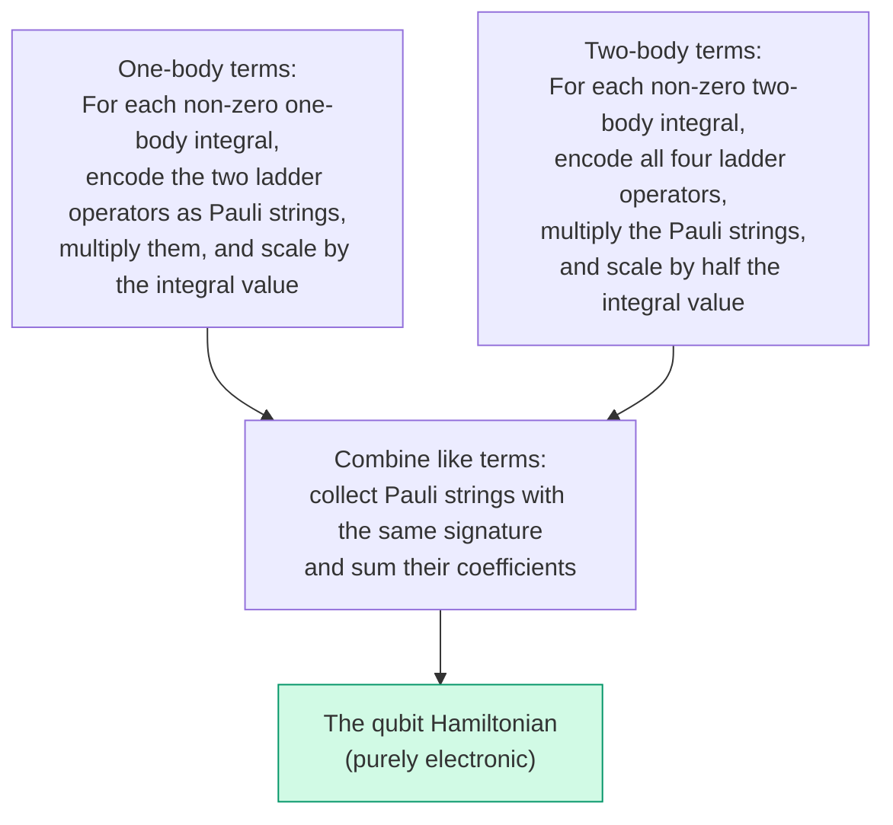
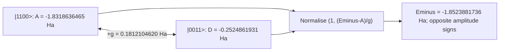

# Chapter 6: Building the Qubit Hamiltonian

_This is where the pipeline pays off. We take the integral tables from Chapter 3, the encoding from Chapter 5, and produce the actual qubit Hamiltonian — the object that a quantum computer will simulate._

## In This Chapter

- **What you'll learn:** How diagonal configuration energies and off-diagonal couplings appear in a qubit Hamiltonian, how to encode fermionic terms into Pauli strings, and how to derive the 15-term H₂ result.
- **Why this matters:** VQE, QPE, and Hamiltonian-simulation algorithms consume this operator. Its coefficients, signs, and Pauli weights determine both the physics and the circuit cost.
- **Prerequisites:** Chapters 1–5 (integrals, notation, spin-orbitals, gates, encoding concepts).

---

## Configuration Energies and Couplings

Before computing Pauli strings, separate two basis-dependent roles in
the Hamiltonian. A diagonal matrix element is an energy assigned to a
configuration. An off-diagonal element couples two configurations.
Both belong to the same operator.

Take the two closed-shell determinants
$|g\rangle=|1100\rangle$ and $|u\rangle=|0011\rangle$.
For now write their electronic Hamiltonian block symbolically:

$$H_{\mathrm{closed}}=
\begin{pmatrix}A&G\\G&D\end{pmatrix},$$

where $A=\langle g|H|g\rangle$, $D=\langle u|H|u\rangle$,
and $G=\langle g|H|u\rangle=\langle u|H|g\rangle$ is real
in our orbital and determinant convention. We will derive their
numerical values from the integrals below.

### Start with a pure state

A normalised pure state in this block is
$|\psi\rangle=\alpha|g\rangle+\beta|u\rangle$ with
$|\alpha|^2+|\beta|^2=1$.
Expanding its expectation value rather than naming it gives

$$
\begin{aligned}
E_\psi
&=(\alpha^*\langle g|+\beta^*\langle u|)
  H(\alpha|g\rangle+\beta|u\rangle)\\
&=|\alpha|^2A+|\beta|^2D
  +\alpha^*\beta G+\beta^*\alpha G\\
&=|\alpha|^2A+|\beta|^2D+2G\,\operatorname{Re}(\alpha^*\beta).
\end{aligned}
$$

The first two terms use **configuration energies**. The last term
depends on a relative phase and uses the **configuration coupling**.
For equal real amplitudes, changing $\beta$ from $+1/\sqrt2$ to
$-1/\sqrt2$ changes the energy from $(A+D)/2+G$ to
$(A+D)/2-G$, without changing either configuration's probability.

### Compare with a mixture having the same populations

Suppose instead we toss a classical coin and prepare $|g\rangle$
with probability $p$, otherwise $|u\rangle$. There is no fixed
relative phase between those separately prepared states. Averaging
their energies gives

$$E_{\mathrm{mix}}=pA+(1-p)D.$$

Choosing $p=|\alpha|^2$ matches the pure state's computational-basis
probabilities but loses its cross term. This is the same
superposition-versus-mixture distinction as the Bell example in
Chapter 4, now with an energy consequence.

### Density matrices abbreviate both calculations

The outer product $|v\rangle\langle w|$ is an operator: it takes
an overlap with $|w\rangle$ and returns a multiple of $|v\rangle$.
For a pure state define its **density matrix**
$\rho_\psi=|\psi\rangle\langle\psi|$. For a statistical mixture
of states $|\psi_k\rangle$ prepared with probabilities $p_k$,
define $\rho=\sum_k p_k|\psi_k\rangle\langle\psi_k|$.
These matrices are Hermitian and positive semidefinite (their
eigenvalues are nonnegative). Their diagonal entries sum to one.
Here the two examples are

$$
\rho_\psi=\begin{pmatrix}
|\alpha|^2&\alpha\beta^*\\
\beta\alpha^*&|\beta|^2
\end{pmatrix},\qquad
\rho_{\mathrm{mix}}=\begin{pmatrix}p&0\\0&1-p\end{pmatrix}.
$$

The **trace**, $\operatorname{Tr}(B)=\sum_iB_{ii}$, is the sum
of a matrix's diagonal entries. Multiplying first, then taking
that sum, recovers both expectation formulae:

$$
\langle H\rangle=\operatorname{Tr}(\rho H)
=\sum_i\rho_{ii}H_{ii}+\sum_{i\ne j}\rho_{ij}H_{ji}.
$$

Off-diagonal density entries are called **coherences in the chosen
basis**. A mixed state need not be diagonal in every basis; our
coin preparation is diagonal specifically in the determinant basis.
Likewise an energy eigenstate has no off-diagonal entries in its
own eigenbasis. "Diagonal" is not an absolute label for classical
physics.

Off-diagonal Hamiltonian elements can lower the optimised energy
by mixing determinants. That does not make correlation energy
equal to the expectation of just those elements: the optimal
populations change too. Correlation energy compares the optimised
correlated and Hartree–Fock expectations of the **full** Hamiltonian.

A Hamiltonian diagonal in the occupation basis has computational-basis
eigenstates, so coherence cannot lower its minimum eigenvalue. Degeneracy may
also permit coherent ground states, but it gives no energetic advantage over a
basis-state ground state. In JW, terms containing $X$ or $Y$ connect
occupation configurations. Evolution cost depends on weight, however:
a weight-two $ZZ$ rotation also uses entangling gates, while a
weight-one $X$ rotation does not. Measuring a string is a separate task
from evolving under it.

Encoding changes the Pauli representation of both diagonal and off-diagonal
fermionic operators. The practical question is not which part is "classical" or
"quantum" in an absolute sense, but how accurately and cheaply the chosen
representation implements the full operator.

---

## What We Have and What We'll Do

Chapters 1–4 gave us everything we need:

- **The chemistry** (Chapter 1): H₂ in STO-3G, 4 spin-orbitals, the second-quantized Hamiltonian.
- **The notation** (Chapter 2): physicist's convention, the conversion rule, the traps to avoid.
- **The numbers** (Chapter 3): complete spin-orbital integral tables and a coefficient factory in F#.
- **The quantum computer** (Chapter 4): qubits, gates, CNOT cost, and the $2(w-1)$ formula.
- **The encoding** (Chapter 5): Jordan–Wigner's Z-chain mechanism for translating fermionic operators to Pauli strings.

The procedure is systematic, but every new input still needs an integral-
convention check, a direct matrix reference where feasible, and a validated
encoding implementation.

---

## The Recipe



FockMap multiplies and collects symbolic Pauli operators rather than
constructing dense matrices. Their signs and phases follow a discrete
algebra; their molecular coefficients remain finite-precision numbers.
We will do the multiplication and collection explicitly enough to recover
every entry of the final table.

### One-body terms: number operators

The non-zero one-body integrals for H₂ are all diagonal (Chapter 3): $h_{00} = h_{11} = -1.2533097866$ Ha and $h_{22} = h_{33} = -0.4750688488$ Ha. Under Jordan–Wigner, the number operator simplifies — the Z-chains cancel:

$$\hat{n}_j = a_j^\dagger a_j = \frac{1}{2}(I - Z_j)$$

Weight 1, regardless of system size. The one-body Hamiltonian produces five diagonal terms:

| Pauli term | Coefficient (Ha) | Origin |
|:---:|:---:|:---|
| $IIII$ | $-1.7283786354$ | Sum of diagonal one-body integrals, halved |
| $ZIII$ | $+0.6266548933$ | $-h_{00}/2$ (energy of $\sigma_g, \alpha$) |
| $IZII$ | $+0.6266548933$ | $-h_{11}/2$ (energy of $\sigma_g, \beta$) |
| $IIZI$ | $+0.2375344244$ | $-h_{22}/2$ (energy of $\sigma_u, \alpha$) |
| $IIIZ$ | $+0.2375344244$ | $-h_{33}/2$ (energy of $\sigma_u, \beta$) |

All I and Z. By itself, this operator cannot mix occupation configurations; its eigenvalues are read directly from computational-basis states.

### Two-body terms: one by hand

After the symmetry-related index permutations are combined, the Coulomb
repulsion between opposite-spin electrons in $\sigma_g$ contributes
$0.6747559268\,a_0^\dagger a_1^\dagger a_1a_0$.

One way to see its structure is to use CAR first:
$a_0^\dagger a_1^\dagger a_1a_0=\hat n_0\hat n_1$.
Number operators on distinct modes commute. Under JW each is
$(I-Z_j)/2$, so

$$a_0^\dagger a_1^\dagger a_1 a_0 = \frac{1}{4}(IIII - ZIII - IZII + ZZII)$$

Scaled by the integral, this gives four diagonal Pauli contributions.

### Collect all diagonal contributions

Use short names for the four spatial integral values:

$$
\begin{aligned}
J_g&=[00|00]=0.6747559268, &
J_u&=[11|11]=0.6976515045,\\
J&=[00|11]=0.6637114014, &
g&=[01|01]=0.1812104620 ,
\end{aligned}
$$

all in hartree. Here $J$ is a Coulomb integral between the two
different MOs and $g$ also supplies same-spin exchange. For opposite
spins the exchange spin overlap vanishes; for same spins it survives.
Combining the raw integral permutations as in Chapter 2 yields six
occupied-pair coefficients:

| Occupied modes | Spin relation | Coefficient of $\hat n_p\hat n_q$ |
|:---:|:---|:---:|
| 0, 1 | Opposite, both in $\sigma_g$ | $J_g$ |
| 2, 3 | Opposite, both in $\sigma_u$ | $J_u$ |
| 0, 3 | Opposite, different MOs | $J$ |
| 1, 2 | Opposite, different MOs | $J$ |
| 0, 2 | Same, different MOs | $J-g$ |
| 1, 3 | Same, different MOs | $J-g$ |

With $h_g=-1.2533097866$ and $h_u=-0.4750688488$ Ha,
the diagonal operator is therefore

$$
\begin{aligned}
H_{\mathrm{diag}}={}&h_g(\hat n_0+\hat n_1)
+h_u(\hat n_2+\hat n_3)
+J_g\hat n_0\hat n_1+J_u\hat n_2\hat n_3\\
&+J(\hat n_0\hat n_3+\hat n_1\hat n_2)
+(J-g)(\hat n_0\hat n_2+\hat n_1\hat n_3).
\end{aligned}
$$

Every pair contributes
$V_{pq}(I-Z_p-Z_q+Z_pZ_q)/4$.
This gives a compact coefficient ledger:

$$
\begin{aligned}
c_I&=h_g+h_u+\frac{J_g+J_u+4J-2g}{4},\\
c_{Z_0}=c_{Z_1}
&=-\frac{h_g}{2}-\frac{J_g+2J-g}{4},\\
c_{Z_2}=c_{Z_3}
&=-\frac{h_u}{2}-\frac{J_u+2J-g}{4},\\
c_{Z_0Z_1}&=J_g/4,\qquad c_{Z_2Z_3}=J_u/4,\\
c_{Z_0Z_3}=c_{Z_1Z_2}&=J/4,\qquad
c_{Z_0Z_2}=c_{Z_1Z_3}=(J-g)/4.
\end{aligned}
$$

For example, $(J-g)/4=0.1206252348$ Ha to the precision
displayed in the final table. The identity coefficient is
$-0.8121706072$ Ha. It includes the constants introduced when
rewriting number operators, but **not nuclear repulsion**.
We now have all eleven diagonal strings: identity, four single
$Z$s, and six $ZZ$s.

### The four coupling monomials

Number products cannot connect different configurations. The remaining
nonzero, collected quartic terms transfer an opposite-spin pair or
exchange the occupied spin-orbitals. Set

$$A_f=a_0^\dagger a_1^\dagger a_3a_2,\qquad
C_f=a_0^\dagger a_3^\dagger a_2a_1.$$

The subscript distinguishes these fermionic monomials from the diagonal
block entry $A$. Their adjoints reverse the whole operator product:

$$A_f^\dagger=a_2^\dagger a_3^\dagger a_1a_0,\qquad
C_f^\dagger=a_1^\dagger a_2^\dagger a_3a_0.$$

The off-diagonal contribution is

$$
\begin{aligned}
H_{\mathrm{couple}}=g(&a_0^\dagger a_1^\dagger a_3a_2
+a_2^\dagger a_3^\dagger a_1a_0\\
&-a_0^\dagger a_3^\dagger a_2a_1
-a_1^\dagger a_2^\dagger a_3a_0).
\end{aligned}
$$

The first line transfers an opposite-spin pair between the bonding and
antibonding orbitals; the second line contains the associated spin-exchange
terms. Their relative sign is already present before encoding. In the
restricted antisymmetrised notation, for example,

$$\langle01\Vert23\rangle=g-0=g,\qquad
\langle03\Vert12\rangle=0-g=-g.$$

The zero in each subtraction comes from the spin deltas of Chapter 3.
The second coefficient multiplies
$a_0^\dagger a_3^\dagger a_2a_1=C_f$.
The reverse transfers have the same real coefficients. Thus
$H_{\mathrm{couple}}=g(A_f+A_f^\dagger-C_f-C_f^\dagger)$.

### Expand one monomial completely

Substitute the four JW ladders into $A_f$. Keeping their written order,

$$
A_f=\frac1{16}(X_0-iY_0)
Z_0(X_1-iY_1)
Z_0Z_1Z_2(X_3+iY_3)
Z_0Z_1(X_2+iY_2).
$$

Operators on different qubits can be gathered without a sign.
At qubit 0, $(X-iY)Z=X-iY$ and the remaining two $Z$s
cancel. At qubit 1, the two later $Z$s cancel. At qubit 2,
$Z(X+iY)=X+iY$. We obtain

$$A_f=\frac1{16}
(X_0-iY_0)(X_1-iY_1)(X_2+iY_2)(X_3+iY_3).$$

Choose $X$ or $Y$ at each of four positions: there are sixteen
terms. If the chosen $Y$ positions are a set $S$, the coefficient
is $(-i)^{|S\cap\{0,1\}|}i^{|S\cap\{2,3\}|}/16$.
For `XXYY` this is $i^2/16=-1/16$.
For `XYYX` it is $(-i)i/16=+1/16$.
For `XXXY` it is $i/16$: a single monomial is not Hermitian.

The other transfer has the analogous product

$$C_f=\frac1{16}
(X_0-iY_0)(X_1+iY_1)(X_2+iY_2)(X_3-iY_3).$$

Since each Pauli string is Hermitian, taking either monomial's
adjoint conjugates each coefficient. We can now show **every**
term and its cancellation. Entries below are sixteen times the
Pauli coefficient; the last column includes the two minus signs
in the Hamiltonian but not $g$.

| Signature | $16A_f$ | $16A_f^\dagger$ | $-16C_f$ | $-16C_f^\dagger$ | Sum |
|:---:|:---:|:---:|:---:|:---:|:---:|
| `XXXX` | 1 | 1 | −1 | −1 | 0 |
| `XXXY` | $i$ | $-i$ | $i$ | $-i$ | 0 |
| `XXYX` | $i$ | $-i$ | $-i$ | $i$ | 0 |
| `XXYY` | −1 | −1 | −1 | −1 | −4 |
| `XYXX` | $-i$ | $i$ | $-i$ | $i$ | 0 |
| `XYXY` | 1 | 1 | −1 | −1 | 0 |
| `XYYX` | 1 | 1 | 1 | 1 | 4 |
| `XYYY` | $i$ | $-i$ | $-i$ | $i$ | 0 |
| `YXXX` | $-i$ | $i$ | $i$ | $-i$ | 0 |
| `YXXY` | 1 | 1 | 1 | 1 | 4 |
| `YXYX` | 1 | 1 | −1 | −1 | 0 |
| `YXYY` | $i$ | $-i$ | $i$ | $-i$ | 0 |
| `YYXX` | −1 | −1 | −1 | −1 | −4 |
| `YYXY` | $-i$ | $i$ | $i$ | $-i$ | 0 |
| `YYYX` | $-i$ | $i$ | $-i$ | $i$ | 0 |
| `YYYY` | 1 | 1 | −1 | −1 | 0 |

Odd numbers of $Y$s cancel within adjoint pairs. Four even-$Y$
signatures cancel between the pair-transfer and spin-exchange
contributions. Four survive. Restoring the factor $g/16$ gives

$$
H_{\mathrm{couple}}
=\frac{g}{4}(-XXYY+XYYX+YXXY-YYXX).
$$

Thus every four-body Pauli coefficient has magnitude
$g/4=0.0453026155$ Ha. A coefficient half as large could mean
that an adjoint or symmetry-related term was omitted; a doubled
one could indicate a prefactor error. Those are hypotheses to test
against the raw entries and monomials, not diagnoses from magnitude
alone.

### Check a labelled transition before diagonalising

Each of the four strings takes $|0011\rangle$ to
$|1100\rangle$, but with different phases:

| String | Its phase on $\lvert0011\rangle$ | Hamiltonian coefficient | Contribution to $\langle1100\mid H\mid0011\rangle$ |
|:---:|:---:|:---:|:---:|
| `XXYY` | $(-i)(-i)=-1$ | $-g/4$ | $+g/4$ |
| `XYYX` | $(i)(-i)=+1$ | $+g/4$ | $+g/4$ |
| `YXXY` | $(i)(-i)=+1$ | $+g/4$ | $+g/4$ |
| `YYXX` | $(i)(i)=-1$ | $-g/4$ | $+g/4$ |

The matrix element is therefore **$+g$**, as the original pair
transfer requires. A table of coefficients has become one concrete
operator action. In the occupation-integer matrix this is row 3,
column 12, not row 12 because the label happens to start with `11`.

---

## The Complete 15-Term Hamiltonian

After processing all 32 non-zero two-body integrals and combining like terms:

| # | Pauli String | Coefficient (Ha) | Character |
|:---:|:---:|:---:|:---|
| 1 | $IIII$ | $-0.8121706072$ | Energy offset |
| 2 | $IIIZ$ | $-0.2234315369$ | Diagonal |
| 3 | $IIZI$ | $-0.2234315369$ | Diagonal |
| 4 | $IIZZ$ | $+0.1744128761$ | Diagonal |
| 5 | $IZII$ | $+0.1714128264$ | Diagonal |
| 6 | $IZIZ$ | $+0.1206252348$ | Diagonal |
| 7 | $IZZI$ | $+0.1659278503$ | Diagonal |
| 8 | $XXYY$ | $-0.0453026155$ | **Configuration coupling** |
| 9 | $XYYX$ | $+0.0453026155$ | **Configuration coupling** |
| 10 | $YXXY$ | $+0.0453026155$ | **Configuration coupling** |
| 11 | $YYXX$ | $-0.0453026155$ | **Configuration coupling** |
| 12 | $ZIII$ | $+0.1714128264$ | Diagonal |
| 13 | $ZIIZ$ | $+0.1659278503$ | Diagonal |
| 14 | $ZIZI$ | $+0.1206252348$ | Diagonal |
| 15 | $ZZII$ | $+0.1686889817$ | Diagonal |

---

## Reading the Hamiltonian: Where the Energy Lowering Comes From

Now we read this table through the density matrix lens.

Eleven terms contain only I and Z. Together they assign an energy to each
occupation configuration. Four weight-four terms couple the closed-shell
determinants $|1100\rangle$ and $|0011\rangle$, and also the
open-shell opposite-spin determinants $|1001\rangle$ and $|0110\rangle$.
For this integral tensor, these are separate two-dimensional blocks.

### The closed-shell block

In $|1100\rangle$ only $\hat n_0,\hat n_1$ are nonzero, so
$A=2h_g+J_g$. In $|0011\rangle$, $D=2h_u+J_u$.
The off-diagonal calculation above supplies $G=g$, giving

$$H_{\mathrm{closed}}\approx
\begin{pmatrix}
-1.8318636465&+0.1812104620\\
+0.1812104620&-0.2524861931
\end{pmatrix}\ \text{Ha}.$$

The displayed inputs are rounded; the following reference energies use
the canonical full-precision data. For a real symmetric block the
characteristic equation is

$$\det(H_{\mathrm{closed}}-EI)=(A-E)(D-E)-g^2=0,$$

so

$$E_\pm=\frac{A+D}{2}
\pm\sqrt{\left(\frac{D-A}{2}\right)^2+g^2}.$$

This yields
$E_-=-1.8523881736$ Ha and $E_+=-0.2319616660$ Ha.
Since the square root exceeds $(D-A)/2$ when $g\ne0$, the
lower eigenvalue is below $A$. That is the energy benefit of
mixing, obtained without a variational optimiser or a quantum device.

Solve $(A-E_-)\alpha+g\beta=0$ to recover the state:

$$\frac{\beta}{\alpha}=\frac{E_--A}{g}<0,\qquad
|\psi_-\rangle\approx
0.99364675\,|1100\rangle-0.11254389\,|0011\rangle.$$

The negative relative sign is selected by the **positive** coupling.
Its squared RHF overlap is approximately 0.98733387, while the
antibonding-pair probability is 0.01266613.
These probabilities sum to one; neither is itself an energy.

The two same-spin determinants have energy $h_g+h_u+J-g
=-1.2458776961$ Ha. The opposite-spin open-shell block has
diagonal $h_g+h_u+J$ and off-diagonal $-g$, with eigenvalues
$-1.2458776961$ and $-0.8834567721$ Ha. This accounts for
all six two-electron states and confirms that $E_-$ is the
two-electron ground energy, not merely the lower eigenvalue of
an arbitrarily selected block.



*Figure 6.1. The closed-shell H₂ block in the chosen determinant phase
convention. Diagonal entries are configuration energies; the connecting
entry is a matrix element, not an extra energy added once to each state.
All values are electronic, for H₂/STO-3G at 0.74 Å.*

### Reconcile the pure-state and mixture energies

Deleting the four coupling strings (rows 8–11 in the Pauli table)
makes $|1100\rangle$ the lowest two-electron determinant. Its
electronic energy is $-1.8318636465$ Ha; adding
$V_{nn}=0.7151043391$ Ha gives $-1.1167593074$ Ha.
This equals RHF because the chosen MOs are the RHF orbitals and
the reference determinant is the lowest diagonal configuration
for this example. It is not a general algorithm for doing HF
with arbitrary fixed orbitals.

Restoring the coupling gives total FCI energy
$-1.8523881736+0.7151043391=-1.1372838345$ Ha.

The decomposition makes the earlier warning concrete. In the exact ground
state, changed determinant populations raise the diagonal expectation by about
$0.0200046$ Ha relative to the HF determinant, while the off-diagonal
expectation contributes about $-0.0405291$ Ha. Their sum is the net
correlation energy, $-0.0205245$ Ha (about $-12.88$ kcal/mol). The
correlation energy is therefore enabled by the coupling but does not "live
entirely" in four expectation values.

Using the amplitudes just computed, the two contributions can be
recovered separately:

$$
\begin{aligned}
E_{\mathrm{diag}}-A&=|\beta|^2(D-A)
\approx+0.0200045946\ \text{Ha},\\
E_{\mathrm{couple}}&=2g\alpha\beta
\approx-0.0405291217\ \text{Ha},\\
E_--A&\approx-0.0205245271\ \text{Ha}.
\end{aligned}
$$

A mixture with these same determinant populations has energy
$E_{\mathrm{diag}}\approx-1.8118590519$ Ha, which is *above*
RHF. Mixing in the expensive antibonding determinant only pays
because the coherent cross term lowers the energy by more than
that population change costs. Saying "the state has 1.27% of the
excited determinant" does not explain the energy until its relative
phase and coupling are also specified.

---

## Constructing with FockMap

Run `dotnet fsi code/ch06-building-hamiltonian.fsx` from the repository
root for the complete companion. The following **construction excerpt**
loads the Chapter 3 raw factory, assembles the JW Hamiltonian, and
prints the collected nonzero terms. The companion's assertions and
comparison reporting are separate from this short listing:

```fsharp
#load "code/ch03-spin-orbitals.fsx"

open System.Numerics
open Encodings
open Encodings.Hamiltonian

let h2RawPhysicistFactory =
    ``Ch03-spin-orbitals``.h2RawPhysicistFactory

let hamiltonian =
    computeHamiltonian h2RawPhysicistFactory 4u

let terms =
    hamiltonian.DistributeCoefficient.SummandTerms
    |> Array.filter (fun t -> Complex.Abs t.Coefficient > 1e-12)
    |> Array.sortBy (fun t -> t.Signature)

for t in terms do
    printfn "%+.4f  %s" t.Coefficient.Real t.Signature
```

Output:

```
-0.8122  IIII
-0.2234  IIIZ
-0.2234  IIZI
+0.1744  IIZZ
+0.1714  IZII
+0.1206  IZIZ
+0.1659  IZZI
-0.0453  XXYY
+0.0453  XYYX
+0.0453  YXXY
-0.0453  YYXX
+0.1714  ZIII
+0.1659  ZIIZ
+0.1206  ZIZI
+0.1687  ZZII
```

`computeHamiltonian` applies the raw two-body half and the
$a_s a_r$ order; the factory has not already done so.
`DistributeCoefficient.SummandTerms` exposes individual weighted
strings for inspection. The reporting filter removes numerically
tiny coefficients, not missing physical interactions. Inspecting real
parts for printing is appropriate for this Hermitian result; it is
not permission to discard imaginary discrepancies in a matrix check.

The canonical result has **15 assembled nonzero terms**. Equal
term counts or two sentinel coefficients alone would not establish
the complete operator. Chapter 9 compares full coefficients, labelled
actions, matrices and spectra against independent construction.
The
coefficient 1-norm
$\lambda_{\mathrm{coeff}}=\sum_k|c_k|=2.6992778241$ Ha includes the identity
term; it is not the commutator quantity used in Chapter 15.

There is also a useful arithmetic check on the displayed table.
Its total Pauli weight is

$$0+4(1)+6(2)+4(4)=32.$$

Under Chapter 4's standard logical staircase, evolving once under
each nonidentity term requires

$$4(0)+6(2)+4(6)=36\ \text{CNOTs}.$$

There are **14 nonidentity rotations**, not 15: the identity term
contributes only a global phase to ordinary uncontrolled evolution.
Controlled evolution needs that phase accounted for separately,
as later chapters explain. These are counts for one untapered
first-order logical product, not a complete energy-estimation
algorithm or an experimental resource estimate.

We now have an inspectable JW reference. Chapter 7 introduces the
other encoders and shows how to pass an encoder to
`computeHamiltonianWith`; Chapter 9 checks the results with the
corresponding state/basis map. An encoding comparison is the next
lesson, not an unexplained extra argument in this one.

---

## Key Takeaways

- A diagonal density matrix represents a classical mixture in the chosen basis; off-diagonal entries retain coherence between configurations.
- Off-diagonal Hamiltonian terms couple configurations, but correlation energy is the change in the optimised expectation of the full Hamiltonian.
- The direct H₂ JW Hamiltonian has 11 diagonal terms and 4 configuration-coupling terms.
- Encoding changes supports and state representation. The collected weights determine a specified logical staircase count; complete simulation cost needs additional algorithm and compilation choices.

## Common Mistakes

1. **Remember to add $V_{nn}$ when computing total energy.** The 15-term Hamiltonian above is the purely electronic Hamiltonian. Its eigenvalues are electronic energies $E_\text{el}$. To get the total molecular energy, add the nuclear repulsion: $E_\text{total} = E_\text{el} + V_{nn}$. (For H₂, $V_{nn} = 0.7151$ Ha.)

2. **Wrong operator ordering.** Writing $a_r a_s$ instead of $a_s a_r$ negates every surviving quartic monomial, including pair energies. Taking an adjoint reverses the entire product, not just the annihilators.

3. **Not combining like terms.** The 32 two-body integrals produce many duplicate Pauli signatures that must be summed.

## Exercises

1. **Number operator by hand.** Verify that $a_2^\dagger a_2 = \frac{1}{2}(I - Z_2)$ by expanding the JW-encoded operators.

2. **Coupling-term sign.** Starting from the four-monomial expression above, explain why $XXYY$ has coefficient $-0.0453026155$ and $XYYX$ has $+0.0453026155$.

3. **Diagonal-only energy.** Delete coupling terms **8–11**, retaining all eleven I/Z strings. Evaluate the six two-electron configurations and identify the minimum electronic energy. Add $V_{nn}$ to obtain the total RHF energy. Why is this deletion different from omitting the cross-spin *integrals* in Chapter 3?

4. **Closed-shell eigenstate.** Use $A$, $D$ and $g$ from the block to solve its characteristic equation and normalise $(1,(E_--A)/g)$. Report electronic energy, total energy and RHF overlap separately.

5. **Same populations, different energy.** Construct the pure-state and mixture density matrices using the ground-state amplitudes. Recover their energies by direct matrix multiplication and trace. Explain why the mixture's energy is above RHF even though the coherent state's is below it.

6. **One cancellation, one survivor.** In the sixteen-row expansion, derive the four contributions to `XYXY` and `XYYX` without reading their final sums. Why does one signature disappear while the other has coefficient $+g/4$?

7. **Resource arithmetic.** Recover total weight 32 and logical CNOT count 36 from the fifteen-term table. Explain why there are fourteen nonidentity rotations and why those thirty-six CNOTs are not required merely to measure all the Pauli expectations.

## Further Reading

- Whitfield, J. D., Biamonte, J., and Aspuru-Guzik, A. "Simulation of electronic structure Hamiltonians using quantum computers." *Mol. Phys.* 109, 735 (2011).
- McArdle, S. et al. "Quantum computational chemistry." *Rev. Mod. Phys.* 92, 015003 (2020). Section III.

---

**Previous:** [Chapter 5 — A Visual Guide to Encodings](05-visual-encodings.html)

**Next:** [Chapter 7 — Six Encodings, One Interface](07-six-encodings.html)
