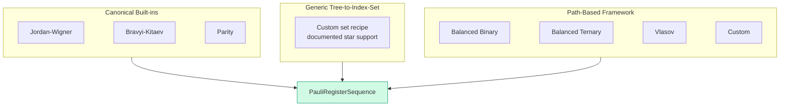

# Chapter 7: Six Encodings, One Interface

_We built the H₂ Hamiltonian with Jordan–Wigner. Its parity chains grow linearly. Can a different representation reduce weight while preserving the operator and labelled states?_

## In This Chapter

- **What you'll learn:** Why we need alternatives to Jordan–Wigner, whether different encodings give the same answer (they do — and we'll see why), and how to compare their costs.
- **Why this matters:** Encoding changes Pauli weight and downstream circuits,
  but only a CAR, matrix, state-order, and spectrum test establishes a faithful
  representation.
- **Prerequisites:** Chapters 1–6 (you have the 15-term JW Hamiltonian and understand the diagonal/off-diagonal structure).

---

## Why Would We Want a Different Encoding?

In Chapter 6, four of the 15 JW terms couple configurations: XXYY, XYYX,
YXXY, and YYXX. They enable determinant mixing; the final correlation energy
comes from the optimised expectation of the full Hamiltonian. Under the
standard staircase these weight-4 rotations also carry the largest H₂ CNOT
cost.

Under Jordan–Wigner, the worst-case ladder-operator weight grows linearly with
the number of modes. Under the standard staircase, a weight-$n$ Pauli
rotation uses $2(n-1)$ logical CNOTs before routing or cancellation. This is a
worst-case operator statement, not a molecule-level gate estimate.

This is the motivation for alternative encodings: **can we preserve the
fermionic operator with shorter Pauli strings?**

Chapter 5 showed that Bravyi–Kitaev and ternary-tree encodings both achieve $\Theta(\log n)$ weight, with different constants and mode assignments. But a natural question arises: if the Pauli strings are different, how do we know we're still computing the same molecule?

The answer starts with the **canonical anti-commutation relations** (CAR).
An encoding must preserve all three relations, not just the one involving a
creation and an annihilation operator. It must also preserve adjoints. For
$n$ modes represented on exactly $n$ qubits, those requirements give a
unitary change of basis on the full $2^n$-dimensional Fock space. We will
construct that basis change below, rather than asking the theorem to do all
the explanatory work.

---

## Do Different Encodings Give the Same Answer?

An **encoder** is a function that takes an operation (`Raise` for creation,
`Lower` for annihilation), a mode index $j$, and the number of modes $n$.
It returns the Pauli *sum* representing that ladder operator. A creation
operator is not Hermitian; its two Pauli coefficients can therefore be
complex even though the assembled electronic Hamiltonian is Hermitian.

The common F# type is:

```fsharp
LadderOperatorUnit -> uint32 -> uint32 -> PauliRegisterSequence
```

Read the arrows from left to right: three inputs, followed by the result.
`uint32` is a nonnegative integer type; `4u` is its F# literal for four.
The `j` input must lie in $0,\ldots,n-1$, and every returned signature must
have width $n$. The encoder does not read integrals, choose a particle number,
add nuclear repulsion, or prepare a state. Those are separate responsibilities.

Here is the complete list *before* we use it. This executable excerpt belongs
after the imports in `code/ch07-six-encodings.fsx`; that script supplies
`Encodings`, `Encodings.JordanWigner`, `Encodings.BravyiKitaev`,
`Encodings.MajoranaEncoding`, and `Encodings.TreeEncoding`:

```fsharp
let encoders = [
    ("Jordan-Wigner",         jordanWignerTerms)
    ("Bravyi-Kitaev",         bravyiKitaevTerms)
    ("Parity",                parityTerms)
    ("Balanced Binary Tree",  balancedBinaryTreeTerms)
    ("Balanced Ternary Tree", ternaryTreeTerms)
    ("Vlasov Tree",           vlasovTreeTerms)
]
```

Each parenthesised item is a pair: a printable name and a function value.
The list contains functions, not already-computed Hamiltonians. The loop
calls each function through the same builder. With the Chapter 3 raw factory
loaded and `Encodings.Hamiltonian` open, its core is:

```fsharp
for (name, encoder) in encoders do
    let ham =
        computeHamiltonianWith
            encoder ``Ch03-spin-orbitals``.h2RawPhysicistFactory 4u
    let terms = ham.DistributeCoefficient.SummandTerms
    printfn "%-25s  %d terms" name terms.Length
```

This is a construction/counting excerpt, not an eigenvalue test.
`DistributeCoefficient` incorporates an outer coefficient into the summands;
`SummandTerms` exposes the resulting Pauli terms. The input is the canonical
raw physicist tensor. FockMap 0.9.0's primary builder supplies its own
one-half prefactor and annihilator order; do not pre-weight this input.

For the canonical 0.74 Å input, the direct Jordan–Wigner derivation has 15 terms
and identity coefficient $-0.8121706072$ Ha. Every package encoding must
reproduce the same full spectrum, particle-number structure, and matrix
invariants. Term count and individual strings are representation-level outputs,
so print and test them rather than assuming they match.

For H₂, preserving the answer is easier to establish than predicting the
best circuit. Even four-qubit encodings can change state preparation,
measurement grouping and tapering opportunities. A small example is a good
place to inspect those changes because we can still see the whole matrix.

---

## Why Equivalence Holds: The CAR Theorem

An encoding maps fermionic operators $a_p^\dagger$, $a_p$ to qubit operators (Pauli sums). Different encodings produce different Pauli strings for the same ladder operator. But the second-quantized Hamiltonian

$$\hat{H} = \sum_{pq} h_{pq}\, a_p^\dagger a_q + \frac{1}{2}\sum_{pqrs} \langle pq \mid rs\rangle\, a_p^\dagger a_q^\dagger a_s a_r$$

is defined in terms of the *algebra* of the operators — their products and commutation relations — not their specific matrix representations.

The key property that any valid encoding must preserve is the **canonical anti-commutation relations (CAR)**:

$$\{a_p^\dagger, a_q\} = \delta_{pq}, \qquad \{a_p^\dagger, a_q^\dagger\} = 0, \qquad \{a_p, a_q\} = 0$$

Here is the theorem:

> **For $n$ modes on a $2^n$-dimensional register, a unital,
> adjoint-preserving representation of the full CAR is unitarily equivalent
> to the occupation representation. Applying the same Hamiltonian polynomial
> therefore preserves its spectrum, including multiplicities.**

Here *unital* means that the identity maps to the register identity, not to
a projector onto an unspecified subspace. *Adjoint-preserving* means that
the encoded annihilator really is the Hermitian adjoint of the encoded
creator. Dimension matters: adding spectator qubits would duplicate
eigenvalues; restricting to a fixed-particle subspace would no longer realise
the full ladder algebra, because creation and annihilation leave that subspace.

Write the encoded annihilators as $A_j$ and define $N_j=A_j^\dagger A_j$.
CAR gives $N_j^2=N_j$, so the only occupation eigenvalues are zero and one.
For different modes the $N_j$ commute, so we can label a common eigenbasis
by binary occupations. Lowering an occupied mode has nonzero norm and
eventually reaches a vacuum $|\Omega\rangle$ annihilated by every $A_j$.
From a normalised vacuum construct

$$|n_0\ldots n_{n-1}\rangle_{\rm enc}
=(A_0^\dagger)^{n_0}\cdots(A_{n-1}^\dagger)^{n_{n-1}}|\Omega\rangle.$$

The increasing order of creators is fixed; the rightmost operator acts
first. The CAR then give norm one, orthogonality of different occupations,
and the same fermionic sign for every ladder action as in Chapter 5.
There are $2^n$ such vectors, so they fill the assumed register dimension.
The matrix $U$ whose columns are these vectors, in occupation-integer order,
is unitary. It satisfies

$$A_j=U a_j^{\rm occ}U^\dagger,\qquad
H_{\rm enc}=U H_{\rm occ}U^\dagger.$$

This also tells us what to do with observables and states. An occupation
state becomes $U|\psi\rangle$, and its number operator becomes
$U\hat n_jU^\dagger$. Reusing the old bit labels with the new Hamiltonian
is not a free optimisation. It is a different experiment.

At the Pauli-sum level, the mixed CAR test checks that

$$(\text{encoded } a_i^\dagger)(\text{encoded } a_j) + (\text{encoded } a_j)(\text{encoded } a_i^\dagger) = \delta_{ij} \cdot I$$

for all pairs $(i,j)$, using symbolic Pauli multiplication. The full
check also includes the two same-type relations and adjoints, as
Chapter 8 demonstrates. Passing those checks establishes the ladder
algebra for the tested modes. Chapter 9 additionally
compares the encoded matrix, labelled basis states, and eigenvalues with an
independent fermionic reference; CAR alone does not protect integral processing,
coefficient assembly, ordering, or like-term combination.

The theorem licenses a change of representation once its hypotheses hold.
It does not prove that a particular loop, input tensor or library helper
satisfies them. Nor does it make the basis change free on hardware.

---

## A Basis Change We Can Actually Follow

The **cumulative parity encoding** stores

$$b_j=n_0\oplus n_1\oplus\cdots\oplus n_j,$$

where $\oplus$ is addition modulo two. Recover occupations with
$n_0=b_0$ and $n_j=b_{j-1}\oplus b_j$ for $j>0$.
For four modes, occupation `1100` becomes encoded label `1000`:
the first running count is odd, and every later count is even.
The same physical determinant is therefore row 3 in JW but row 1 in
cumulative parity, using our usual integer rule on each register.

For two modes the entire map fits on the page:

| Occupation label | Occupation row | Parity label | Parity row |
|:---:|:---:|:---:|:---:|
| `00` | 0 | `00` | 0 |
| `10` | 1 | `11` | 3 |
| `01` | 2 | `01` | 2 |
| `11` | 3 | `10` | 1 |

One CNOT with control 0 and target 1 performs this map:
$U|n_0n_1\rangle=|n_0,n_0\oplus n_1\rangle$.
Conjugating the JW number operators gives

$$U\hat n_0U^\dagger=\frac{I-Z_0}{2},\qquad
U\hat n_1U^\dagger=\frac{I-Z_0Z_1}{2}.$$

The old second occupation bit is now the parity of two stored bits.
For the simple Hamiltonian $H=\epsilon_0\hat n_0+\epsilon_1\hat n_1$,
JW's diagonal entries in integer order are
$(0,\epsilon_0,\epsilon_1,\epsilon_0+\epsilon_1)$.
The parity matrix has entries
$(0,\epsilon_0+\epsilon_1,\epsilon_1,\epsilon_0)$.
Their sorted eigenvalues agree; their second diagonal entries do not.
That is the difference between spectral agreement and a labelled-state check.

For $n$ modes, apply CNOT$(0,1)$, then CNOT$(1,2)$, and continue through
CNOT$(n-2,n-1)$. At each step the control already contains the cumulative
parity. Reversing this gate order would implement a different transformation.

### What must happen to Pauli term count?

A **Clifford unitary** maps every Pauli string to another Pauli string,
possibly with a minus sign, under conjugation. CNOT is an example.
Conjugation is invertible: two distinct strings cannot become the same
string up to sign, because conjugating back would identify the originals.
Thus the number of exactly nonzero terms in a simplified Pauli expansion
is invariant under a Clifford basis change. The coefficient magnitudes
are merely permuted.

A general unitary need not have this property. For one qubit,
$U=e^{-i\theta Y/2}$ gives

$$UZU^\dagger=\cos\theta\,Z+\sin\theta\,X.$$

At $\theta=\pi/4$, a one-term Hamiltonian becomes a two-term Hamiltonian.
Conjugating its ladder operators by the same $U$ still preserves CAR.
Consequently "valid encoding" does not imply invariant Pauli-term count.
Equal counts under Clifford-related mappings are expected, not evidence
that a comparison forgot to change encoders. Numerical thresholds must
also be reported: thresholding is not exact algebra.

---

## Where the Differences Emerge: Scaling

The Chapter 7 companion measures the largest weight of any Pauli summand
in any creation operator, maximised over $j=0,\ldots,n-1$. These are
FockMap 0.9.0 helper outputs, not Hamiltonian-term weights:

| $n$ | JW | BK | Ternary Tree | JW/TT ratio |
|:---:|:---:|:---:|:---:|:---:|
| 4 | 4 | 3 | 2 | 2.0× |
| 8 | 8 | 4 | 3 | 2.7× |
| 16 | 16 | 5 | 4 | 4.0× |
| 32 | 32 | 6 | 5 | 6.4× |
| 64 | 64 | 7 | 6 | 10.7× |

At 32 modes, the heaviest JW ladder summand touches 32 qubits; the measured
`ternaryTreeTerms` summand touches five. If either string were used as a
Pauli rotation, the standard staircase would require 62 or eight logical
CNOTs. A molecular Hamiltonian, however, contains *products* of ladders.
Their strings can overlap and cancel. Neither number is a per-term bound
for the already-collected molecular Hamiltonian.

There is also a distinction inside the phrase "ternary tree". An ideal
height-balanced ternary construction can attain maximum Majorana weight
$\lceil\log_3(2n+1)\rceil$: four at $n=32$ and five at $n=64$.
The pinned helper above reports five and six. Its source selects a midpoint
root, divides the indices *before* it into two parts, and assigns all
indices *after* it to the third subtree. The approximate proportions are
$n/4,n/4,n/2$, not three equal thirds. Its longest branch therefore need
not attain the ideal ternary height. Both have logarithmic growth; that
does not make their finite-size constants interchangeable.

Chapter 8 accounts for the $2n+1$ terminal paths and shows exactly what
their weights count. Circuit depth still needs a compiler, connectivity,
gate ordering and scheduling policy. A table of operator weights has none
of those things.

---

## The Three Frameworks

FockMap implements encodings through two complementary frameworks (plus one special case):



**Canonical built-ins:** JW, BK, and Parity are separate tested
implementations. Their correctness is not inferred by feeding a chain or
Fenwick tree into the generic tree-to-index-set constructor.

**Generic tree-to-index-set construction** (`treeEncodingScheme`): our
custom recipe derives update, parity and occupation sets from a tree.
The pinned source documents a finite $n=3,\ldots,6$ census and warns
against non-star input. A **rooted star** has every non-root node as a
direct child of its root. This is a statement about this recipe, not a
definition of all valid fermion encodings.

**Path-based framework** (TreeEncoding.fs): An encoding is derived from a
validated labelled rooted tree. This supports tree constructions that are not
expressed by FockMap's current index-set helpers.

**Fenwick-specific BK** (`BravyiKitaev.fs`): this is the separate canonical BK
implementation, with formulas in terms of $j+1$. It is not an output of
`treeEncodingScheme`.

> **Evidence boundary:** FockMap 0.9.0 source
> `96320a56786393269fd681c67c66df88058a8b8f`, `TreeEncoding.fs`,
> reports that the census at $n=3,\ldots,6$ accepted only rooted stars.
> That is a versioned report of finite evidence, not an all-size proof
> supplied in this book. The function itself simply returns the three set
> functions: it does **not** enforce a star check at runtime. Its documented
> support policy and its actual validation behaviour must not be confused.
> Seeley, Richard and Love's established JW/BK/parity constructions are
> separate from our custom tree recipe; its failures do not refute theirs.

### Two ternary trees: why tree shape matters

The path-based framework has a concrete payoff: FockMap ships a
midpoint-split ternary helper and a breadth-first helper inspired by
Vlasov. Both use labelled paths and Majorana pairing; their tree shapes
and finite-size weights differ. Jiang et al. provide the optimal-weight
construction and bound, not a guarantee that every helper with "ternary"
in its name attains that bound.

How does one go from a tree shape to a working encoding? That's the subject of the next chapter, where we'll build the Vlasov tree step by step — define the tree, plug it into the framework, and verify that it works.

---

## Defining Custom Encodings

FockMap supports two routes for custom encodings beyond the six built-in options:

**Index-set route.** Define three set-valued functions — Update, Parity,
Occupation — and pass them as an `EncodingScheme`. Treat this as a custom
algebraic candidate requiring direct CAR tests. If those sets are generated
from a rooted tree by `treeEncodingScheme`, follow its documented star
support policy and test the result; the function does not enforce that policy.

**Tree-based route.** Define a supported labelled tree and plug it into the
path-based framework. This is the subject of the next chapter, where we build a
breadth-first ternary tree and test its encoded operators.

> **Warning:** Not every custom scheme produces a valid encoding. Always verify the CAR before trusting results — Chapter 8 shows how.

---

## A Decision Framework

| Situation | Recommended encoding | Reasoning |
|:---|:---|:---|
| Learning / prototyping | Jordan–Wigner | Simplest to understand and debug |
| Small reference problem | Jordan–Wigner | Direct occupation labels make independent checks simple |
| 1D chain / local interactions | Jordan–Wigner | Adjacent-orbital terms have short Z-chains |
| General-purpose candidate | Bravyi–Kitaev | Well-studied logarithmic ladder weight; measure the assembled Hamiltonian |
| Exploring lower path weight | Ternary Tree or Vlasov Tree | Compare actual shapes, not just their asymptotic class |
| Exploring custom topologies | Path-based | Labelled trees with at most three children; CAR validation required |
| Comparing ternary tree variants | Vlasov Tree | Same scaling, different qubit assignment |
| Comparing multiple encodings | All six | FockMap's interchangeable interface makes this trivial |

---

## Key Takeaways

- JW's $O(n)$ Pauli weight motivates the search for alternative encodings.
- All valid encodings produce Hamiltonians with the **same eigenvalues** — this follows from CAR preservation, not just empirical observation.
- For H₂ (4 qubits), valid encodings preserve the spectrum but generally produce different Pauli strings.
- A smaller ladder weight motivates a circuit comparison; it does not replace one.
- The interface is short. Establishing the algebra, basis map and input contract is the substantive work.

## Common Mistakes

1. **Assuming different strings are either automatically wrong or automatically
   equivalent.** Verify CAR, matrices, labelled states, and spectra under the
   declared basis map.

2. **Applying the wrong term-count rule.** Exact Clifford conjugation preserves
   simplified nonzero term count. Arbitrary unitary encodings need not.

3. **Using a custom encoding without verifying CAR.** An encoding that violates anti-commutation will produce plausible but wrong Hamiltonians. Always test.

## Exercises

1. **Cumulative parity.** Encode occupation `1011` using the four-mode
   cumulative rule. Recover the occupations from your result. Give both
   integer row indices; remember that the leftmost character is qubit 0.

2. **A basis change, not a new spectrum.** Set $\epsilon_0=1$ and
   $\epsilon_1=3$ in the two-mode number Hamiltonian above. Write its JW and
   parity matrices in integer order. Locate the same one-electron state
   `10` in both representations and evaluate its energy.

3. **Term-count boundary.** Conjugate $Z$ by $e^{-i\pi Y/8}$.
   Count the resulting nonzero Pauli terms and check its eigenvalues.
   Explain why this does not contradict Clifford term-count invariance.

4. **Measured versus ideal.** Run `dotnet fsi code/ch07-six-encodings.fsx`.
   For $n=32,64$, compare its ternary maxima with
   $\lceil\log_3(2n+1)\rceil$. Explain the difference using the source split
   proportions. Do not infer a molecule's CNOT count from either column.

## Further Reading

- Seeley, J. T., Richard, M. J., and Love, P. J. "The Bravyi–Kitaev transformation for quantum computation of electronic structure." *J. Chem. Phys.* 137, 224109 (2012). The index-set framework.
- Jiang, Z., Kalev, A., Mruczkiewicz, W., and Neven, H. "Optimal fermion-to-qubit mapping via ternary trees with applications to reduced quantum states learning." *Quantum* 4, 276 (2020). DOI: 10.22331/q-2020-06-04-276.
- Vlasov, A. Yu. "Clifford algebras, Spin groups and qubit trees." *Quanta* 11, 97–114 (2022). DOI: 10.12743/quanta.v11i1.199; arXiv:1904.09912.
- Tranter, A. et al. "The Bravyi–Kitaev transformation: Properties and applications." *Int. J. Quantum Chem.* 115, 1431 (2015). Practical JW vs BK comparison.

---

**Previous:** [Chapter 6 — Building the Qubit Hamiltonian](06-building-hamiltonian.html)

**Next:** [Chapter 8 — Building a Tree Encoding](08-building-vlasov.html)
