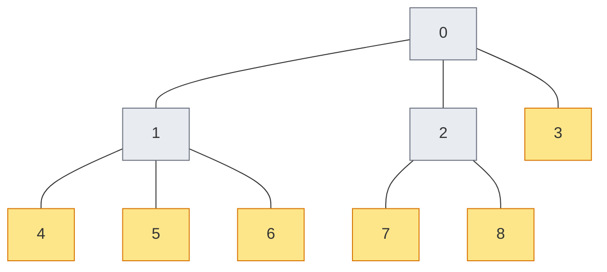
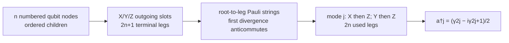
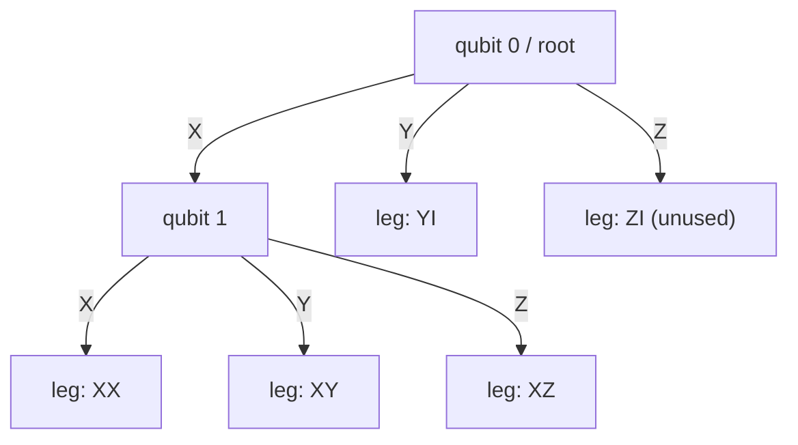
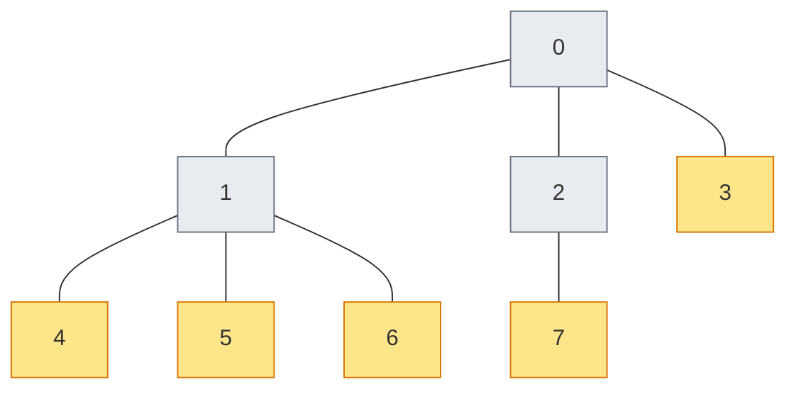
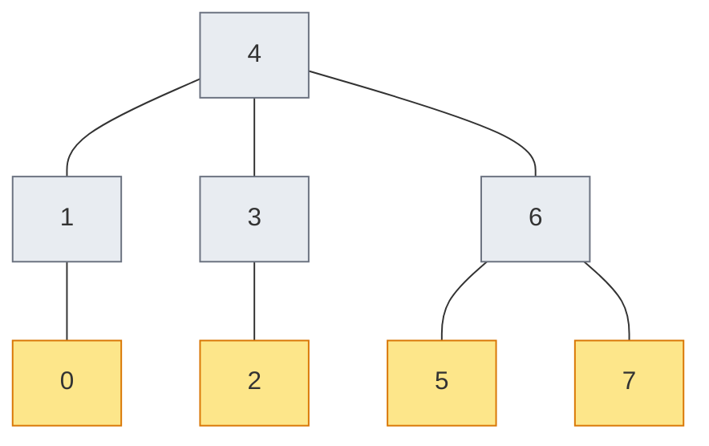

# Chapter 8: Building a Tree Encoding

_Chapter 7 gave us six encodings. This chapter shows how we got the sixth — by building it from scratch._

## In This Chapter

- **What you'll learn:** How the path-based framework constructs a candidate
  from a supported max-three-child tree, how FockMap defines its
  Vlasov-inspired helper, and how CAR/matrix tests establish validity.
- **Why this matters:** Understanding the framework well enough to build your own encoding means you're not limited to the built-in options. And the verification skills you'll develop here — checking CAR, comparing eigenvalues — are the same skills you'll need for every pipeline you build.
- **Prerequisites:** Chapter 7 (you know the six encodings, the two frameworks, and the CAR theorem).

> **Scope note:** This chapter covers the tree-based (path-based) route to
> custom encodings. Chapter 7's finite star-census report concerns a different
> tree-to-index-set constructor; it does not restrict the separately defined
> path-based mapping here. Neither route makes an untested custom mapping valid
> without CAR checks.

---

## The Goal

In Chapter 7, we listed six encodings and noted that FockMap ships *two*
ternary-tree helpers: a midpoint-split construction and a breadth-first
construction inspired by Vlasov. Both have logarithmic worst-case weight,
but their finite-size path lengths differ. Neither a name nor a picture
establishes the map. We need the actual paths, their Pauli strings, and
the rule that turns those strings into fermionic operators.

How did the Vlasov-inspired tree get into FockMap? Someone defined a supported
max-three-child shape, plugged it into the path-based framework, and verified
the resulting operators. This chapter shows that process without implying that
an arbitrary rooted tree is accepted or valid.

> I am grateful to Dr Robin Kothari and Dr Stephen Jordan for bringing Vlasov's construction to my attention. Their suggestion led directly to the implementation we'll develop here.

---

## Step 1: Define the Tree Shape

A **tree** is a connected graph without cycles. Selecting one node as the
**root** gives every other node one parent: its neighbour on the unique
route back to the root. Its other neighbours are its **children**.
The depth of a node is the number of edges from the root to it; the root
has depth zero. A **leaf node** has no children.

In this construction, each of the $n$ numbered nodes supplies one qubit.
The node index also labels one fermionic mode, but that mode's operators
will generally act on several qubits. "Mode 3" does not mean "store its
occupation in qubit 3".

Each node has three *outgoing slots*, labelled X, Y and Z. A slot either
continues to a child or ends immediately in a **terminal leg**. A terminal
leg is not another qubit and is not the same object as a leaf node. A leaf
node has three terminal legs; a node with one child has two. We draw the
node tree first, then fill its unused slots with legs.

FockMap's `vlasovTree` helper builds a **breadth-first ternary tree** inspired
by Vlasov's qubit-tree construction. Node 0 is the root; the children of node
$j$ are $3j+1$, $3j+2$, and $3j+3$, as in a heap. CAR tests validate the
implemented map; historical correspondence to every detail of Vlasov's
construction remains a separate source-level claim.

For $n = 9$ modes:



Node 0 has children 1, 2, 3. Node 1 has children 4, 5, 6. Node 2 has children 7, 8. Node 3 is a leaf — its would-be children (10, 11, 12) all fall outside $n = 9$.

For nine nodes, the midpoint helper instead chooses root 4 and partitions
the remaining indices into `[0;1]`, `[2;3]`, and `[5;6;7;8]`.
The root must be accounted for separately: it cannot also belong to a
subtree. This is not a split into three equal thirds.

### The code

This complete F# example builds the nine-node breadth-first tree through
the public record types. Save it as a separate scratch script and run it
with `dotnet fsi`; it does not need a checkout of the library source.

```fsharp
#r "nuget: FockMap, 0.9.0"
open Encodings
open Encodings.TreeEncoding

let n = 9
let rec buildNode j parent =
    let childIndices =
        [3*j+1; 3*j+2; 3*j+3] |> List.filter (fun c -> c < n)
    let children =
        childIndices |> List.map (fun c -> buildNode c (Some j))
    { Index = j; Children = children; Parent = parent }

let root = buildNode 0 None
let rec nodePairs node =
    (node.Index, node) :: (node.Children |> List.collect nodePairs)

let tree =
    { Root = root; Nodes = nodePairs root |> Map.ofList; Size = n }
let terms = encodeWithTernaryTree tree Raise 0u (uint32 n)
printfn "%A" terms
```

`let rec` allows a function to call itself. The recursion ends when no child
index is below `n`; the resulting `children` list is empty. `Some j` records
a known parent, whereas `None` marks the root. The braces construct a
record with named fields. `nodePairs` visits the records to build the
index-to-node map required by `EncodingTree`.

The helper names `mkNode` and `mkTree` in the pinned library source are
private, so they are not a public construction API. For ordinary use,
`vlasovTree 9` already builds this shape. The longer example exposes what
must be consistent: unique indices $0,\ldots,n-1$, the same nodes in the
root traversal and map, matching parent links, and a matching `Size`.
The path encoder rejects more than three children; that guard is not
a substitute for constructing a coherent record.

---

## Step 2: Plug It Into the Framework

Before calling another helper, we need to know what it constructs.
A **Majorana operator** is a Hermitian combination of a creator and an
annihilator:

$$\gamma_{2j}=a_j+a_j^\dagger,\qquad
\gamma_{2j+1}=i(a_j^\dagger-a_j).$$

The normalisation here gives
$\{\gamma_r,\gamma_s\}=2\delta_{rs}I$, so every Majorana squares to
identity. These are algebraic combinations, not additional fermionic
modes or extra qubits. Solving the two defining equations gives

$$a_j^\dagger=\frac{\gamma_{2j}-i\gamma_{2j+1}}{2},
\qquad
a_j=\frac{\gamma_{2j}+i\gamma_{2j+1}}{2}.$$

The minus sign belongs to creation. In particular, for one qubit these
reduce to $(X-iY)/2=|1\rangle\langle0|$ and its adjoint.

### Count the paths before pairing them

There are $3n$ outgoing slots. A connected tree on $n$ nodes uses $n-1$
of them for edges to children, leaving

$$3n-(n-1)=2n+1$$

terminal legs. Each root-to-leg route defines a Pauli string: at every
visited node, use the label of the outgoing slot taken there; put identity
on every unvisited node. The last label, at the leg's own node, counts too.
A leg at node depth $d$ therefore has string weight $d+1$.

Any two distinct leg paths coincide until they choose different outgoing
slots at one node. Their Pauli factors anticommute at that node. Beyond
it they either terminate or enter disjoint subtrees, so there are no
additional anticommuting overlaps. The two complete strings anticommute.
Every individual string is Hermitian and squares to identity.

Thus $2n+1$ pairwise anticommuting strings have appeared on $n$ qubits.
We need only $2n$ Majoranas for $n$ modes. The extra path will be left
unpaired; it is not a missing mode.

### The pairing rule

For mode $j$, start at node $j$ and take its X slot. If it reaches a child,
follow Z slots until reaching a terminal leg. The *full path from the root*
to that leg gives $\gamma_{2j}$. Repeat from node $j$'s Y slot to obtain
$\gamma_{2j+1}$. The common root-to-$j$ prefix is included in both strings.

Every leg except the all-Z path from the root has a last non-Z choice
somewhere on its route. That choice is X or Y at a unique node $j$, followed
only by Z choices. It therefore belongs to exactly one of these pairs.
This accounts for all $2n$ used legs and identifies the one unused leg.
There is no arbitrary "pair nearby leaves" step.



The slot labels in the pinned implementation follow the order of the
`Children` list: first child X, second Y, third Z. Missing children leave
terminal legs in the remaining slots. Reordering a child list therefore
changes the mapping even when the unlabelled graph is unchanged.

### Two nodes, all five paths

Take root 0 with one child, node 1. The X slot of node 0 goes to node 1;
its Y and Z slots terminate. Node 1 has no children:



There are two nodes, one node-to-node edge and five legs.
The pairing rule yields:

| Mode | X-then-Z terminal | Y-then-Z terminal | Even Majorana | Odd Majorana |
|:---:|:---|:---|:---:|:---:|
| 0 | node 1, Z leg | node 0, Y leg | $XZ$ | $YI$ |
| 1 | node 1, X leg | node 1, Y leg | $XX$ | $XY$ |

Consequently

$$a_0^\dagger=\tfrac12(XZ-iYI),\qquad
a_1^\dagger=\tfrac12(XX-iXY).$$

For example, acting on $|00\rangle$, $XZ$ produces $|10\rangle$ and
$YI$ produces $i|10\rangle$. Their creation combination gives
$|10\rangle$, not zero. For mode 1 the two terms give $|11\rangle$:
creating one fermion need not flip only one stored bit.
Using $\hat n_j=(I+i\gamma_{2j}\gamma_{2j+1})/2$ gives

$$\hat n_0=\frac{II-ZZ}{2},\qquad
\hat n_1=\frac{II-IZ}{2}.$$

Both annihilators kill $|00\rangle$, so it is the encoded vacuum.
The state $|11\rangle$ indeed has occupations $(0,1)$ under these number
operators. The two-particle state in the ordered-creator convention is
$a_0^\dagger a_1^\dagger|00\rangle=-|01\rangle$.
The minus sign illustrates why a basis map may carry phases as well as
permuting labels.

### The wrapper now has a meaning

FockMap wraps the shape and pairing in this source-level excerpt:

FockMap wraps this in a one-line convenience function:

```fsharp
let vlasovTreeTerms (op : LadderOperatorUnit) (j : uint32) (n : uint32) =
    let tree = vlasovTree (int n)
    encodeWithTernaryTree tree op j n
```

`encodeWithTernaryTree` performs the link labelling, path traversal,
pairing and the two coefficients we have just derived. The wrapper is
short because that work is elsewhere, not because that work is optional.

---

## Step 3: Compare the Tree Shapes

Before we verify correctness, let's see what the two ternary trees actually look like for $n = 8$:

```fsharp
let vlTree = vlasovTree 8
let btTree = balancedTernaryTree 8
```

**Vlasov tree** ($n = 8$, level-order):



**Midpoint-split ternary tree** ($n = 8$, root = node/mode 4):



Different roots, different parent–child relationships, different path
lengths. Neither diagram shows the terminal legs; add the unused X/Y/Z
slots before counting Majoranas or assigning weights.

### What do the Pauli strings look like?

Encode the creation operator $a_3^\dagger$ on 8 modes with both trees:

```fsharp
let btTerms = ternaryTreeTerms Raise 3u 8u
let vlTerms = vlasovTreeTerms Raise 3u 8u
```

The Pauli strings are *different* — different signatures, different coefficients. But both satisfy the CAR, and both produce Hamiltonians with the same eigenvalues.

---

## Step 4: Verify Correctness

There are two levels of verification, and you should do both.

### Level 1: Check the CAR

A valid encoding must satisfy the canonical anti-commutation relations:

$$\{a_i^\dagger, a_j\} = \delta_{ij} \cdot I, \qquad \{a_i^\dagger, a_j^\dagger\} = 0, \qquad \{a_i, a_j\} = 0$$

For the two-node example, we can complete the check without an unspecified
test helper. Denote the four strings above by $G_0,\ldots,G_3$.
Their six off-diagonal pairs anticommute:

| Pair | Position with the odd anticommuting overlap |
|:---:|:---:|
| $XZ,YI$ | 0 |
| $XZ,XX$ | 1 |
| $XZ,XY$ | 1 |
| $YI,XX$ | 0 |
| $YI,XY$ | 0 |
| $XX,XY$ | 1 |

Also $G_r^2=I$ for each $r$. Write $E_j=G_{2j}$ and $O_j=G_{2j+1}$.
Then every creator/annihilator anticommutator is

$$\{a_i^\dagger,a_j\}
=\tfrac14\bigl(\{E_i,E_j\}+i\{E_i,O_j\}
-i\{O_i,E_j\}+\{O_i,O_j\}\bigr)
=\delta_{ij}I.$$

The two same-type cases are

$$\{a_i^\dagger,a_j^\dagger\}
=\tfrac14\bigl(\{E_i,E_j\}-i\{E_i,O_j\}
-i\{O_i,E_j\}-\{O_i,O_j\}\bigr)=0,$$

$$\{a_i,a_j\}
=\tfrac14\bigl(\{E_i,E_j\}+i\{E_i,O_j\}
+i\{O_i,E_j\}-\{O_i,O_j\}\bigr)=0.$$

For $i=j$, the $2I$ diagonal Majorana contributions cancel in the
same-type cases and add in the mixed case. For $i\ne j$, all four
contributions vanish. Hermiticity of each $G_r$ establishes the required
adjoint relation too. This proves the full two-mode CAR, not merely
nilpotence of one creator.

The executable check is `dotnet fsi code/ch08-car-census.fsx`. Its
finite test cases check adjoints and all three families of CAR. The
algorithm being tested can be stated independently of a Pauli-sum API:

```text
For each chosen n and each encoder:
    build every creator C[j] and annihilator A[j]
    require C[j] = adjoint(A[j])
    for every ordered pair (i,j):
        require C[i]A[j] + A[j]C[i] = delta(i,j) I
        require C[i]C[j] + C[j]C[i] = 0
        require A[i]A[j] + A[j]A[i] = 0
```

This is pseudocode, not an F# listing with the crucial assertion left out.
For symbolic Pauli arithmetic, simplify and compare every coefficient.
For a dense numerical test, compare the whole residual matrix to a stated
tolerance. Finite tests establish implementation evidence at those sizes;
the path-divergence argument supplies the mathematical reason for the
construction on a correctly formed supported tree.

### Level 2: Check the constructed Hamiltonian

Use the common builder and raw factory from Chapter 7. Construct the basis
map from the encoded vacuum and ordered creators, so both matrices are
compared in the *same physical basis*. Chapter 9 develops the matrix and
state checks. Merely taking the difference between the two raw qubit
matrices would test the wrong proposition.

The CAR check tests the ladder algebra. A direct matrix and labelled-state
comparison tests tree construction, path traversal, Majorana assembly,
Hamiltonian construction, and basis order for the chosen input. Spectrum
agreement alone can hide a basis permutation.

---

## The Weight Comparison

For each mode at $n=8$, take the maximum weight of the two creation
summands returned by the pinned helpers:

| Mode | JW | BK | Balanced Ternary | Vlasov |
|:---:|:---:|:---:|:---:|:---:|
| 0 | 1 | 4 | 3 | 3 |
| 1 | 2 | 4 | 3 | 3 |
| 2 | 3 | 4 | 3 | 3 |
| 3 | 4 | 4 | 3 | 2 |
| 4 | 5 | 4 | 2 | 3 |
| 5 | 6 | 4 | 3 | 3 |
| 6 | 7 | 4 | 3 | 3 |
| 7 | 8 | 4 | 3 | 3 |

For $n=8$, both displayed ternary maxima are three.
JW reaches eight and BK reaches four. The mode index determines a *pair
of terminal paths*, so node depth alone is not its ladder weight:
the X-then-Z or Y-then-Z rule can descend below the mode's own node.

The two ternary trees have *slightly* different per-mode weights because different shapes put modes at different depths. Both are $\Theta(\log n)$; the exact finite-size bound depends on the
construction and indexing.

### What the ideal ternary height says

At most $3^h$ terminal paths can fit when every root-to-leg path has
weight at most $h$. To accommodate $2n+1$ paths we therefore need
$3^h\geq 2n+1$. A height-balanced full ternary construction achieves
$h=\lceil\log_3(2n+1)\rceil$ by expanding shallow legs into nodes until
there are $n$ nodes. Each expansion replaces one leg with three and adds
two to the leg count.

That is the combinatorial height target; Jiang et al. give the broader
optimal-weight analysis for Majorana mappings. It is not a theorem that
the midpoint helper attains that height. For example, its $n=32$ tree
contains the successive nodes $16,24,28,30,31$ on one descending route.
The terminal strings on that route have weight five. The breadth-first
shape fits 32 nodes within four visited-node levels because
$1+3+9+27=40$; an ideal four-weight construction is available.
For 64 nodes the corresponding ideal level capacity is
$1+3+9+27+81=121$, giving five rather than the midpoint helper's measured
six. Nothing is wrong with CAR in the deeper tree. It simply uses longer
paths than necessary for that objective.

---

## The Recipe for a Supported Tree

You've now seen the complete process. Here it is as a recipe:

1. **Choose a supported tree shape.** The current path encoder requires a
   labelled rooted tree with at most three children per node. A four-child star
   is outside the API contract. Validate CAR for every custom candidate.

2. **Implement the tree.** Use a public shape helper or consistent
   `TreeNode`/`EncodingTree` records. Child order determines X/Y/Z slots.

3. **Call `encodeWithTernaryTree`.** The framework handles edge labelling, path traversal, and Majorana construction.

4. **Verify CAR.** Run the anti-commutation check for all pairs $(i, j)$ at several system sizes. If it fails, your tree construction has a bug.

5. **Compare matrices and labelled states.** Build a Hamiltonian and compare
   with an independent fermionic reference. Check the full matrix, occupations,
   and spectrum with stated tolerances.

The breadth-first helper takes a few lines of tree construction and a wrapper.
The important work is the CAR and matrix test suite; short source code does not
by itself establish correspondence with a published construction.

---

## Key Takeaways

- The path-based framework accepts supported max-three-child labelled trees;
  CAR and matrix tests establish whether the resulting candidate is valid.
- The Vlasov tree uses level-order indexing ($3j+1$, $3j+2$, $3j+3$) — a different qubit assignment than the balanced ternary tree, but the same asymptotic weight.
- **Verification is non-negotiable.** A tree that looks reasonable can still violate the CAR. Always check anti-commutation before trusting results.
- Verification needs symbolic CAR plus direct matrix, labelled-state, and spectrum checks.
- Tree construction is short; CAR, matrix, state-order, and spectrum validation
  are the substantive work.

## Exercises

1. **Five paths, two modes.** For the two-node tree, multiply
   $\gamma_0\gamma_1$ and $\gamma_2\gamma_3$ explicitly. Recover the two
   number operators and verify their eigenvalues on all four stored bit
   labels. Which label represents both modes occupied?

2. **A missing imaginary unit.** Replace
   $a_0^\dagger=(XZ-iYI)/2$ with $B=(XZ-YI)/2$.
   Calculate $B^2$. Which CAR check detects the error? Does
   $\{B,B^\dagger\}=I$ by itself reject it?

3. **A lopsided tree.** Use the chain of nine nodes
   $0\to1\to\cdots\to8$, with every child on its parent's X slot.
   Count the terminal legs and find the maximum path weight. Explain why
   this has JW's linear worst-case weight without claiming its displayed
   Pauli strings are identical to canonical JW.

4. **One shape, two notions of leaf.** Draw the breadth-first tree for
   $n=4$, with root 0 and children 1, 2, 3. Count leaf nodes, terminal
   legs and used Majoranas. List the two Majoranas assigned to mode 0.
   Check the counts against $2n+1$ and the ideal height formula.

## Further Reading

- Vlasov, A. Yu. "Clifford algebras, Spin groups and qubit trees." *Quanta* 11, 97–114 (2022). DOI: 10.12743/quanta.v11i1.199; arXiv:1904.09912.
- Jiang, Z., Kalev, A., Mruczkiewicz, W., and Neven, H. "Optimal fermion-to-qubit mapping via ternary trees with applications to reduced quantum states learning." *Quantum* 4, 276 (2020). DOI: 10.22331/q-2020-06-04-276.
- Miller, A., Zimborás, Z., Knecht, S., Maniscalco, S., and
  García-Pérez, G. "Bonsai Algorithm: Grow Your Own Fermion-to-Qubit
  Mappings." *PRX Quantum* 4, 030314 (2023).
  DOI: 10.1103/PRXQuantum.4.030314; arXiv:2212.09731.
  The terminal-leg pairing and localisation framework.

---

**Previous:** [Chapter 7 — Six Encodings, One Interface](07-six-encodings.html)

**Next:** [Chapter 9 — Checking Our Answer](09-verification.html)
