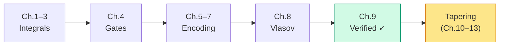

# Chapter 9: Checking Our Answer

_We have fifteen Pauli strings and fifteen coefficients. How do we know they're right? Chapter 8 checked the ladder algebra. Here we check what we built from it: the matrix, the states it acts on, and the energies in the intended physical sector._

## In This Chapter

- **What you'll learn:** How to verify an encoded Hamiltonian against a direct
  matrix, particle-number sectors, labelled states, and spectral invariants.
- **Why this matters:** A correct ladder algebra can still be fed the wrong
  integrals or labelled in the wrong order. Independent checks must cross
  those boundaries; a matching ground energy alone does not.
- **Prerequisites:** Chapters 1–8 (you have the 15-term Hamiltonian from all six encodings and understand both algebraic and numerical verification).

---

## The Verification Problem

Here is a sobering fact about fermion-to-qubit encoding: **most bugs produce plausible output.**

A wrong-convention Hamiltonian (Chapter 2, Error #1) can have real coefficients and plausible Pauli symmetries. A missing cross-spin block (Chapter 3, Mistake #1) can lose configuration-coupling terms while still looking like a valid Hamiltonian. A reversed operator ordering (Chapter 6, Mistake #2) flips signs but leaves much of the structure intact.

None of these errors needs to crash your code. Many change eigenvalues;
some preserve the entire spectrum. A basis permutation, for example,
can move the Hartree–Fock state to a different row without moving a single
eigenvalue. We need checks that say which of those properties they test.

For H₂ in STO-3G, we have an independent direct reference. Cross-encoding
agreement is a useful consistency check, but all implementations can agree on
the same bad tensor or basis permutation.

---

## From Pauli Sum to Matrix

This is the one place where we leave the symbolic world and build a matrix. We do this *only* for verification — the actual quantum simulation never needs a matrix.

Each single-qubit Pauli operator has a $2 \times 2$ matrix:

$$I = \begin{pmatrix}1&0\\0&1\end{pmatrix}, \quad X = \begin{pmatrix}0&1\\1&0\end{pmatrix}, \quad Y = \begin{pmatrix}0&-i\\i&0\end{pmatrix}, \quad Z = \begin{pmatrix}1&0\\0&-1\end{pmatrix}$$

A displayed 4-qubit string $IIZZ$ means $I_0I_1Z_2Z_3$.
In our integer-row convention its dense matrix is
$Z\otimes Z\otimes I\otimes I$, a $16\times16$ matrix.
The rightmost tensor factor acts on the least significant bit, qubit 0.
The full matrix is therefore

$$H = \sum_{\alpha=1}^{15} c_\alpha
\left(\sigma_{\alpha,3}\otimes\sigma_{\alpha,2}
\otimes\sigma_{\alpha,1}\otimes\sigma_{\alpha,0}\right).$$

For 4 qubits, this is a $16 \times 16$ Hermitian matrix. Diagonalising it gives 16 eigenvalues.

Dense matrix rows use the occupation integer $b=\sum_jn_j2^j$. Because
FockMap displays signatures as $P_0P_1P_2P_3$, the matrix builder reverses
the displayed signature and forms
$P_3\otimes P_2\otimes P_1\otimes P_0$. The displayed HF ket
$\lvert1100\rangle$ therefore has occupation integer and matrix row 3
(`0b0011`). The verifier applies every number operator to every labelled basis
state; spectrum equality alone cannot detect a basis permutation.

For JW, the reconstructed Pauli matrix equals the direct occupation-basis
matrix element-wise to numerical round-off in the canonical reference. The
two-electron ground state's HF determinant amplitude squared is
$0.9873339$. Other encodings may use a different qubit basis: require the
explicit basis transform before comparing their matrix elements with JW, even
when spectra agree.

### A matrix entry with a label attached

Consider the displayed HF state $|1100\rangle$, row 3.
The number operator for mode 0 is $(IIII-ZIII)/2$; in dense form it is
$I\otimes I\otimes I\otimes(I-Z)/2$ and returns eigenvalue one
on row 3. The operator for mode 2 is $(IIII-IIZI)/2$ and returns zero.
Reversing the Pauli factors incorrectly exchanges these conclusions.

The off-diagonal entry gives a second test. The displayed double excitation
is $|0011\rangle$, row 12. On $|1100\rangle$,
`XXYY` and `YYXX` each produce $-|0011\rangle$,
whereas `XYYX` and `YXXY` each produce $+|0011\rangle$.
Their coefficients are respectively $-g,+g,+g,-g$, with
$g=0.04530261550379918$ Ha. Hence

$$H_{12,3}=H_{3,12}=4g=0.18121046201519672\ {\mathrm{Ha}}.$$

The HF diagonal is $H_{3,3}=-1.831863646477506$ Ha.
These checks name states and matrix entries; they do not merely recognise
a familiar minimum eigenvalue.

### Build the independent matrix without Pauli strings

An independent occupation-space constructor can apply the original
fermionic monomials directly to every integer-labelled basis state.
For a ladder on mode $j$, read occupation bit $n_j$ and count occupied
bits below it. A creator on an already occupied mode gives zero; an
annihilator on an empty mode gives zero. Otherwise toggle bit $j$ and
multiply by $(-1)^{\sum_{\ell<j}n_\ell}$.

For each term, apply operators from right to left. In
$a_p^\dagger a_q^\dagger a_s a_r$, apply $a_r$ first, then $a_s$,
then $a_q^\dagger$, then $a_p^\dagger$. Recompute the lower-bit count
after each action: it belongs to the current intermediate determinant.
Add the resulting signed coefficient to the destination-row,
source-column entry. Use the raw physicist coefficient with the
one-half prefactor once.

This route shares the declared physical input but not the Pauli
multiplication and collection machinery. A separate PySCF calculation
checks the chemistry and sector energies. Independence is relative to
a failure mode: two implementations calling the same faulty integral
adapter are not independent tests of that adapter.

For another encoding, form the $U$ from Chapter 7 and compare
$U^\dagger H_{\mathrm{enc}}U$ with this occupation matrix. Check
$U^\dagger U=I$ first. A comparison of $H_{\mathrm{enc}}$ directly with
$H_{\mathrm{JW}}$ is appropriate only when their declared bases coincide.

> **Why 16 and not 6?** The 4-qubit Hilbert space has $2^4=16$ basis
> states, but only $\binom42=6$ have two electrons. Other eigenvalues
> describe other electron counts in this same fixed orbital model.
> They are not interchangeable with a neutral-molecule result.

### Project before attaching a particle-number label

In occupation order, the two-electron row indices are
$[3,5,6,9,10,12]$, displaying respectively
`1100`, `1010`, `0110`, `1001`, `0101`, `0011`.
The projector $\Pi_2$ is the diagonal matrix with ones on exactly those
rows. Since $[H,\hat N]=0$, the matrix block on these rows is invariant.
Diagonalise that $6\times6$ block to obtain the $N=2$ spectrum.

Do not diagonalise the full matrix and infer particle number from an
eigenvalue's position in a sorted list. Degenerate eigenvectors can be
arbitrary mixtures within the degenerate eigenspace. A sector block
declares the quantum number before solving; expectation values and
residuals can then check it.

---

## The Eigenspectrum of H₂

Diagonalising the particle-number blocks of the 15-term JW Hamiltonian gives:

| Sector ($N_e$) | Electronic eigenvalue (Ha) | Multiplicity |
|:---:|---:|:---:|
| 0 | $0$ | 1 |
| 1 | $-1.2533097866$ | 2 |
| 1 | $-0.4750688488$ | 2 |
| **2** | $\mathbf{-1.8523881736}$ | 1 |
| 2 | $-1.2458776961$ | 3 |
| 2 | $-0.8834567721$ | 1 |
| 2 | $-0.2319616660$ | 1 |
| 3 | $-1.1607201546$ | 2 |
| 3 | $-0.3595836390$ | 2 |
| 4 | $0.2080748418$ | 1 |

Multiplicity counts the number of states with that eigenvalue. Summing
within sectors gives $1,4,6,4,1$ states, respectively, for all 16 states.

The ground state of the physical 2-electron sector is $E_0^\text{el} = -1.8523881736$ Ha. Adding nuclear repulsion:

$$\boxed{E_0^\text{total} = E_0^\text{el} + V_{nn} = -1.8523881736 + 0.7151043391 = -1.1372838345 \text{ Ha}}$$

This is the Full CI ground-state energy for the stated non-relativistic
Hamiltonian, finite STO-3G orbital basis, 0.74 Å geometry, and two-electron
sector. The value comes from the committed PySCF/direct-matrix artifact
(Sun et al., 2020), not from cross-encoding agreement.

---

## How Good Is This?

Let's put the number in context by comparing with simpler approximations:

| Method | $E_\text{total}$ (Ha) | Error (kcal/mol) | What it captures |
|:---|:---:|:---:|:---|
| Hartree–Fock | $-1.1167593074$ | $12.88$ | Mean-field (no correlation) |
| MP2 | $-1.1298973810$ | $4.64$ | Perturbative correlation |
| Full CI (= our result) | $-1.1372838345$ | $0$ | Exact (within basis) |
| Chemical accuracy target | — | $< 1.0$ | The goal for quantum chemistry |

The Hartree–Fock error is $12.88$ kcal/mol for this model. Our Full CI result captures the entire correlation energy within the STO-3G basis. As Chapter 6 showed, configuration coupling makes the lower variational energy possible, but the final correlation energy contains both a change in diagonal populations and an off-diagonal interference contribution.

Of course, STO-3G is a minimal basis — the absolute energy is still far from the true Born–Oppenheimer value. But within the model space we've defined, our answer is exact.

> **The point of quantum simulation is not to replace the basis set.** It offers a different route to the finite-basis electronic problem when explicit Full CI is intractable. For H₂ in STO-3G (6 configurations), any laptop can do Full CI. For 50 electrons in 100 spin-orbitals, explicitly storing roughly $10^{29}$ configuration amplitudes is impossible. A quantum register avoids that storage, but a useful calculation still needs state preparation, adequate target-state overlap, Hamiltonian simulation, and precise measurement. Whether a quantum algorithm wins depends on those costs and on the best classical method for the particular molecule.

---

## What Numerical Agreement Actually Means

For a small Hermitian matrix, compute and sort its eigenvalues, retaining
all multiplicities. If $\lambda_k$ and $\lambda_k^{\mathrm{ref}}$ are the two
sorted lists, an explicit absolute acceptance condition is

$$\max_k|\lambda_k-\lambda_k^{\mathrm{ref}}|\leq\epsilon_E.$$

For this small H₂ reference, $\epsilon_E=10^{-10}$ Ha is a useful
comparison tolerance. It is a numerical software tolerance, not a claim
of chemical accuracy relative to nature. The printed ten-decimal tables
are for reading; use full-precision fixture values for the test.

Before diagonalising, require the correct dimensions, finite entries and
Hermiticity. For example, an entrywise check
$\max_{jk}|H_{jk}-\overline{H_{kj}}|\leq10^{-12}$ Ha rejects a broken
adjoint. After solving, inspect eigenpair residuals
$\|Hv_k-\lambda_kv_k\|_2$ and orthonormality of the eigenvectors if the
solver returns them. A routine that exhausted its iteration budget has
not produced a successful reference simply because it returned an array.

The matrix must remain complex. $Y$ has purely imaginary off-diagonal
entries and eigenvalues $-1,+1$. Replacing it by its real part produces
the zero matrix with eigenvalues $0,0$. The canonical H₂ JW matrix happens
to be real; that special case does not license a real-part projection in
a general Pauli eigensolver.

### Why spectral moments are not an eigenvalue tolerance

The **trace** of a square matrix is the sum of its diagonal entries.
The $k$th spectral moment is $\operatorname{tr}(H^k)=\sum_j\lambda_j^k$.
These quantities are convenient diagnostics: the first moment checks the
sum of eigenvalues, while $\operatorname{tr}(H^2)$ checks their squared
sum. For a Pauli expansion on $n$ qubits,

$$2^{-n}\operatorname{tr}(H)=c_I,\qquad
2^{-n}\operatorname{tr}(H^2)=\sum_P c_P^2$$

for real coefficients of Hermitian Pauli strings. The second equality
uses Pauli orthogonality, not pairwise commutation of the Hamiltonian terms.

Exact moments through the matrix dimension determine the characteristic
polynomial in exact arithmetic. Approximate moment agreement does not
bound eigenvalue errors by the same tolerance. Take

$$A=\operatorname{diag}(1,1),\qquad
B=\operatorname{diag}(1-\delta,1+\delta),\qquad \delta=10^{-7}.$$

The mean $k$th moment of $B$ is

$$\frac{(1-\delta)^k+(1+\delta)^k}{2}
=1+\binom{k}{2}\delta^2+O(\delta^4).$$

Even for $k=16$, the change is only about $1.2\times10^{-12}$,
comfortably below $10^{-10}$. Yet both eigenvalues moved by $10^{-7}$,
a thousand times the proposed eigenvalue tolerance. Splitting a
degeneracy hides at first order from these moments.

This is a weakness in an acceptance test, not a new failure of quantum
mechanics or of CAR. Keep moment checks as diagnostics and test the
eigenvalues themselves when an eigenvalue tolerance is claimed.

## Cross-Encoding Verification

After each implementation matches the independent fermionic matrix and state
order, compare all six spectra as an additional consistency check.

The verification procedure is pseudocode; the complete executable checks
live in the companions rather than in an ellipsis inside a code listing:

```text
For each encoder:
    build H from the same raw physicist tensor
    check all ladder adjoints and CAR
    construct the encoded occupation basis U
    compare U† H U with the independent fermionic matrix
    compare labelled number operators and HF energy
    compare sorted spectra in every particle-number sector
```

| Encoding | $E_0^\text{el}$ (Ha) | $\lvert\Delta E\rvert$ from JW |
|:---|:---:|:---:|
| Direct fermionic matrix | $-1.8523881736$ | reference |
| Jordan–Wigner Pauli matrix | $-1.8523881736$ | $< 10^{-12}$ |

The direct fermionic and independently derived JW Pauli matrices agree to
numerical precision. These two reference rows identify what is being
compared. Each package encoding has the same acceptance target, but
cross-encoding agreement alone cannot validate a shared bad input.

This is not a coincidence. It is a mathematical guarantee: every valid encoding preserves the canonical anti-commutation relations, and therefore preserves the operator algebra, and therefore preserves every eigenvalue. FockMap's test suite verifies the anti-commutation relations symbolically (no eigenvalues needed), but the eigenvalue comparison provides an independent numerical cross-check.

---

## A Verification Checklist

When building and verifying an encoded Hamiltonian, check these in order:

| # | Check | How | What failure means |
|:---:|:---|:---|:---|
| 1 | Input identity | Geometry, basis, raw convention, provenance and full entries | Wrong physical problem or input |
| 2 | Ladder algebra | All three CAR families and adjoints | Invalid encoded ladder representation |
| 3 | Full Pauli coefficients | Compare every simplified JW coefficient, not just 15 terms | Assembly or convention discrepancy |
| 4 | Matrix/order | Reversed dense factors; compare under the explicit basis map | Wrong operator or basis map |
| 5 | Labelled states | Number operators, HF row 3, coupling row 12 | State semantics not preserved |
| 6 | Physical blocks | Number commutator and sector dimensions | Sector extraction or conservation error |
| 7 | Direct eigenspectrum | Sorted eigenvalues with multiplicities and stated tolerance | Spectral discrepancy |
| 8 | Independent chemistry | Same geometry, basis and quantum numbers | Disagreement with the physical reference |

Term count, identity coefficient and spin-paired coefficients are useful
early diagnostics, not unique diagnoses. Fifteen terms can have fifteen
wrong coefficients. Equal identity coefficients can coexist with wrong
off-diagonal entries. A cross-encoding disagreement locates a problem
somewhere in the encoding/comparison path; it does not identify which
implementation is guilty without a reference.

### Make the tests fail on purpose

A useful **negative control** deliberately changes a known-good input or
intermediate result and checks that the relevant guard rejects it.
Reverse a labelled Pauli signature without updating the row convention:
the number-operator test should fail even if eigenvalues survive.
Flip one coupling coefficient: the full coefficient and matrix tests
should fail. Use $Y$ to check complex handling, and the split-degeneracy
example to reject a moment-only eigenvalue certificate.

The committed oracle is read-only input to verification. If it is
corrupted, the verifier should report a mismatch, not regenerate the
answer over the evidence. Regeneration is a separate, explicit operation
with reviewed provenance. Otherwise a green result may mean only that
the program agreed with what it just wrote.

---

## Encoding Stage Complete

With verification done, we have walked the complete path from molecule to validated qubit Hamiltonian:



The canonical direct matrix and the 15-term JW matrix now agree for H₂/STO-3G at 0.74 Å, with total ground-state energy $-1.1372838345$ Ha. Cross-encoding package parity remains a separate test: every implementation must reproduce this reference before its result is trusted.

But can we make it *smaller*? Can we remove qubits without losing physics? That's what tapering does — and it's where we go next.

---

## Key Takeaways

- CAR, direct matrix, labelled-state, sector and eigenvalue checks answer
  different questions. No single one replaces the others.
- The H₂/STO-3G ground-state energy at 0.74 Å is $E_0 = -1.1372838345$ Ha (Full CI, exact within basis).
- The direct fermionic matrix and independent JW Pauli matrix agree; all six package encodings must be checked against that external reference.
- Spectral moments are diagnostics, not an eigenvalue-error certificate.
- A basis permutation can preserve all eigenvalues while changing every state label.
- Matrix diagonalisation is used *only* for verification. The actual quantum simulation operates on the symbolic Pauli sum.

## Common Mistakes

1. **Verifying only the ground state.** Check the full spectrum (all particle-number sectors), not just $E_0$. Some bugs preserve the ground state but corrupt excited states.

2. **Comparing absolute energies across basis sets.** STO-3G and cc-pVDZ give different energies for the same molecule. Only compare within the same basis.

3. **Skipping verification for "trusted" code.** Even well-tested libraries can produce wrong results if the integral input is wrong. Verify the first Hamiltonian you build for any new molecule.

## Exercises

1. **Sector analysis.** The electronic 0-electron sector has eigenvalue 0.
   Explain this from right-to-left ladder action. What eigenvalue does it
   have if the separate $0.7151043391$ Ha nuclear constant is included?

2. **Correlation energy.** Compute the total Hartree–Fock energy of H₂ by
   hand using the **spatial-orbital** integrals:
   $E_{\mathrm{HF,total}}=2h^{\mathrm{spatial}}_{00}
   +[00\mid00]_{\mathrm{spatial}}+V_{nn}$.
   Both electrons occupy spatial orbital 0, with opposite spins.
   Verify that $E_\text{corr}=E_\text{FCI}-E_\text{HF}
   =-0.0205245271$ Ha, about $-12.88$ kcal/mol. Then reproduce
   Chapter 6's separate diagonal and off-diagonal expectation contributions.

3. **Independent reference.** Run `make verify-data` and inspect the full sector spectrum. Then compare each pinned FockMap encoding against that matrix rather than only against another encoding.

4. **A spectrum cannot label a state.** For
   $H=\hat n_0+3\hat n_1$ on two modes, exchange stored qubits 0 and 1.
   Show that the spectrum is unchanged but the energy assigned to displayed
   `10` changes if its label is not transformed.

5. **Moment counterexample.** For the matrices $A,B$ above, calculate
   $\operatorname{tr}(B)-\operatorname{tr}(A)$ and
   $\operatorname{tr}(B^2)-\operatorname{tr}(A^2)$ exactly in terms of
   $\delta$. Contrast them with the maximum sorted eigenvalue error.

## Further Reading

- Szabo, A. and Ostlund, N. S. *Modern Quantum Chemistry.* Background on
  Hartree–Fock and configuration interaction; the numerical table here is
  tied to the committed 0.74 Å fixture, not to a textbook's geometry.
- Helgaker, T., Jørgensen, P., and Olsen, J. *Molecular Electronic-Structure Theory.* Chapter 12 covers Full CI theory and implementation.

---

**Previous:** [Chapter 8 — Building a Tree Encoding](08-building-vlasov.html)

**Next:** [Chapter 10 — Why Tapering?](10-why-tapering.html)
