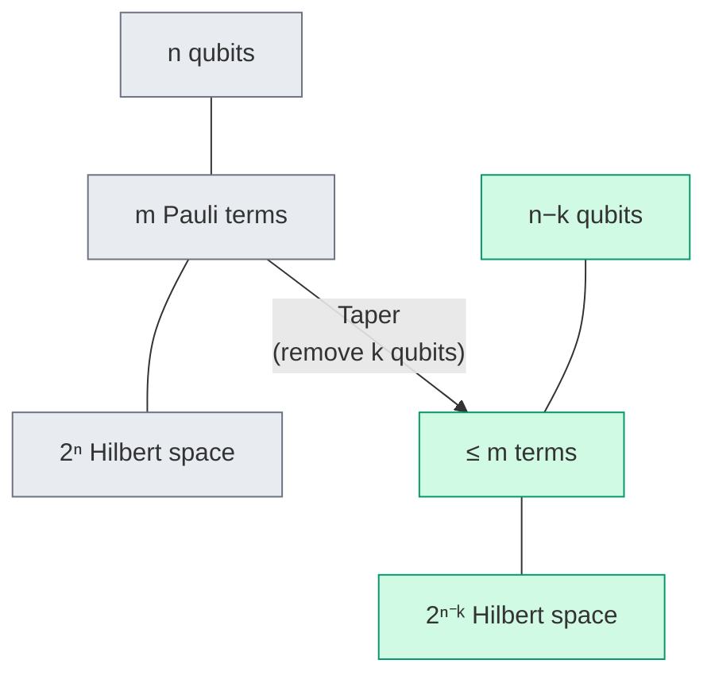

# Chapter 10: Why Tapering?

_The Hamiltonian is correct and verified. But it may be bigger than it needs to be. This chapter shows why encoded Hamiltonians often contain redundant qubits — and how to detect them._

## In This Chapter

- **What you'll learn:** How conserved binary quantum numbers become Pauli
  symmetries, which sector describes the intended molecule, and what can
  be removed without approximating that sector.
- **Why this matters:** Removing one logical qubit halves the represented
  Hilbert space. The circuit saving depends on the reduced terms, not
  on the qubit count alone.
- **Prerequisites:** Chapters 1–9 (you have a verified qubit Hamiltonian and understand Pauli strings).

---

## The Observation

Look again at the H₂ Hamiltonian from Chapter 6. Focus on the Pauli operators at each qubit position (in FockMap notation $ABCD$, the leftmost character is qubit 0):

| Term | String | q0 | q1 | q2 | q3 |
|:---:|:---:|:---:|:---:|:---:|:---:|
| 1 | $IIII$ | I | I | I | I |
| 2 | $IIIZ$ | I | I | I | **Z** |
| 3 | $IIZI$ | I | I | **Z** | I |
| 4 | $IZII$ | I | **Z** | I | I |
| 5 | $ZIII$ | **Z** | I | I | I |
| 6 | $IIZZ$ | I | I | **Z** | **Z** |
| 7 | $IZIZ$ | I | **Z** | I | **Z** |
| 8 | $IZZI$ | I | **Z** | **Z** | I |
| 9 | $ZIIZ$ | **Z** | I | I | **Z** |
| 10 | $ZIZI$ | **Z** | I | **Z** | I |
| 11 | $ZZII$ | **Z** | **Z** | I | I |
| 12 | $XXYY$ | **X** | **X** | **Y** | **Y** |
| 13 | $XYYX$ | **X** | **Y** | **Y** | **X** |
| 14 | $YXXY$ | **Y** | **X** | **X** | **Y** |
| 15 | $YYXX$ | **Y** | **Y** | **X** | **X** |

Every qubit has at least some terms with X or Y — no qubit is purely
diagonal (I/Z only) across all 15 terms. Thus H₂ under JW has **no
single-qubit Z symmetry**. It does have diagonal *multi-qubit* Pauli
symmetries. "Diagonal" and "single-qubit" are different restrictions.

For instance, $Z_0Z_2$ commutes with every diagonal term. Each of the four
coupling strings has X or Y at both positions 0 and 2. Moving $Z_0Z_2$
past one of those strings introduces two minus signs, so it commutes
with them too. The useful information is already there; JW has simply
not put it on a single wire.

## What Does Z₂ Mean?

The group $\mathbb Z_2$ has two elements. For a nontrivial Hermitian
Pauli operator $g$, the corresponding operations are $I$ and $g$,
with $g^2=I$. Applying $g$ twice does nothing. Its eigenvalues must be
$+1$ or $-1$, because $\lambda^2=1$.

If $[H,g]=Hg-gH=0$, time evolution preserves each eigenspace of $g$.
An eigenspace with specified eigenvalue is a **symmetry sector**.
For one generator, the two projectors are

$$\Pi_\pm=\frac{I\pm g}{2}.$$

They satisfy $\Pi_\pm^2=\Pi_\pm$, $\Pi_+\Pi_-=0$ and
$\Pi_++\Pi_-=I$. Commutation with $H$ implies that the off-block
operators $\Pi_+H\Pi_-$ and $\Pi_-H\Pi_+$ vanish.
States in one sector evolve without leaking into the other.

For several generators, we need them to commute with *one another* as
well as with $H$. With $k$ independent commuting Pauli generators and
consistent eigenvalues $\lambda_i$, the sector projector is

$$\Pi_{\boldsymbol\lambda}
=\prod_{i=1}^k\frac{I+\lambda_i g_i}{2}.$$

Here independent means that no nonempty product gives identity up to
phase. Such a nonempty sector has dimension $2^{n-k}$ on $n$ qubits.
This dimension explains the qubit saving. It does not claim that the
entire original spectrum fits on the smaller register.

### Where diagonal symmetries come from

Our electronic Hamiltonian conserves total electron number
$\hat N=\sum_j\hat n_j$. Under JW, this is a sum
$(nI-\sum_jZ_j)/2$, not itself a Pauli string with only two eigenvalues.
Its **parity** is the binary quantity $(-1)^N$, represented by

$$(-1)^{\hat N}=\prod_{j=0}^{n-1}(I-2\hat n_j)=\prod_{j=0}^{n-1}Z_j.$$

Even particle numbers give $+1$; odd particle numbers give $-1$.
Conservation of $N$ implies conservation of its parity, but the converse
does not hold. Both zero and two electrons have even parity.

The cumulative parity encoding from Chapter 7 puts this product onto the
last qubit, because $b_{n-1}=N\bmod2$. It changes the storage of the
conserved quantity, not the conservation law.

For the spin-independent Hamiltonian used here, alpha and beta electron
numbers are conserved separately. Define

$$N_\alpha=\sum_{j\ {\rm even}}n_j,\quad
N_\beta=\sum_{j\ {\rm odd}}n_j,\quad
N=N_\alpha+N_\beta,\quad M_s=\frac{N_\alpha-N_\beta}{2}.$$

$M_s$ is the spin projection in units of $\hbar$; it is the eigenvalue
of $S_z/\hbar$. It is not the total-spin quantum number $S$, whose
square operator has eigenvalue $S(S+1)\hbar^2$. A two-electron singlet
and the $M_s=0$ component of a triplet both have $M_s=0$.
Parity provides still less information: many values of $N_\alpha$
can have the same alpha parity.

These distinctions matter when attaching a molecular name to an energy.
Fixing total parity alone does not specify neutral H₂. Fixing $M_s=0$
alone does not specify a singlet. A point-group label, when available,
is a further spatial-symmetry condition, not another name for spin.

## The H₂ Physical-Sign Ledger

We will carry the same example through Chapters 11 and 12. The target is
the neutral, two-electron, $M_s=0$ problem in the canonical four-mode
STO-3G basis. Interleaved indices are $0\alpha,0\beta,1\alpha,1\beta$.
Solving $N=2$, $M_s=0$ gives $N_\alpha=N_\beta=1$.

Choose the two commuting generators

$$g_\alpha=Z_0Z_2,\qquad g_\beta=Z_1Z_3.$$

Their eigenvalues follow *before* any eigensolver call:

| Physical input | Generator | Required sign |
|:---|:---:|:---:|
| One alpha electron | $g_\alpha=(-1)^{\hat N_\alpha}$ | $-1$ |
| One beta electron | $g_\beta=(-1)^{\hat N_\beta}$ | $-1$ |
| Two electrons in total | $g_\alpha g_\beta=Z_0Z_1Z_2Z_3$ | $+1$ |

The third row is the product of the first two, not a third independent
qubit removal. There are just two alpha modes and two beta modes here.
Odd alpha count therefore means *exactly one* alpha electron, and
likewise for beta. This special small basis makes the two parity
constraints equivalent to $N=2,M_s=0$. With four alpha modes, odd
parity would allow one or three alpha electrons; that equivalence would
be lost.

The surviving occupation labels are:

| Displayed occupation | Integer row | Occupied modes | $(g_\alpha,g_\beta)$ |
|:---:|:---:|:---|:---:|
| `1100` | 3 | $0,1$ (HF) | $(-1,-1)$ |
| `0110` | 6 | $1,2$ | $(-1,-1)$ |
| `1001` | 9 | $0,3$ | $(-1,-1)$ |
| `0011` | 12 | $2,3$ | $(-1,-1)$ |

The other two $N=2$ determinants, `1010` and `0101`, have respectively
$M_s=+1$ and $M_s=-1$ and are not in this block.
The four surviving determinants can still form singlet and triplet
states. We have not selected total spin by calling the block $M_s=0$.

### Put the parities on two wires

Consider the reversible bit transformation

$$b_0=n_0,\quad b_1=n_1,\quad
b_2=n_2\oplus n_0,\quad b_3=n_3\oplus n_1.$$

CNOT$(0,2)$ and CNOT$(1,3)$ implement it. The gates have disjoint
supports, so their order does not matter in this particular pair.
Let their product be $U$. Then

$$Ug_\alpha U^\dagger=Z_2,\qquad
Ug_\beta U^\dagger=Z_3.$$

In the selected sector, $b_2=b_3=1$, since $Z|1\rangle=-|1\rangle$.
Retain $b_0,b_1$ and discard those two *fixed* bits.
The HF label `1100` becomes `1111` under $U$ and reduces to `11`;
the double excitation `0011` stays `0011` and reduces to `00`.

Chapter 11 applies the fixed-bit substitution rule. Chapter 12 derives
the generator search and carries every Hamiltonian coefficient through
this same $U$. There is no default-positive sector hidden in the notation.

---

## What Tapering Gains You

The benefits are concrete and multiplicative:

| What shrinks | Factor | Example (12 → 9 qubits) |
|:---|:---:|:---|
| Logical qubit count | $-k$ | 3 fewer data-register wires |
| Hilbert space | $2^{-k}$ | $4096 \to 512$ (8× smaller) |
| Circuit width | $-k$ | 3 fewer wires in every gate layer |
| Pauli weight | often reduces | Shorter Z-chains after qubit removal |
| Term count | often reduces | Some terms collapse to identity |

And these savings **compound** with encoding choice. A ternary-tree encoding can combine logarithmic-weight operators with a smaller, correctly tapered register.

---

## The Two Levels of Tapering

FockMap implements two levels of increasing generality:

### Level 1: Single-qubit Z detection

A qubit $j$ is *diagonally taperable* if every term in the Hamiltonian has only I or Z at position $j$ — never X or Y. This means qubit $j$'s value is determined by symmetry: it is always $+1$ or always $-1$ in the sector we care about, and it never gets flipped during the simulation. We can fix it to that value and remove it from the problem entirely.

**How you detect it:** Look at each qubit position across all Pauli terms. If you never see X or Y in that column, the qubit is taperable. It's a simple scan — FockMap checks this in one pass over the Hamiltonian.

### Level 2: General Clifford

Sometimes no *single* qubit is purely diagonal, but a *combination* of qubits is. For example, $Z_0 Z_1$ might commute with every Hamiltonian term even though $Z_0$ alone does not. This means the product of their Z eigenvalues is conserved, even though neither single-qubit Z is.

In this case, we can apply a small rotation circuit (built from Hadamard, S, and CNOT gates — the same gates from Chapter 4) that rearranges the Hamiltonian so that the conserved combination ends up on a single qubit. After the rotation, that qubit is diagonally taperable, and we remove it just like in Level 1.

**How you detect it:** Search for Pauli operators that commute with every
nonzero Hamiltonian term. This gives candidates. Then select an
independent subset that also commutes pairwise and identify its physical
eigenvalues. Chapter 12 develops the binary linear algebra and the signed
Clifford transformation.

The important thing at this stage is the *idea*: even when the symmetry isn't visible on a single qubit, it may be hiding in a combination of qubits, and a rotation can expose it.

We'll work through the diagonal case in Chapter 11, the Clifford generalisation in Chapter 12, and concrete benchmarks in Chapter 13.

---

## When Tapering Is Exact

With a verified symmetry generator and the correct sector, tapering does not approximate or truncate the Hamiltonian in that sector.

When we remove a tapered qubit, we are removing a degree of freedom whose value was *already determined* — fixed by a conservation law (like particle number or spin parity) that the Hamiltonian respects. The qubit was never free to vary in the first place; it was constrained by symmetry to a single eigenvalue in the sector we're studying. Removing it simply acknowledges this constraint explicitly.

The eigenvalues of the tapered Hamiltonian are a *subset* of the eigenvalues of the original — specifically, the eigenvalues in the chosen symmetry sector. Eigenvalues in other sectors are intentionally excluded. Choosing the wrong sector therefore changes the physical problem rather than giving a harmless approximation.

There is a precise map behind "remove". Let $V$ insert the fixed target
bits into a smaller register, so $V^\dagger V=I$ on that register.
Then

$$H_{\rm red}=V^\dagger UHU^\dagger V,\qquad
|\psi\rangle_{\rm full}=U^\dagger V|\psi\rangle_{\rm red}.$$

Because the selected subspace is invariant, this compressed Hamiltonian
has exactly its sector's eigenvalues. Apply the same transformation to
observables. An observable that changes the chosen symmetry sector
cannot in general be evaluated as a within-sector operator without
additional machinery.

This does not contradict Chapter 7's $n$-qubit representation of the
full CAR for $n$ modes. A single fermionic creator changes particle
parity and leaves the tapered sector. We are now representing a
Hamiltonian and suitable observables *within a sector*, not every
creation and annihilation operation on the entire Fock space.

This is why we taper *before* Trotterization, not after: the circuit should operate on the physically relevant Hilbert space from the start, not carry redundant qubits through every gate layer.

---

## Key Takeaways

- A Z₂ symmetry is a conserved two-valued operator. A Clifford basis
  change can store its sector label on a removable qubit.
- Removing a qubit with a verified generator and physical sector preserves that sector's spectrum exactly while reducing downstream Hamiltonian-simulation cost.
- Single-qubit Z generators are the simplest case. A multi-qubit Z
  product is also diagonal, but needs a basis change before the same
  single-wire substitution can remove it.
- Encoding and tapering compound, but in a fixed order: encode the fermionic Hamiltonian, identify symmetries in that qubit representation, select the physical sector, taper, then compile.

## Common Mistakes

1. **Confusing diagonal candidates with all symmetries.** H₂/JW has no
   single-qubit diagonal candidate because the coupling terms put X/Y on every
   qubit, but multi-qubit symmetries may still exist.

2. **Confusing tapering with truncation.** Active-space reduction changes
   the model. Tapering preserves the selected invariant sector exactly;
   it intentionally excludes other sectors and does not retain arbitrary
   cross-sector observables.

3. **Tapering after circuit compilation.** Taper before Trotterization, not after. The circuit should be built on the smaller Hamiltonian.

## Exercises

1. **Parity is not number.** List all possible electron numbers in six
   modes with total parity $+1$. Can that sign alone specify a neutral
   two-electron calculation?

2. **Parity encoding candidate.** Under the Parity encoding, identify the qubit
   storing total electron-number parity for a particle-conserving Hamiltonian.
   Derive its eigenvalue for the target electron number before tapering it.

3. **Scaling impact.** A hypothetical 14-to-11 reduction shrinks the Hilbert
   space by what factor? Explain why the CNOT reduction cannot be inferred
   without the post-taper term and weight distribution.

4. **Follow the ledger.** Apply the two CNOT bit rules above to each of
   the four surviving H₂ determinants. List its reduced label and integer
   row. Explain why two independent signs remove two qubits, although the
   table also contains a third conserved parity.

## Further Reading

- Bravyi, S., Gambetta, J. M., Mezzacapo, A., and Temme, K. "Tapering off qubits to simulate fermionic Hamiltonians." arXiv:1701.08213 (2017). The foundational paper on qubit tapering.

---

**Previous:** [Chapter 9 — Checking Our Answer](09-verification.html)

**Next:** [Chapter 11 — Diagonal Z₂ Symmetries](11-diagonal-z2.html)
