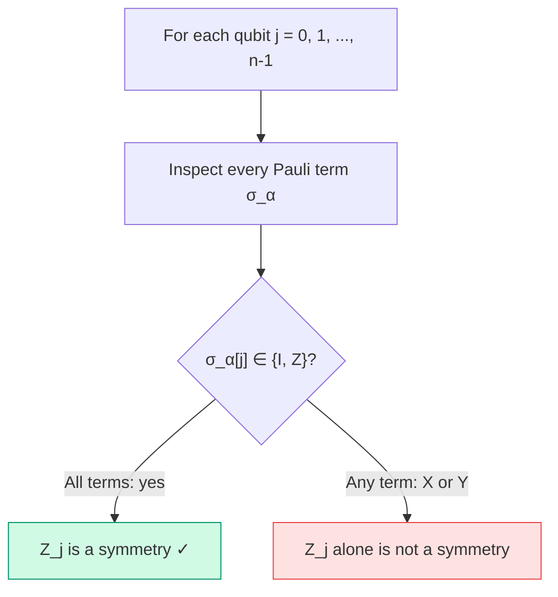

# Chapter 11: Diagonal Z₂ Symmetries

_The simplest form of tapering: find qubits that are always I or Z, fix their eigenvalue, and remove them._

## In This Chapter

- **What you'll learn:** The single-qubit Z detection algorithm, the
  coefficient substitution rule, and its application to the H₂ physical
  signs derived in Chapter 10.
- **Why this matters:** Once a generator has been put on a single wire,
  its sector can be represented without that wire. No approximation is
  introduced within the selected invariant subspace.
- **Prerequisites:** Chapter 10 (you understand why tapering is valuable and what Z₂ symmetries are).

---

## The Detection Algorithm

Given a simplified Hamiltonian $\hat H=\sum_\alpha c_\alpha\sigma_\alpha$
with distinct nonzero Pauli terms, qubit $j$ has a **single-qubit Z
symmetry** if:

$$\forall \alpha:\; \sigma_\alpha[j] \in \{I, Z\}$$

This is exactly the condition $[H,Z_j]=0$. Multiplying by $Z_j$ commutes
with I/Z and anticommutes with X/Y at that position. For distinct
simplified Pauli terms, the unwanted commutators cannot cancel one
another: multiplication by a fixed Pauli maps distinct strings to
distinct strings up to phase. Terms with coefficients cancelled to zero
must therefore be removed before scanning.

The API calls this `diagonalZ2SymmetryQubits`. Its name does not mean it
finds every diagonal Pauli symmetry. The multi-qubit product $Z_0Z_2$
in Chapter 10 is diagonal too, but is outside this column-by-column test.

The algorithm is a single scan:



**Complexity:** $O(nm)$, where $n$ is the qubit count and $m$ is the
number of stored terms. Wall-clock time depends on representation and
implementation; this book does not infer molecule timings from the asymptotic
scan alone.

### In FockMap

The F# listings in this chapter are contextual excerpts from
`code/ch11-diagonal-z2.fsx`. That runnable script references FockMap
0.9.0 and opens `System.Numerics`, `Encodings` and `Encodings.Tapering`.
Here `Complex(x,0.0)` is a real coefficient stored in a complex number,
and `PauliRegisterSequence` collects the weighted registers into a sum.

```fsharp
let symQubits = diagonalZ2SymmetryQubits hamiltonian
// Returns int[] of taperable qubit indices
```

For a new, deliberately all-diagonal toy:

```fsharp
let h =
    [| PauliRegister("ZIZI", Complex(0.8, 0.0))
       PauliRegister("ZZII", Complex(-0.4, 0.0))
       PauliRegister("IIZZ", Complex(0.3, 0.0))
       PauliRegister("IZIZ", Complex(0.2, 0.0)) |]
    |> PauliRegisterSequence

diagonalZ2SymmetryQubits h
// → [| 0; 1; 2; 3 |]  — all four qubits are diagonal!
```

Every term has only I or Z at every position. The Hamiltonian is diagonal in
the computational basis, so a basis state attains its minimum eigenvalue.
Degeneracy can still permit coherent eigenstates; “diagonal” is the precise
property used by the detector.

### A mixed toy

In practice, molecular Hamiltonians are *mixed*: some qubits are diagonal, others are not. Consider a Hamiltonian where qubits 0 and 2 are always I/Z, but qubits 1 and 3 have X and Y terms:

```fsharp
let hmixed =
    [| PauliRegister("ZIZI", Complex(0.5, 0.0))   // q0=Z, q1=I, q2=Z, q3=I
       PauliRegister("IXIX", Complex(-0.3, 0.0))   // q0=I, q1=X, q2=I, q3=X
       PauliRegister("ZIIZ", Complex(0.2, 0.0))    // q0=Z, q1=I, q2=I, q3=Z
       PauliRegister("IYIY", Complex(0.1, 0.0)) |] // q0=I, q1=Y, q2=I, q3=Y
    |> PauliRegisterSequence

diagonalZ2SymmetryQubits hmixed
// → [| 0; 2 |]
```

Qubit 0 has Z, I, Z, I across the four terms — all diagonal. Qubit 2 has Z, I, I, I — also all diagonal. But qubit 1 has I, X, I, Y — the X and Y disqualify it. Qubit 3 has I, X, Z, Y — also disqualified.

Only qubits 0 and 2 satisfy this single-qubit diagonal test. Qubits 1 and 3
appear with X/Y support and cannot be removed by this rule. That statement is
about the detected symmetry form, not a classical-versus-quantum partition.

> **The intuition:** in a selected symmetry sector, a tapered generator
> eigenvalue is fixed. Removing its target qubit represents that constraint;
> it is not a partition into “classical” discarded qubits and “quantum” kept
> qubits.

---

## Sectors: Choosing Eigenvalues

For each diagonal Z₂ qubit, we **choose** whether to fix its $Z$ eigenvalue to $+1$ or $-1$. This choice is called a **sector**.

A sector is a list of (qubit, eigenvalue) pairs:

```fsharp
let sector = [ (1, +1); (3, -1) ]
// Fix qubit 1 to eigenvalue +1, qubit 3 to eigenvalue -1
```

**Physical interpretation:** The signs label the particular generators
being fixed. If a generator represents particle-number parity, its sign
selects even versus odd count, not a unique particle number. A generator
related to spin can similarly encode a parity rather than a complete
$M_s$ or total-spin label. Identify the operator first, then interpret
its sign.

For example, if qubit $j$ represents the parity of the total electron number (even vs odd), then:
- Sector $+1$ → even number of electrons
- Sector $-1$ → odd number of electrons

If you know your molecule has 2 electrons (even), you choose sector $+1$ for that qubit. This projects the Hamiltonian onto the physically relevant subspace.

For $k$ diagonal qubits, there are $2^k$ possible sectors. Each gives a valid tapered Hamiltonian with the eigenvalues of that sector, but sectors can represent different particle numbers, spins, or point-group quantum numbers. A molecular calculation must select the sector matching the intended physical system. Sweeping all sectors is useful for reconstructing or debugging the full spectrum; taking the lowest value across them may instead select an ion or a different spin state.

---

## How Sector Fixing Modifies Terms

The modification rule is simple:

For each term $c_\alpha \sigma_\alpha$ and each tapered qubit $(j, \lambda)$:

1. If $\sigma_\alpha[j] = I$: no change to the coefficient
2. If $\sigma_\alpha[j] = Z$: multiply the coefficient by $\lambda$ (the eigenvalue: $+1$ or $-1$)
3. Remove position $j$ from the Pauli string

### Worked Example

Start with:

$$\hat{H} = 0.8\,\text{ZIZI} - 0.4\,\text{ZZII} + 0.3\,\text{IIZZ} + 0.2\,\text{IZIZ}$$

Fix sector $[(1, +1),\; (3, -1)]$:

| Original term | Qubit 1 | Factor | Qubit 3 | Factor | New coeff | Remaining Pauli |
|:---:|:---:|:---:|:---:|:---:|:---:|:---:|
| $0.8\,\text{ZIZI}$ | I | $\times 1$ | I | $\times 1$ | $0.8$ | ZZ |
| $-0.4\,\text{ZZII}$ | Z | $\times (+1)$ | I | $\times 1$ | $-0.4$ | ZI |
| $0.3\,\text{IIZZ}$ | I | $\times 1$ | Z | $\times (-1)$ | $-0.3$ | IZ |
| $0.2\,\text{IZIZ}$ | Z | $\times (+1)$ | Z | $\times (-1)$ | $-0.2$ | II |

**Result:** $\hat{H}' = 0.8\,\text{ZZ} - 0.4\,\text{ZI} - 0.3\,\text{IZ} - 0.2\,\text{II}$

Four qubits → two qubits. The eigenvalues of $\hat{H}'$ are exactly the eigenvalues of $\hat{H}$ in the $(+1, -1)$ sector.

### Check the block, including its row order

The original positions being removed are 1 and 3. Keep positions 0 and 2,
in that order, and call the remaining bits $b_0,b_1$. Since
$Z_1=+1$ fixes old bit 1 to zero and $Z_3=-1$ fixes old bit 3 to one,
the insertion map is

$$V|b_0b_1\rangle=|b_0,0,b_1,1\rangle.$$

The original row is $8+b_0+4b_1$. Thus reduced integer rows
$0,1,2,3$ correspond to original rows $8,9,12,13$, not four adjacent
rows. Evaluating the reduced Pauli sum gives

$$H'=\operatorname{diag}(-0.1,-0.9,-1.1,1.3).$$

Selecting those same rows and columns of the original $16\times16$
matrix gives exactly this matrix. The eigenvalues are the four diagonal
entries; sorting gives $(-1.1,-0.9,-0.1,1.3)$.
We have not calculated the other three choices of $(Z_1,Z_3)$, and
we have not claimed that this sector contains the toy's global ground
state. The requested sector is the problem we solved.

The map $V$ also explains why the substitution is exact. On its image,
$Z_1V=+V$ and $Z_3V=-V$, so every deleted Z can be replaced by its
eigenvalue inside $V^\dagger HV$. An X on either deleted position would
take us out of that image. Dropping such an X is not tapering; the
single-qubit detector prevents that operation.

### In FockMap

```fsharp
let result = taperDiagonalZ2 [ (1, 1); (3, -1) ] h

printfn "%d → %d qubits" result.OriginalQubitCount result.TaperedQubitCount
// This diagonal toy: 4 → 2 after explicitly fixing q1=+1 and q3=-1

printfn "Removed: %A" result.RemovedQubits
// [| 1; 3 |]
```

The indices in the sector list refer to the original Hamiltonian, not
to a string whose earlier positions have already been removed. A safe
implementation accumulates all sign factors and deletes the complete
set of positions together. Deleting qubit 1 first and then treating
"qubit 3" as a position in the shorter string is an off-by-one error
with perfectly plausible output.

## Continue the H₂ Ledger

In Chapter 10 we selected $g_\alpha=Z_0Z_2=-1$ and
$g_\beta=Z_1Z_3=-1$, and chose
$U=\mathrm{CNOT}(0,2)\mathrm{CNOT}(1,3)$.
Write $\widetilde H=UHU^\dagger$. In this representation,
the same signs are $Z_2=Z_3=-1$.
The original JW Hamiltonian has no single-qubit candidates;
$\widetilde H$ does. The operation in this chapter applies to
$\widetilde H$, not directly to the original $H$.

For example, the original term
$0.12062523483390411\,ZIZI$ is proportional to $g_\alpha$.
Conjugation makes it
$0.12062523483390411\,IIZI$.
Fixing $Z_2=-1$ turns it into
$-0.12062523483390411\,II$ on the two kept qubits.
Its contribution has become an energy offset; it has not disappeared.
The analogous $IZIZ$ term contributes the same negative offset from
$g_\beta$.

Let $g=0.04530261550379918$ Ha. The four coupling terms become

$$-g\,YYII+g\,YYZI+g\,YYIZ-g\,YYZZ.$$

Their factors on the removed positions give

$$(-g-g-g-g)\,YY=-4g\,YY.$$

The final coefficient is negative even though two original coefficients
were positive. Applying the signs *before* collecting terms is essential.
For example, `YYZI` contributes $-g\,YY$, not $+g\,YY$.
Chapter 12 derives all four conjugated strings and the complete matrix.

The state mapping stays with the coefficients:

| Original occupation | After $U$ | Reduced label | Reduced integer row |
|:---:|:---:|:---:|:---:|
| `0011` | `0011` | `00` | 0 |
| `1001` | `1011` | `10` | 1 |
| `0110` | `0111` | `01` | 2 |
| `1100` | `1111` | `11` | 3 |

In integer row order, the association is old rows $[12,9,6,3]$.
$U$ keeps old bits 0 and 1 unchanged; this is the useful check on the
two middle entries. Their diagonal energies happen to agree, so
comparing diagonals alone would not detect a swapped label.

The insertion-and-return map, which avoids relying on any table, is

$$|\psi\rangle_{\rm full}
=U^\dagger\bigl(|\psi\rangle_{0,1}\otimes|11\rangle_{2,3}\bigr),$$

where the tensor notation names wire groups rather than reversing our
integer-row convention. The full occupations reconstructed from reduced
bits are $(b_0,b_1,1\oplus b_0,1\oplus b_1)$.
This is also how reduced eigenvectors recover their physical labels.

---

## The Convenience Helper

For quick exploration, taper all detected qubits in the $+1$ sector:

```fsharp
let auto = taperAllDiagonalZ2WithPositiveSector hamiltonian

// Equivalent to:
// let qs = diagonalZ2SymmetryQubits hamiltonian
// let sector = qs |> Array.map (fun q -> (q, 1)) |> Array.toList
// let auto = taperDiagonalZ2 sector hamiltonian
```

This is fine for API exploration but not for a molecular result: the $+1$ sector may not have the required electron number or spin. For a physical calculation, derive each generator eigenvalue from known quantum numbers and verify the tapered spectrum against that untapered sector.

---

## Validation

FockMap rejects non-diagonal targets and invalid eigenvalues. These
examples are contextual error demonstrations, not a script to run
straight through:

```fsharp
// Non-diagonal qubit → error
let nonDiagonal =
    PauliRegisterSequence [| PauliRegister("XI", Complex.One) |]
taperDiagonalZ2 [(0, 1)] nonDiagonal
// → ArgumentException: "Qubit 0 is not a diagonal Z2 symmetry"

// Invalid eigenvalue → error
taperDiagonalZ2 [(0, 0)] hamiltonian
// → ArgumentException: "Sector eigenvalues must be +1 or -1"
```

These guards prevent the two most common tapering bugs: applying tapering to a qubit that has X or Y terms (which would silently drop those terms), and using an eigenvalue other than $\pm 1$ (which would corrupt the coefficients).

---

## Key Takeaways

- Detection is a single scan: $O(n \times m)$.
- Sector choice selects which quantum-number subspace to project into.
- Each term's coefficient is multiplied by $\pm 1$ per tapered qubit (depending on I vs Z), then the qubit position is removed.
- A sector sweep is a spectrum diagnostic, not a substitute for identifying the molecule's particle-number and spin sector.
- FockMap validates inputs to prevent silent errors.

## Sector Selection: A Practical Workflow

Choosing the correct sector is a common source of confusion for first-time practitioners. Here is a concrete decision procedure:

1. **If you know the conserved quantities** (e.g., particle number parity, spin projection), compute the expected eigenvalue for each generator and set the sector accordingly. For molecular ground states, the particle number is fixed, so parity-related generators should be set to match the electron count.

2. **If the generator-to-quantum-number map is unclear**, derive it before reporting a molecular energy. A sweep over all $2^k$ sectors can show how the full spectrum decomposes and can expose a sign mistake, but its global minimum need not belong to the intended molecule.

3. **For production workflows**, compare the tapered spectrum with the matching untapered sector (if computable) or with a reference labelled by the same electron number and spin. A sector mismatch can be either higher or lower than the desired molecular energy.

## Common Mistakes

1. **Assuming the $+1$ sector is physical.** Generator signs must be derived from the target electron number, spin, and other conserved quantum numbers.

2. **Tapering a non-diagonal qubit.** FockMap catches this, but if you're implementing by hand, silently dropping X/Y terms is the most dangerous bug.

3. **Forgetting to combine like terms after tapering.** Removing qubits can make previously distinct Pauli strings identical. The terms must be re-accumulated.

## Exercises

1. **Substitute a different sector.** For the four-term diagonal toy,
   fix $(Z_1,Z_3)=(-1,+1)$. Write the reduced Pauli sum on old qubits
   0 and 2 and its four diagonal entries in integer order.

2. **Collision and cancellation.** Let
   $H=0.7\,IX+0.7\,ZX+0.2\,ZI$.
   Identify the single-qubit Z candidate. Fix it to $-1$, collect the
   reduced terms, and compute the two eigenvalues. Explain why the
   $IX$ term does not prevent this particular removal.

3. **The H₂ offset.** The identity coefficient before reduction is
   $-0.8121706072487134$ Ha, and the two spin-parity coefficients
   are both $0.12062523483390411$ Ha. Derive their combined reduced
   identity coefficient in the physical $(-1,-1)$ sector.

4. **Restore a state.** Take reduced H₂ label `10`.
   Insert $b_2=b_3=1$, undo the two CNOTs, and identify its original
   occupation label, row and $(N_\alpha,N_\beta)$.

## Further Reading

- Bravyi, S., Gambetta, J. M., Mezzacapo, A., and Temme, K. "Tapering off qubits to simulate fermionic Hamiltonians." arXiv:1701.08213 (2017). The foundational paper on exploiting Z₂ symmetries to reduce qubit count.

---

**Previous:** [Chapter 10 — Why Tapering?](10-why-tapering.html)

**Next:** [Chapter 12 — General Clifford Tapering](12-clifford-tapering.html)
