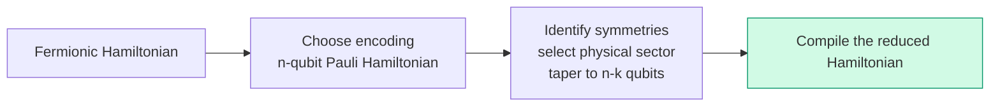
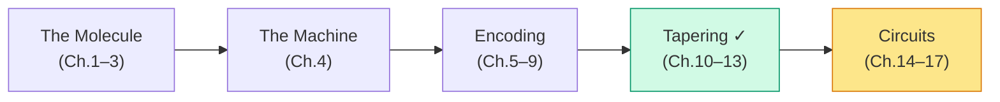

# Chapter 13: Tapering Benchmarks

_Numbers, not promises. We can now count the cost of the H₂ reduction we actually derived, and distinguish it from what a smaller register merely suggests._

## In This Chapter

- **What you'll learn:** Reproducible before-and-after counts for canonical
  H₂ and three fully specified toy Hamiltonians, with the sector and
  compilation assumptions attached to each result.
- **Why this matters:** Tapering sounds good in theory. This chapter shows exactly how good — and where the limits are.
- **Prerequisites:** Chapters 10–12 (you understand both diagonal and Clifford tapering).

---

## Methodology

For each test system, we:
1. Build the encoded Hamiltonian (JW encoding)
2. Count: qubits, terms, max weight, total CNOT cost per Trotter step
3. Select verified commuting symmetries and their physical-sector eigenvalues
4. Re-count the same metrics on the tapered Hamiltonian
5. Report the reduction

The **weight** $w_k$ counts nonidentity factors of a Pauli string.
For this chapter the compiler model is the logical CNOT staircase:
one Pauli rotation of weight $w\geq1$ costs $2(w-1)$ CNOTs.
The identity has weight zero and contributes no CNOTs, so the correct
sum over all Hamiltonian terms is

$$C_{\mathrm{step}}=\sum_k2\max(w_k-1,0).$$

The maximum prevents an identity term from being counted as negative
two gates. Identity still contributes to energies. We omit its
uncontrolled global-phase gate in the rotation count and retain its
coefficient in every Hamiltonian and matrix.

This is one first-order product-formula step, one rotation for each
nonidentity simplified term. We count no routing SWAPs, cross-term
CNOT cancellations, native-gate synthesis or error-correction overhead.
Terms can be ordered lexicographically by displayed signature for
reproducibility; that order does not change this unoptimised sum, though
it does affect product-formula error and opportunities for cancellation.
The counts are logical operations, not elapsed time or hardware depth.

All tables count distinct nonzero Pauli terms *after* like-term
collection. For H₂ the zero threshold is $10^{-12}$ Ha, matching the
canonical oracle. The toy coefficients are exact stated decimals;
their algebraic reductions need no molecular input and use arbitrary
consistent energy units rather than a claimed molecular Hartree value.

## Canonical H₂: An Auditable Molecular Row

Here is the input and representation record behind the molecular counts.
It is deliberately more specific than "H₂, four qubits".

| Item | Value |
|:---|:---|
| Geometry and orbital basis | H–H distance 0.74 Å; STO-3G; two spatial orbitals |
| Orbital reduction | None: no frozen core or omitted active orbital |
| Spin-orbital order | Interleaved $0\alpha,0\beta,1\alpha,1\beta$ |
| Input convention | Raw physicist spin integrals; builder supplies the one-half prefactor |
| Input size | Four one-body entries; 32 raw two-body entries |
| Package | Public FockMap 0.9.0, source `96320a56786393269fd681c67c66df88058a8b8f` |
| Reference input | Research source `66ebdfe255c0cc6ba25a6d1b76b58401aee3ab06`, `papers/results/h2_sto3g/physicist_spin_integrals.json` |
| Input SHA-256 | `6539afb30a1c03ec89202a2960a06c6580a91afaebf13a6cadbcfd32c2d71812` |
| Encoding and labels | JW; q0-leftmost display; row $\sum_jn_j2^j$; reversed dense factors |
| Electronic coefficient oracle | `code/h2_0.74_oracle.json` |
| Nuclear constant | $0.7151043390810812$ Ha, kept separate |
| Primary tapered sector | $Z_0Z_2=-1,\ Z_1Z_3=-1$, hence $N=2,M_s=0$ for this four-mode basis |
| Clifford and retained order | CNOT$(0,2)$, CNOT$(1,3)$; keep old qubits $(0,1)$ |
| Optional further block | Retained $Z_0Z_1=+1$; CNOT$(0,1)$; keep old qubit 0 |
| Spectrum comparison | Direct complex-Hermitian block eigenvalues, absolute tolerance $10^{-9}$ Ha |
| Matrix comparison | Entrywise operator comparison, absolute tolerance $10^{-10}$ Ha |

The primary reduction represents the entire four-state $N=2,M_s=0$
block. The optional reduction represents only its two-state closed-shell
invariant block. We report them separately:

| Metric | Untapered JW | Two spin parities fixed | Closed-shell block also fixed |
|:---|---:|---:|---:|
| Logical qubits | 4 | 2 | 1 |
| Represented dimension | 16 | 4 | 2 |
| Nonzero terms, including identity | 15 | 5 | 3 |
| Nonidentity rotations per first-order step | 14 | 4 | 2 |
| Maximum Pauli weight | 4 | 2 | 1 |
| Sum of Pauli weights | 32 | 6 | 2 |
| Logical staircase CNOTs per step | 36 | 4 | 0 |

These counts come from the complete operators in Chapter 12, not from
a generic claim about molecular symmetry. Run
`dotnet fsi code/ch12-h2-physical-taper.fsx` for the pinned package
construction and physical-sector comparison.

The count can also be checked without trusting a resource helper.
The untapered Hamiltonian has one weight-zero identity, four weight-one
terms, six weight-two terms and four weight-four terms. Thus

$$W=4(1)+6(2)+4(4)=32,\qquad
C_{\mathrm{step}}=4(0)+6(2)+4(6)=36.$$

The two-qubit sum has weights $0,1,1,2,2$:
$C\,II+B\,ZI+B\,IZ+D\,ZZ+F\,YY$.
Its two weight-two rotations cost two CNOTs each, giving four.
The optional one-qubit sum has an identity, X and Z, so both rotations
need no CNOTs. It is still a nontrivial one-qubit evolution; zero CNOTs
does not mean zero gates.

The primary logical-CNOT reduction is $(36-4)/36=88.9\%$ under this
model. That percentage does not establish the saving at a fixed
simulation-error target. A smaller Hamiltonian may require a different
number of Trotter steps, and a hardware compiler may optimise both
representations differently. Chapter 15 treats product-formula costs
more closely.

### The energy and state check attached to the count

The four retained electronic eigenvalues are

$$\{-1.8523881736,-1.2458776961,-0.8834567721,-0.2319616660\}
\ {\mathrm{Ha}}.$$

The optional closed-shell block retains the first and last of these.
The HF determinant is `11` on two qubits and `1` on one qubit,
with electronic diagonal energy $-1.8318636465$ Ha in both.
Adding nuclear repulsion to the lower root gives
$-1.1372838345$ Ha.

The reduced integer rows $0,1,2,3$ correspond to original rows
$12,9,6,3$. This state map is part of the benchmark: the two
open-shell determinants have equal diagonal energies, so a swapped
label could pass a spectrum-only comparison. Chapter 9's state checks
are not paperwork attached after the calculation.

The two initial CNOTs are the symbolic change of representation used
to construct the reduced Hamiltonian. They are not charged once per
Trotter step. A concrete state-preparation circuit may need transformed
preparation gates, and an observable may need a transformed measurement
scheme. Those costs must be accounted for in an end-to-end algorithm;
they are outside the per-step rotation sum above.

---

## Fully Specified Toy Comparisons

### Fully diagonal 6-qubit Hamiltonian

A synthetic Hamiltonian where all terms are I/Z only — the limiting case
in which every wire can be fixed. The following listings are contextual
F# constructions after the imports used in Chapter 11.

```fsharp
let h6 =
    [| PauliRegister("ZIIIII", Complex(0.5, 0.0))
       PauliRegister("IZIIII", Complex(-0.3, 0.0))
       PauliRegister("IIZIII", Complex(0.8, 0.0))
       PauliRegister("IIIZII", Complex(0.2, 0.0))
       PauliRegister("IIIIZI", Complex(-0.4, 0.0))
       PauliRegister("IIIIIZ", Complex(0.7, 0.0))
       PauliRegister("ZZZZII", Complex(0.1, 0.0))
       PauliRegister("IIZZZZ", Complex(-0.2, 0.0)) |]
    |> PauliRegisterSequence
```

| Metric | Before | After | Reduction |
|:---|:---:|:---:|:---:|
| Qubits | 6 | 0 | 100% |
| Terms | 8 | 1 | 87.5% |
| Hilbert space | 64 | 1 | 64× |
| CNOTs/step | 12 | 0 | 100% |

The sector here is explicitly $Z_0=\cdots=Z_5=+1$, meaning the displayed
state `000000`. Substitution yields the scalar

$$0.5-0.3+0.8+0.2-0.4+0.7+0.1-0.2=1.4.$$

The two weight-four terms each cost six staircase CNOTs before fixing;
the six weight-one terms cost none. After fixing, the sector dimension
is one. "Zero qubits" means a scalar sector energy, not a quantum register
on which the original 64-state dynamics can still be simulated.
Nor does the $+1$ choice claim to minimise this toy Hamiltonian.

### Mixed Hamiltonian (partial tapering)

A 4-qubit system where qubits 0 and 2 are diagonal but qubits 1 and 3 have X/Y terms.

```fsharp
let hmixed =
    [| PauliRegister("ZIZI", Complex(0.5, 0.0))
       PauliRegister("IXIX", Complex(-0.3, 0.0))
       PauliRegister("ZIIZ", Complex(0.2, 0.0))
       PauliRegister("IYIY", Complex(0.1, 0.0)) |]
    |> PauliRegisterSequence
```

| Metric | Before | After | Reduction |
|:---|:---:|:---:|:---:|
| Qubits | 4 | 2 | 50% |
| Terms | 4 | 4 | 0% |
| Hilbert space | 16 | 4 | 4× |
| Max weight | 2 | 2 | 0% |

For this row fix $(Z_0,Z_2)=(+1,+1)$, and keep old qubits 1 and 3,
in that order. The reduced operator is

$$H_{\mathrm{mixed,red}}=0.5\,II-0.3\,XX+0.2\,IZ+0.1\,YY.$$

Its weights are $0,2,1,2$, giving four CNOTs per step, compared with
eight before. The two-qubit matrix has even-bit coupling $-0.4$ and
odd-bit coupling $-0.2$. Its eigenvalues are

$$0.5\pm\sqrt{0.2^2+0.4^2},\qquad
0.5\pm\sqrt{0.2^2+0.2^2},$$

or approximately
$0.0527864,0.2171573,0.7828427,0.9472136$.
They agree with the original matrix block on rows $[0,2,8,10]$.
Half the qubits are removed, but the largest remaining weight is
still two. The term count also stays at four because a new identity
term replaces one of the old interactions.

### Heisenberg model (Clifford needed)

$\hat H=XX+YY+ZZ$ on two qubits has no *single-qubit* Z symmetry.
Use exactly the one generator $ZZ$, CNOT$(0,1)$ and target $Z_1=-1$
from Chapter 12. No automatic maximal-generator claim is needed.

| Metric | Original | One-generator, $ZZ=-1$ sector |
|:---|:---:|:---:|
| Qubits | 2 | 1 |
| Terms including identity | 3 | 2 |
| Maximum weight | 2 | 1 |
| CNOTs/step | 6 | 0 |
| Spectrum | $-3,1,1,1$ | $-3,1$ |

The reduced operator is $2X-I$. In the other sector, $ZZ=+1$,
the reduced operator is $I$, with spectrum $1,1$.
These two blocks reconstruct the original multiplicities.
This benchmark is the pure isotropic three-term model; a companion
example with extra $ZI/IZ$ fields is a different Hamiltonian and should
not silently supply its counts.

---

## The Impact on Circuit Cost

The real payoff of tapering shows in the **CNOT staircase** (Chapter 15). Each nonidentity Pauli rotation $e^{-i\theta P}$ with weight $w$ costs
$2(w-1)$ CNOTs under the stated staircase model. Tapering can reduce
term count or Pauli weight, but neither reduction is guaranteed. The
following counts belong to these particular operators and sectors:

| System | Terms before | Terms after | CNOTs/step before | CNOTs/step after | Savings |
|:---|:---:|:---:|:---:|:---:|:---:|
| 6-qubit diagonal | 8 | 1 | 12 | 0 | 100% |
| 4-qubit mixed | 4 | 4 | 8 | 4 | 50% |
| Pure Heisenberg, $ZZ=-1$ | 3 | 2 | 6 | 0 | 100% |
| H₂, two spin parities | 15 | 5 | 36 | 4 | 88.9% |

These savings multiply across every Trotter step. For a simulation with 1000 Trotter steps, the 50% reduction in the mixed case means 4000 fewer CNOTs total.

---

## Tapering + Encoding: How to Benchmark the Combination

Tapering and encoding choice address different aspects of circuit cost, and they **compound**:



No molecule-specific H₂O tapering count is inferred here from the
classical water angular scan. A defensible additional molecular row
must record:

1. geometry, basis, frozen-core and active-space choices;
2. orbital and qubit ordering plus the pinned encoding version;
3. nonzero Pauli terms before and after tapering;
4. commuting generators and the physical sector;
5. product-formula ordering and logical connectivity assumptions; and
6. generated term-weight and CNOT totals.

Worst-case ladder-operator weight is not enough to infer a full molecular
Hamiltonian's cost.

---

## Tapering Stage Complete



We now have the criteria for a verified tapered Hamiltonian: a commuting
generator set, a physical sector, phase-preserving Clifford conjugation, and a
sector-spectrum parity test. The next stage turns a Hamiltonian that passes
those checks into gates.

---

## How Much Tapering Is Enough?

A natural question: should you always taper everything you can, or is there a point of diminishing returns?

The safe rule is: **use every verified symmetry whose sector you can identify and whose downstream transformations you can validate.** Unlike basis-set truncation, correct tapering introduces no approximation within that sector. But an invalid generator, a phase error, or the wrong sector changes the spectrum, and transformed observables and state preparation may add practical overhead.

The real questions are whether the generators form a valid independent commuting set, which physical sector they label, and whether the implementation preserves phases and sector spectra. Diagonal tapering (Chapter 11) catches qubits that are individually frozen. Clifford tapering (Chapter 12) can expose symmetries hidden across combinations of qubits, provided those checks pass.

Could you do more? In principle, yes. The Hamiltonian has other symmetries beyond Z₂ — particle-number conservation (U(1)), spin symmetry (SU(2)) — that could remove additional qubits. But exploiting them requires different mathematical machinery (symmetry-adapted encodings, qubit-efficient mappings) that goes beyond the stabiliser framework we've developed here. This is an active area of research; Chapter 23 touches on it briefly.

Encoding and tapering must be evaluated together. Starting from the same fermionic Hamiltonian, build each candidate encoded Hamiltonian, identify its symmetry generators, map the target quantum numbers to sector eigenvalues, taper, and only then compare circuit costs. You cannot taper a Jordan–Wigner Hamiltonian and then re-encode the reduced Pauli operator with a different fermion mapping.

---

## Key Takeaways

- Tapering reduces qubit count, Hilbert space size, and often term count and Pauli weight.
- Diagonal tapering handles the easy cases; Clifford tapering catches multi-qubit symmetries that diagonal misses.
- Taper only verified commuting symmetries in an identified physical sector; then check sector-spectrum preservation.
- Encoding and tapering compound, but tapering is performed separately after each fermion-to-qubit encoding.
- The metric reported here is logical CNOTs per first-order step, not
  hardware runtime or cost at a fixed final error.
- At large scale, encoding and tapering benefits must be generated separately for the stated Hamiltonian and physical sector.

## Exercises

1. **Reconstruct the H₂ count.** Use the before-and-after weight
   multisets supplied above to recover 36 and four CNOTs per step.
   What erroneous result would $\sum_k2(w_k-1)$ give for the five-term
   reduced Hamiltonian if identity were included without the maximum?

2. **A fixed step budget.** With 100 identical first-order steps in
   each representation, compute the untapered and two-qubit H₂ CNOT
   totals and their difference. State precisely what extra evidence
   is needed before calling this a comparison at equal simulation error.

3. **A diagonal sector is not a minimiser.** For the six-qubit toy,
   evaluate the all-positive sector energy. Now change only $Z_2$
   to $-1$, keeping every other sign positive, and calculate the
   new scalar. Does this establish that all-positive was the global
   ground sector? Does it establish which sector is globally minimal?

4. **Audit a proposed benchmark.** Someone reports "water:
   14 qubits to 10, therefore 16 times faster". List the metadata
   missing from that statement, and identify which factor of 16
   does follow mathematically from the qubit counts.

5. **The constant has a job.** Add $V_{nn}$ to each H₂ Hamiltonian
   in the table. Which entries in the resource table change? Which
   eigenvalues change? Explain why a controlled energy-estimation
   circuit needs a separate identity-phase policy.

## Further Reading

- Bravyi, S., Gambetta, J. M., Mezzacapo, A., and Temme, K. "Tapering off qubits to simulate fermionic Hamiltonians." arXiv:1701.08213 (2017). The original tapering paper, including the benchmarks that motivate this chapter.
- Setia, K., Chen, R., Rice, J. E., Mezzacapo, A., Pistoia, M., and
  Whitfield, J. D. "Reducing qubit requirements for quantum simulations
  using molecular point group symmetries." *J. Chem. Theory Comput.* 16,
  6091–6097 (2020). DOI: 10.1021/acs.jctc.0c00113.

---

**Previous:** [Chapter 12 — General Clifford Tapering](12-clifford-tapering.html)

**Next:** [Chapter 14 — From Hamiltonian to Time Evolution](14-time-evolution.html)
