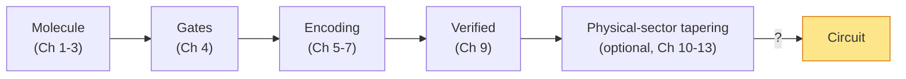
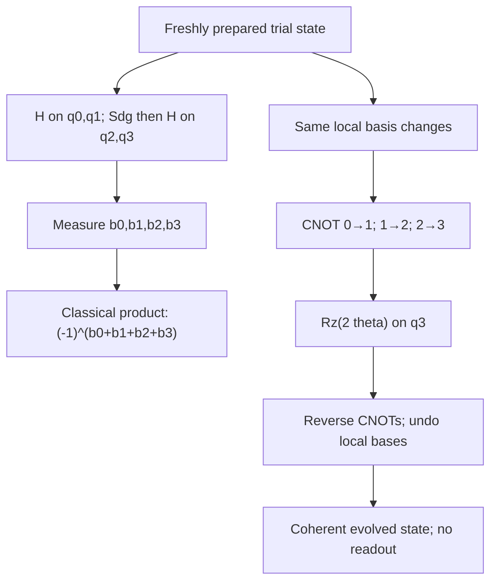
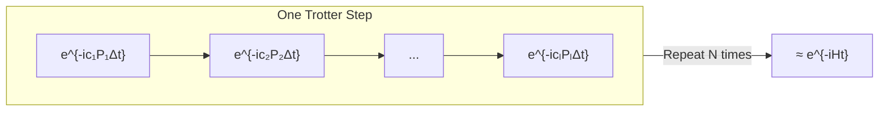

# Chapter 14: From Hamiltonian to Time Evolution

_We have a Hamiltonian — a complete description of the molecule's physics. But a quantum computer can't execute a description. It needs instructions. This chapter is about turning the description into instructions._

## In This Chapter

- **What you'll learn:** What time evolution $e^{-iHt}$ does, how it differs from preparing a state or measuring its energy, why non-commuting terms complicate its implementation, and how Trotterization provides a practical bridge.
- **Why this matters:** Without this bridge, the pipeline from molecule to circuit is incomplete. This is the chapter that turns a symbolic object into something a quantum processor can actually run.
- **Prerequisites:** Chapters 1–13 (you have a verified, optionally tapered, Pauli-sum Hamiltonian and understand gates from Chapter 4).

---

## What We Have, and What We Need

Our pipeline has produced a remarkable object: a symbolic Pauli-sum Hamiltonian

$$\hat{H} = \sum_{k=1}^{L} c_k P_k$$

verified against an independent matrix and labelled states, and potentially
tapered in an identified physical sector. This finite-basis operator contains
the orbital, interaction, and configuration-coupling terms of the chosen model.

But it is a *description*, not a *program*. A quantum computer doesn't accept descriptions. It accepts a sequence of gates — Hadamard, CNOT, $R_z$ — applied to specific qubits in a specific order. The Hamiltonian tells us *what* to compute; the circuit tells the machine *how* to compute it.

To cross this gap, we need to understand a deep idea: the connection between the Hamiltonian (which describes energy) and time evolution (which describes change).

---

## Energy and Time: Two Sides of the Same Operator

Here is a fact that physics students learn early but whose implications take years to fully appreciate:

> **The Hamiltonian does double duty.** It tells you the energy of a system *and* it tells you how the system evolves in time. The same operator. Both roles.

The Schrödinger equation makes this precise:

$$i\hbar \frac{d}{dt}\lvert\psi(t)\rangle = \hat{H}\lvert\psi(t)\rangle$$

Read it as: "the rate at which the quantum state changes equals the Hamiltonian applied to that state." The Hamiltonian is both the *energy observable* (its eigenvalues are the energies) and the *generator of time evolution* (it drives the dynamics).

The formal solution for a time-independent Hamiltonian is:

$$\lvert\psi(t)\rangle = e^{-i\hat{H}t/\hbar}\lvert\psi(0)\rangle$$

The exponent must be dimensionless. If energy is measured in hartrees, the
corresponding **atomic unit of time** is $\hbar/E_h$, approximately
$2.4189\times10^{-17}$ seconds, where $E_h$ denotes one hartree. Writing
$t=0.1$ below means 0.1 atomic units of time, not 0.1 seconds.
Setting $\hbar = 1$ in this consistent system of atomic units, the
**time-evolution operator** is:

$$U(t) = e^{-i\hat{H}t}$$

This operator is unitary — it preserves probabilities, as any physical evolution must. Its eigenvalues are $e^{-iE_k t}$, where $E_k$ are the energy eigenvalues. The energies are *encoded as phases* of the time-evolution operator.

This dual role supports phase estimation: if we can implement *controlled*
$U(t)$, we can make an eigenstate's phase observable relative to a control
branch. VQE takes a different route. It prepares a trial state and measures
$\langle H\rangle$; it does not need to implement the complete $U(t)$.

### Evolution does not cool the molecule

Expand a normalised input state in energy eigenstates:

$$|\psi(0)\rangle=\sum_a b_a|E_a\rangle,\qquad
|\psi(t)\rangle=\sum_a b_a e^{-iE_at}|E_a\rangle.$$

Only the phases change. The probability $|b_a|^2$ of each energy stays the
same, and therefore

$$\langle H\rangle_t=\sum_a |b_a|^2E_a=\langle H\rangle_0.$$

Running exact molecular time evolution on the Hartree–Fock state does not
gradually turn it into the FCI ground state. There is no dissipation in this
unitary operation. On our canonical H₂ input, its electronic energy remains
$-1.8318636465$ Ha, not the FCI value $-1.8523881736$ Ha.

This gives us three different jobs. **State preparation** chooses the
amplitudes $b_a$. **Hamiltonian simulation** implements the phase evolution.
**Energy estimation** uses measurements to infer an expectation or an
eigenvalue. A good circuit for one job is not automatically a solution to
the other two.

---

## The Gap in Our Pipeline

Let's pause and take stock of the operator-to-circuit sequence so far:

We have a verified, optionally tapered Hamiltonian:

$$\hat{H} = \sum_{k=1}^{L} c_k P_k$$

where each $P_k$ is a Pauli string (like $XXYY$) and $c_k$ is a real coefficient. This describes the chosen finite-basis electronic model, to the precision
of its stored integrals and coefficient pruning.

But a quantum computer doesn't accept a Hamiltonian as input. It accepts a sequence of **quantum gates**. We need to cross the last gap:

$$\text{Hamiltonian } \hat{H} \;\xrightarrow{\;?\;}\; \text{Gate sequence}$$

### An important clarification

Time evolution can model genuine dynamics, but that is not the energy task
we pursue here. We use it as a *mathematical tool*: implement controlled
$U(t)=e^{-iHt}$, then extract energies from its phases.

- **QPE** (Quantum Phase Estimation) applies controlled-$U(t)$ and reads the energy eigenvalue directly as a binary phase, written into an ancilla register.
- **VQE** (Variational Quantum Eigensolver) measures
  $\langle\hat H\rangle=\sum_k c_k\langle P_k\rangle$ on a prepared trial
  state. Ordinary Pauli measurement needs local basis changes and readout,
  not a Pauli-evolution staircase.

### The same string, two different circuits

Take $P=X_0X_1Y_2Y_3$, displayed as `XXYY`. To **measure** it, rotate
each qubit into its appropriate measurement basis, measure the four bits
$b_0,\ldots,b_3$, and return

$$p=(-1)^{b_0+b_1+b_2+b_3}\in\{+1,-1\}.$$

Use $H$ before measuring X. For Y, apply $S^\dagger$ then $H$; the
combined basis change is $HS^\dagger$. No CNOT is needed *for this
measurement basis*. Preparing the state may of course already require
entangling gates.

To **evolve** under this same string, implement $e^{-i\theta P}$.
After basis changes, compute the parity coherently with three CNOTs,
apply a phase rotation, undo those three CNOTs, and undo the basis
changes. There is no intermediate measurement. Chapter 16 derives why
the uncomputation is essential.

The measurement branch consumes a copy of the state and returns one
random sample. The evolution branch preserves a coherent state for
further computation. With the displayed H/S gate set, measurement uses
six basis-change gates and zero CNOTs; evolution uses twelve
basis-change gates, one $R_z$ and six CNOTs. These are primitive costs,
not complete VQE or QPE costs.

Applying $e^{-i\theta P}$ before measuring $P$ would not solve the
basis-change problem: this evolution commutes with $P$ and leaves
$\langle P\rangle$ unchanged. A VQE trial circuit may *contain* Pauli
rotations, but that is a state-preparation choice.

The question for the next two chapters is now precise: how do we implement
$e^{-iHt}$ when $H$ is a sum of non-commuting Pauli terms?

---

## The Problem: Non-Commuting Terms

If the Hamiltonian had a single term, $\hat{H} = cP$, then:

$$e^{-i\hat{H}t} = e^{-ictP}$$

This is a single Pauli rotation (Chapter 16 will show exactly how). But our Hamiltonian has $L$ terms:

$$\hat{H} = c_1 P_1 + c_2 P_2 + \cdots + c_L P_L$$

and the terms generally **do not commute**: $P_j P_k \neq P_k P_j$. This means:

$$e^{-i(c_1 P_1 + c_2 P_2)t} \neq e^{-ic_1 P_1 t} \cdot e^{-ic_2 P_2 t}$$

The exponential of a sum is *not* the product of exponentials for non-commuting operators. Trotterization is how we get around it.

### A one-qubit example we can calculate

Let $A=aX$ and $B=bZ$, with $a$ and $b$ in Ha. The identities
$XZ=-iY$ and $ZX=iY$ give $[A,B]=-2iabY$. Expand both
evolutions through second order in a short time $\delta$:

$$e^{-i(A+B)\delta}
=I-i(A+B)\delta-\tfrac12(A^2+AB+BA+B^2)\delta^2+O(\delta^3),$$

$$e^{-iA\delta}e^{-iB\delta}
=I-i(A+B)\delta-\tfrac12(A^2+B^2)\delta^2-AB\delta^2
+O(\delta^3).$$

Their difference, product minus exact, is
$-\tfrac12[A,B]\delta^2+O(\delta^3)=iabY\delta^2+O(\delta^3)$.
The discrepancy is not a mysterious molecular effect: doing X then Z
is not the same as doing Z then X. Reversing the product reverses this
leading error.

Here and throughout, matrices act rightmost first. When we specify a
*chronological gate list*, its first entry acts first and consequently
appears rightmost in the matrix product. A program and a displayed
product must agree on that convention before we compare their unitaries.

### What we mean by error

For an operator $M$, define the **operator norm**

$$\|M\|=\max_{\|\psi\|_2=1}\|M|\psi\rangle\|_2.$$

For Hermitian $M$ it is the largest absolute eigenvalue. For
$U_{\mathrm{approx}}-U_{\mathrm{exact}}$ it is the largest singular
value, and measures the worst state-vector discrepancy over normalised
inputs. Both unitaries are dimensionless, so

$$\eta=\|U_{\mathrm{approx}}-U_{\mathrm{exact}}\|$$

is dimensionless too. An energy tolerance, such as 0.0016 Ha, is a
different quantity. If an observable $O$ is measured on the two output
states, a useful implication is

$$|\langle O\rangle_{\mathrm{approx}}-\langle O\rangle_{\mathrm{exact}}|
\leq 2\|O\|\eta.$$

This follows by adding and subtracting
$\langle\psi|U_{\mathrm{approx}}^\dagger O U_{\mathrm{exact}}|\psi\rangle$
and applying the norm inequality to the two differences. It is a bound,
not an assertion that the observed discrepancy will reach it. QPE needs
its own phase-and-confidence analysis rather than simply calling $\eta$
an energy error.

---

## The Trotter Idea

The Trotter–Suzuki product formula says that for small $\Delta t$:

$$e^{-i(A + B)\Delta t} = e^{-iA\Delta t} \cdot e^{-iB\Delta t} + O(\Delta t^2)$$

The error is proportional to $\Delta t^2$ — so if we break the total time $t$ into $N$ small steps of size $\Delta t = t/N$:

$$e^{-i\hat{H}t} = \left(e^{-i\hat{H}\Delta t}\right)^N \approx \left(\prod_{k=1}^{L} e^{-ic_k P_k \Delta t}\right)^N$$

Each factor $e^{-ic_k P_k \Delta t}$ is a single Pauli rotation — implementable as a gate sequence. The full circuit repeats this list $N$ times. An identity term contributes
a scalar phase rather than an ordinary single-qubit $R_z$ gate.

**Trade-off:** More Trotter steps ($N$) → better approximation but deeper circuit. Fewer steps → shallower circuit but larger error. The choice of $N$ depends on the target precision and the commutator structure of $\hat{H}$.

---

## First vs Second Order

The formula above is **first-order Trotter**: error $O(\Delta t^2)$ per step, $O(t^2/N)$ total.

**Second-order Trotter** (Suzuki) cuts the error to $O(\Delta t^3)$ by symmetrizing:

$$e^{-i\hat{H}\Delta t} \approx \prod_{k=1}^{L} e^{-ic_k P_k \Delta t/2} \cdot \prod_{k=L}^{1} e^{-ic_k P_k \Delta t/2}$$

The forward pass uses half-angles, the reverse pass mirrors the sequence. The cost is $2L$ rotations per step instead of $L$, but the error decreases faster, so you need fewer steps for the same precision.

| Order | Rotations per step | Error per step | Error for $N$ steps |
|:---:|:---:|:---:|:---:|
| First | $L$ | $O(\Delta t^2)$ | $O(t^2/N)$ |
| Second | $2L$ | $O(\Delta t^3)$ | $O(t^3/N^2)$ |

These counts refer to formula factors before merging neighbours and before
excluding identity phases. Higher order improves an asymptotic error law;
it does not guarantee fewer gates at a particular tolerance.

---

## Beyond Trotterization: Qubitization

Trotterization is the workhorse of Hamiltonian simulation — simple, well-understood, and the approach we develop in this book. But it is not the only method, and intellectual honesty requires us to mention the alternative.

Guang Hao Low and Isaac Chuang's **qubitization** approach uses a
larger unitary containing the Hamiltonian as one block. For a Pauli
expansion, a natural positive normalisation is
$\alpha=\sum_k|c_k|$, so $\|H/\alpha\|\leq1$.
**PREPARE** creates an index register in
$\sum_k\sqrt{|c_k|/\alpha}|k\rangle$.
**SELECT** applies $\operatorname{sign}(c_k)P_k$ to the system
conditioned on that index. Preparing, selecting and unpreparing makes
the index-zero block equal to $H/\alpha$.

Those are specified operations, not free subroutines. A **query** counts
one use of an oracle such as this block-encoding unitary or its inverse;
turning a query into gates requires implementing its coefficient loading,
selection and ancillas. Qubitization constructs a walk from these
operations, and a polynomial transformation of its eigenphases
approximates the desired evolution. We will not implement that machinery.
The important distinction is between the requested approximation error
and the number of queries spent achieving it.

The catch: qubitization requires PREPARE/SELECT-style oracles, ancillas, and a
different resource model. Product formulas are easy to inspect for H₂, where
their unitaries can be compared directly. For larger active spaces, the choice
between product formulas, qubitization, and other methods must come from a
precision-specific generated resource estimate; molecule size alone does not
select the winner.

We will not develop qubitization in this book — it deserves its own treatment — but we mention it here so that the reader understands where Trotterization sits in the landscape:

| Method | Accuracy statement | Resource being counted |
|:---|:---|:---|
| First-order product formula | Operator error $O(t^2/N)$ for fixed Hamiltonian | $NL$ exponential factors |
| Symmetric second order | Operator error $O(t^3/N^2)$ for fixed Hamiltonian | $2NL$ factors before merging |
| Qubitization-based simulation | Choose an operator-error target $\eta$ | Queries grow with $\alpha\lvert t\rvert$ and precision; each query has a separate gate cost |

The first two rows give error at a step budget; the last deliberately
does not pretend that a query-complexity expression is an error law.
Low and Chuang give precise query bounds under their oracle assumptions.
A comparison in *CNOTs at fixed error* must compile the respective
primitives and include those assumptions. An asymptotically attractive
query bound cannot be pasted into a molecular gate ledger.

> The qubitization paper — G. H. Low and I. L. Chuang, "Hamiltonian Simulation by Qubitization," *Quantum* 3, 163 (2019); original arXiv:1610.06546 (2016) — is one of the foundational results of quantum algorithms for chemistry. It is dedicated, with gratitude, as part of the intellectual lineage that inspired this book.

---

## What Comes Next

The Trotter decomposition converts our Hamiltonian into a list of Pauli rotations:

$$\text{Hamiltonian } \hat{H} \;\xrightarrow{\text{Trotter}}\; [e^{-i\theta_1 P_1},\; e^{-i\theta_2 P_2},\; \ldots]$$

Each rotation $e^{-i\theta P}$ must then be decomposed into elementary gates (H, CNOT, Rz). That's the **CNOT staircase** — Chapter 16. First, Chapter 15 will show how FockMap computes the rotation list and chooses the time step.

---

## Key Takeaways

- For dynamics and phase estimation, time evolution
  $e^{-i\hat Ht}$ connects the Hamiltonian to a circuit primitive.
  VQE can instead measure the Hamiltonian on a separately prepared state.
- Non-commuting Pauli terms prevent direct exponentiation. The Trotter–Suzuki formula approximates $e^{-i(A+B)t}$ as a product of individual rotations.
- First-order Trotter: $L$ rotations, $O(t^2/N)$ error. Second-order: $2L$ rotations, $O(t^3/N^2)$ error.
- The quality of the Trotter approximation depends on the time step size and the commutator norm $\lVert[P_j, P_k]\rVert$ — smaller commutators mean smaller errors.
- Measuring a Pauli string, preparing a trial state and simulating a Hamiltonian are different operations. In particular, local Pauli measurement does not require a CNOT staircase.

## Exercises

1. **Two uses of XXYY.** A trial state is already prepared. Using H, S, Sdg,
   CNOT and Rz as elementary gates, count the additional basis-change and
   CNOT gates for measuring XXYY and for implementing its coherent
   evolution. Explain why the measurement branch has no uncomputation.
2. **A local error.** For $A=0.3X$ Ha, $B=0.4Z$ Ha and
   $\delta=0.1$ atomic time units, calculate $[A,B]$ and the norm
   of the leading product-minus-exact error. Is that number in Ha?
3. **No cooling.** A state has probabilities 0.8 and 0.2 on eigenstates
   of energies $-2$ and $-1$ Ha. Find its energy expectation before
   and after exact time evolution. What additional operation would an
   energy-estimation algorithm need to distinguish those energies?

## Further Reading

- Trotter, H. F. "On the product of semi-groups of operators." *Proc. Am. Math. Soc.* 10, 545 (1959). The original product formula.
- Suzuki, M. "General theory of fractal path integrals with applications to many-body theories and statistical physics." *J. Math. Phys.* 32, 400 (1991). Higher-order product formulas.
- Childs, A. M. and Su, Y. "Nearly optimal lattice simulation by product formulas." *Phys. Rev. Lett.* 123, 050503 (2019). Modern error bounds for Trotter formulas.
- Low, G. H. and Chuang, I. L. "Hamiltonian Simulation by Qubitization." *Quantum* 3, 163 (2019); arXiv:1610.06546 (2016). The optimal-complexity alternative to Trotterization, encoding the Hamiltonian directly into a quantum walk operator.

---

**Previous:** [Chapter 13 — Tapering Benchmarks](13-tapering-benchmarks.html)

**Next:** [Chapter 15 — Trotterization in Practice](15-trotter-formulas.html)
