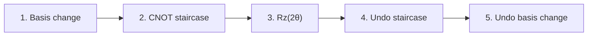
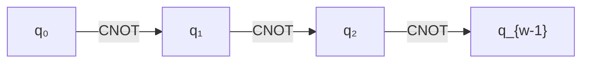

# Chapter 16: The CNOT Staircase

_Every Pauli rotation becomes a sequence of elementary gates. This chapter shows exactly how — and connects the dots from encoding choice to circuit cost._

## In This Chapter

- **What you'll learn:** How $e^{-i\theta P}$ decomposes into basis-change gates, a CNOT chain, and an $R_z$ rotation. Why the cost is exactly $2(w-1)$ CNOTs. How to trace a complete decomposition for the $XXYY$ exchange term.
- **Why this matters:** This is where everything converges. Encoding choice (Chapter 7), tapering (Chapters 10–13), and Trotterization (Chapters 14–15) all reduce to one question: how many times do we run this staircase, and how tall is it?
- **Prerequisites:** Chapters 4 (gates), 14–15 (Trotter decomposition).

---

## The Big Picture

Recall from Chapter 4 the CNOT staircase formula: a Pauli rotation with weight $w$ costs $2(w-1)$ CNOT gates. We stated this without proof. Now let's see *why* — by building the decomposition step by step.

The intuition: a weight-$w$ Pauli rotation $e^{-i\theta P}$ applies a phase
that depends on the *collective parity* of its support. We coherently
compute that parity on one qubit, apply the phase, and undo the
computation. The CNOTs need not entangle every possible input (a
computational-basis input stays a basis state), and uncomputing does not
make the final state separable. It removes the temporary parity
bookkeeping while retaining the desired, potentially entangling, unitary.

---

## The Decomposition Recipe

A Pauli rotation $e^{-i\theta P}$ for a non-identity, weight-$w$
Pauli string $P$ is implemented by the following operations:

### Phase 1: Basis change

For each qubit position in $P$:
- If $P_j = X$: apply Hadamard ($H$) to convert X-basis to Z-basis
- If $P_j = Y$: apply $R_x(\pi/2)$ to convert Y-basis to Z-basis
- If $P_j = Z$ or $I$: no gate needed

After this step, all non-identity Pauli operators have been converted to $Z$.

More precisely, choose a local unitary $B$ such that $BPB^\dagger$
is the product of Zs on the support. The desired circuit is
$B^\dagger e^{-i\theta BPB^\dagger}B$: apply $B$ first, then the
Z-parity rotation, then $B^\dagger$. On a Y position either of
these choices works:

$$R_x(\pi/2)Y R_x(-\pi/2)=Z,\qquad
(HS^\dagger)Y(SH)=Z.$$

The second identity follows from $S^\dagger YS=X$ and $HXH=Z$.
Its chronological gates are **Sdg, H**, not H, Sdg. FockMap 0.9.0
emits that second form, followed at the end by **H, S**.
The Rx form is convenient for deriving the mathematics but counts as
one gate only if the chosen elementary gate set includes Rx.

For a direct state check, $|y_+\rangle=(|0\rangle+i|1\rangle)/\sqrt2$
has Y eigenvalue $+1$. Sdg removes the $i$, producing $|+\rangle$;
H then produces $|0\rangle$. Likewise $|y_-\rangle$ maps to
$|1\rangle$. Measuring Z after this change really does measure Y,
with the correct sign.

### Phase 2: CNOT staircase

Chain CNOTs between the $w$ non-identity qubits:

This creates a parity computation: the final support qubit holds the
XOR of the support's computational **bits**. Z eigenvalues are signs,
not bits; their **product** is $(-1)^{\text{XOR}}$.

### Phase 3: Rz rotation

Apply $R_z(2\theta)$ to the last qubit in the chain. This imprints the rotation angle, conditioned on the collective parity.

By definition $R_z(\gamma)|b\rangle=e^{-i\gamma(-1)^b/2}|b\rangle$.
Setting $\gamma=2\theta$ gives $e^{-i\theta(-1)^b}$.
The even-parity branch gets $e^{-i\theta}$ and the odd branch gets
$e^{i\theta}$. Their relative phase is $e^{2i\theta}$; using
$R_z(\theta)$ would halve it.

### Phases 4–5: Uncompute

Reverse the CNOT staircase (same gates, reversed order), then reverse the
basis-change gates. The resulting unitary is not generally self-inverse:
its inverse replaces $\theta$ by $-\theta$. The compute/uncompute
sections are mutual inverses.

### Trace the parity, not just the gate names

For four active qubits with initial bits $(a,b,c,d)$, the forward chain
acts as follows:

| Operation | Bits after the operation |
|:---|:---|
| Input | $(a,b,c,d)$ |
| CNOT 0→1 | $(a,a\oplus b,c,d)$ |
| CNOT 1→2 | $(a,a\oplus b,a\oplus b\oplus c,d)$ |
| CNOT 2→3 | $(a,a\oplus b,a\oplus b\oplus c,a\oplus b\oplus c\oplus d)$ |

Call the forward unitary $C$ and the final parity bit $p$. Rz adds the
phase $e^{-i\theta(-1)^p}$ without changing any bit. The reversed
chain restores $(a,b,c,d)$, so

$$C^\dagger R_{z,3}(2\theta)C|abcd\rangle
=e^{-i\theta(-1)^{a+b+c+d}}|abcd\rangle.$$

That is exactly the action of $e^{-i\theta Z_0Z_1Z_2Z_3}$.
Because it holds for every basis vector, linearity makes it true for
every superposition. We did not measure parity; doing so would destroy
coherence between the even and odd branches.

For a concrete input `1011`, the bits go `1011 → 1111 → 1101 → 1101`.
Parity is odd, so the phase is $e^{i\theta}$. Reversing gives
`1101 → 1101 → 1111 → 1011`, with that phase retained. Some
CNOTs leave this particular basis input unchanged, but they remain
necessary for the circuit's action on *arbitrary* inputs.

---

## Gate Counts

| Component | Gates |
|:---|:---:|
| Basis change (using H/Rx) | $\leq w$ single-qubit gates |
| Forward CNOT staircase | $w - 1$ CNOTs |
| $R_z$ rotation | 1 single-qubit gate |
| Reverse CNOT staircase | $w - 1$ CNOTs |
| Undo basis change | $\leq w$ single-qubit gates |
| **Total CNOTs** | **$2(w-1)$** |
| **Total single-qubit** | **$\leq 2w + 1$** |

### Examples

| Pauli string | Weight $w$ | CNOTs | Single-qubit |
|:---:|:---:|:---:|:---:|
| $Z$ (single qubit) | 1 | 0 | 1 ($R_z$ only) |
| $ZZ$ | 2 | 2 | 1 |
| $XXYY$ | 4 | 6 | 9 |
| $ZZZZZZZZZ$ (weight 9) | 9 | 16 | 1 |

**Key insight:** CNOTs scale linearly with weight. This is why encoding choice matters — reducing the maximum Pauli weight from 100 (JW) to 5 (ternary tree) saves 190 CNOTs *per rotation*.

That saving applies if the *particular rotation* changes from weight
100 to weight 5, under this all-to-all logical decomposition. A
maximum-weight comparison does not say how many molecular terms attain
either maximum.

With FockMap's actual H/S/Sdg/Rz alphabet, a string containing $n_X$
Xs and $n_Y$ Ys uses

$$N_{\rm one\ qubit}=1+2n_X+4n_Y.$$

The one is its central Rz; each X needs H before and after; each Y
needs Sdg,H before and H,S after. Thus XXYY costs 13 one-qubit
gates in the emitted representation, rather than the 9 in the H/Rx
accounting above. Its six CNOTs are unchanged. Chapter 17 uses
the emitted gate set, not the pedagogical Rx count.

---

## Worked Example: ZZ Rotation (The Cheap Case)

Decompose $e^{-i\theta\, Z_0 Z_1}$:

**Basis change:** Both qubits are already Z — no gates needed.

**CNOT staircase:** CNOT(0→1). One gate.

**Rz:** $R_z(2\theta)$ on qubit 1.

**Reverse staircase:** CNOT(0→1). One gate.

**Total:** 2 CNOTs + 1 single-qubit gate: **three gates**. A molecular
ZZ term contributes to a diagonal configuration energy. It is cheap in
this decomposition, but diagonal does not mean that its evolution
cannot entangle a superposition.

For the four basis inputs, the calculation is small enough to display:

| Input | After first CNOT | Rz phase | After second CNOT |
|:---|:---|:---|:---|
| 00 | 00 | $e^{-i\theta}$ | 00 |
| 01 | 01 | $e^{i\theta}$ | 01 |
| 10 | 11 | $e^{i\theta}$ | 10 |
| 11 | 10 | $e^{-i\theta}$ | 11 |

If the final CNOT is omitted, input `10` leaves as `11`. Its phase
may be correct but its occupation is wrong. This is why a phase
calculation without uncomputation is not the desired operator.

---

## Worked Example: XXYY Rotation (The Expensive Case)

Decompose $e^{-i\theta\, X_0 X_1 Y_2 Y_3}$:

**Basis change:**
- Qubit 0: $X \to Z$ via Hadamard
- Qubit 1: $X \to Z$ via Hadamard
- Qubit 2: $Y \to Z$ via $R_x(\pi/2)$
- Qubit 3: $Y \to Z$ via $R_x(\pi/2)$

**After basis change:** the operation is now $e^{-i\theta\, Z_0 Z_1 Z_2 Z_3}$

**CNOT staircase:** CNOT(0→1), CNOT(1→2), CNOT(2→3)

**Rz:** $R_z(2\theta)$ on qubit 3

**Reverse CNOT staircase:** CNOT(2→3), CNOT(1→2), CNOT(0→1)

**Undo basis change:** $R_x(-\pi/2)$ on qubits 2,3; Hadamard on qubits 0,1

**Total:** 6 CNOTs + 9 single-qubit gates.

That total uses two Rx basis changes and their inverses. In the
actual exported gate alphabet the same calculation is six CNOTs
plus thirteen single-qubit gates.

### Trace an XXYY eigenstate

Take

$$|\chi\rangle=|x_+\rangle_0|x_-\rangle_1
|y_+\rangle_2|y_-\rangle_3.$$

Its local Pauli signs are $(+1,-1,+1,-1)$, whose product is $+1$.
Use the emitted basis convention: H on qubits 0 and 1; Sdg then H
on 2 and 3. The state becomes displayed `0101`. The CNOT chain
takes it through `0101 → 0101 → 0111 → 0110`. The final
parity bit is zero, so Rz contributes $e^{-i\theta}$. Reverse the
chain to recover `0101`, then undo the local bases. The answer is
$e^{-i\theta}|\chi\rangle$, exactly as its XXYY eigenvalue requires.

Change only the final Y state to $|y_+\rangle$. The product sign
becomes $-1$, the accumulated parity becomes odd, and the phase
becomes $e^{i\theta}$. The two examples check both the Y sign
and the factor of two in Rz.

On a computational-basis state, the result need not remain a single
configuration. Since $P^2=I$,

$$e^{-i\theta P}=\cos\theta\,I-i\sin\theta\,P.$$

For $P=XXYY$, $P|1100\rangle=-|0011\rangle$, so

$$e^{-i\theta XXYY}|1100\rangle
=\cos\theta|1100\rangle+i\sin\theta|0011\rangle.$$

The local-basis calculation and this coupling calculation describe the
same unitary in different bases. This example also makes clear why
"undo the staircase" must not be read as "undo the interaction".

### Identities, gaps and routing

For `XIZY`, the active indices are 0, 2 and 3. The logical chain is
CNOT 0→2, then 2→3; qubit 1 does not participate. The raw
cost is $2(3-1)=4$ CNOTs, not six merely because the string has
four characters. Whether 0→2 is a native hardware connection
is a different question, handled by routing in Chapter 21.

A weight-one string has no parity chain and costs one Rz plus its
local basis changes. A weight-zero identity has no final support
qubit at all. The expression $2(w-1)$ therefore applies only
to non-identity rotations; substituting $w=0$ and reporting minus
two CNOTs is an accounting error, not a new optimisation.

---

## Why This Makes Encoding Choice Concrete

The CNOT staircase turns the abstract concept of "Pauli weight" into a concrete gate count:

$$\text{CNOTs per Trotter step} = \sum_{k=1}^{L} 2(w_k - 1)$$

For the reproduced maximum ladder-operator weights at $n=32$:

| Encoding | Max weight | Standard CNOTs for one worst-case rotation |
|:---|:---:|:---:|
| Jordan–Wigner | 32 | 62 |
| Bravyi–Kitaev | 6 | 10 |
| Ternary Tree | 5 | 8 |

This is an operator-level comparison. A molecular Trotter-step total requires
the complete generated term distribution and cannot be inferred from the
maximum alone.

---

## Key Takeaways

- Each Pauli rotation decomposes into basis change → CNOT staircase → $R_z$ → reverse.
- The CNOT count is exactly $2(w-1)$ per rotation, where $w$ is the Pauli weight.
- Total raw CNOTs per Trotter step: $\sum_k2(w_k-1)$ over non-identity terms. This excludes routing, controls and state preparation.
- Encoding and tapering can change the weight distribution; compare the generated distributions rather than assuming every weight decreases.

## Exercises

1. **Three-gate trace.** Starting from displayed `10`, trace
   CNOT 0→1, Rz$(2\theta)$ on 1, CNOT 0→1. Give the final
   state and phase. What wrong output results if the final CNOT is
   omitted?
2. **A sparse support.** For `XIZY`, give the active indices, a
   logical CNOT chain, its reverse, and the CNOT and one-qubit gate
   counts using FockMap's H/S/Sdg/Rz alphabet.
3. **Y-basis sign.** Show that Sdg then H maps $|y_-\rangle$
   to $|1\rangle$. Use this to find the phase on
   $|x_+\rangle|x_-\rangle|y_+\rangle|y_-\rangle$
   under $e^{-i\theta XXYY}$, and explain the error from using
   Rz$(\theta)$ instead of Rz$(2\theta)$.

## Further Reading

- Whitfield, J. D., Biamonte, J., and Aspuru-Guzik, A. "Simulation of electronic structure Hamiltonians using quantum computers." *Mol. Phys.* 109, 735 (2011). Introduces the CNOT staircase decomposition of Pauli rotations used throughout this chapter.

---

**Previous:** [Chapter 15 — Trotterization in Practice](15-trotter-formulas.html)

**Next:** [Chapter 17 — Cost Analysis Across Encodings](17-cost-analysis.html)
