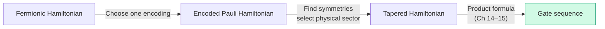
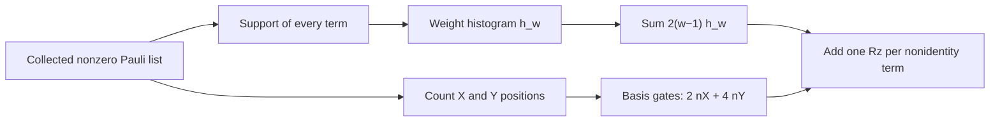

# Chapter 17: Cost Analysis Across Encodings

_The circuit now exists. We can stop guessing how expensive its Pauli strings look and count the gates they actually produce._

## In This Chapter

- **What you'll learn:** The generated H₂ logical CNOT counts and the evidence
  required before extending the comparison to larger molecules or tapering.
- **Why this matters:** This supplies one part of the practical question:
  "which encoding should I use for my molecule?" The answer needs a
  specified Hamiltonian and cost model, not just the molecule's name.
- **Prerequisites:** Chapters 14–16 (Trotter decomposition and CNOT staircase).

---

## The Optimization Stack

Before we compute anything, here is the encoding-to-compilation sequence:

Each stage changes a different part of the calculation:
- **Tapering** reduces qubit count by $k$, often reduces term count
- **Encoding choice** changes Pauli supports, local bases and symmetry representation
- **Trotter order** trades rotations per step for error convergence rate

The order matters: **encode → identify symmetries → select the physical sector → taper → Trotterize**. To compare encodings, repeat that sequence from the same fermionic Hamiltonian for each encoding.

---

## The Full Cost Formula

The total CNOT cost for one Trotter step is:

$$C_\text{CNOT} = \sum_{k=1}^{L} 2(w_k - 1)$$

where $L$ is the number of non-identity terms and $w_k$ is the Pauli weight of term $k$. For second-order Trotter, multiply by 2 (each term appears twice).

---

## The Cost Model Before the Numbers

A **logical gate** here is one member of FockMap's emitted H, S, Sdg,
CNOT and Rz alphabet. It is not a calibrated hardware pulse. We assume
that a CNOT can join any required pair of logical qubits, count every
emitted gate before optimisation, and use first-order evolution with
$\Delta t=0.1$ atomic time units. The input is the untapered four-mode
H₂ STO-3G Hamiltonian at 0.74 Å, using the canonical raw physicist
tensor and FockMap 0.9.0, source `96320a5`.

Terms with combined coefficient magnitude at most $10^{-12}$ Ha
are pruned. Identity stays in the Hamiltonian count but is omitted
from the emitted rotation count. Nuclear repulsion is an external
energy offset, not a Pauli rotation. These small decisions make a
comparison reproducible: changing any of them can change what a row
means.

## H₂: The Generated Untapered Ledger

The independent 15-term JW oracle has 14 non-identity terms, maximum weight 4,
average weight $32/14\approx2.29$, and 36 standard first-order staircase
CNOTs (72 for the symmetric second-order sequence).

Run `dotnet fsi code/ch18-pipeline.fsx` from the repository root.
The six-encoding ledger is written to
`_build/data/h2_encoding_costs.csv`; the separate
geometry scan writes `h2_circuit_costs.csv` in the
same derived-output directory. For this model the
generated first-order ledger is:

| Encoding | Qubits | Hamiltonian terms | Emitted Rz rotations | CNOTs | Other one-qubit gates | Total gates |
|:---|---:|---:|---:|---:|---:|---:|
| Jordan–Wigner | 4 | 15 | 14 | 36 | 48 | 98 |
| Bravyi–Kitaev | 4 | 15 | 14 | 44 | 24 | 82 |
| Parity | 4 | 15 | 14 | 40 | 24 | 78 |
| Balanced binary tree | 4 | 15 | 14 | 40 | 24 | 78 |
| Balanced ternary tree | 4 | 15 | 14 | 44 | 44 | 102 |
| Vlasov tree | 4 | 15 | 14 | 44 | 52 | 110 |

"Other one-qubit gates" excludes the Rz column, so each total is
CNOTs + Rz rotations + other one-qubit gates. This is the actual
gate decomposition: a Y basis change costs Sdg,H before the
rotation and H,S after it. Substituting the one-gate Rx basis
change from a mathematical derivation would produce a different
single-qubit ledger.

The independent JW coefficient map, labelled row-3 Hartree–Fock
matrix element and sector energies supply the reference for this
calculation. Cross-encoding equivalence is a separate matrix/spectrum
question (Chapter 9), not something proved by the common 15-term
column. A gate ledger reports what was constructed. It must travel
with the Hamiltonian validation rather than replace it.

### Read one row all the way through

For JW, four weight-one Z strings contribute no CNOTs, six
weight-two Z strings contribute twelve, and four weight-four
coupling strings contribute twenty-four. That is

$$C_1=4(0)+6(2)+4(6)=36.$$

There is one Rz per non-identity term, hence fourteen. Each coupling
string has two Xs and two Ys, requiring twelve local basis-change
gates. Four such strings supply forty-eight:

$$G_1=36+14+4(12)=98.$$

This also explains why fewer CNOTs need not mean fewer *total*
gates. JW has fewer CNOTs than Parity here, but more basis-change
gates. On some hardware CNOTs are much more expensive than local
gates; on a fault-tolerant implementation arbitrary-angle rotations
bring a separate synthesis cost. There is no universal exchange
rate in this table.

Nor does the small-system result contradict a logarithmic
creation-operator weight bound. The operators being exponentiated
are the *collected molecular Hamiltonian terms*, not isolated
creation operators. Finite-size structure and coefficient
cancellations matter.

### From a step to a simulation

Keep the multiplication explicit:

| JW task | Emitted rotations | CNOTs | Raw total gates |
|:---|---:|---:|---:|
| One first-order step | 14 | 36 | 98 |
| One unmerged symmetric step | 28 | 72 | 196 |
| 100 first-order steps | 1400 | 3600 | 9800 |
| 90 first-order steps | 1260 | 3240 | 8820 |

The final row is the Chapter 15 sufficient bound for dimensionless
operator error $1.6\times10^{-3}$ at total time $t=1$. The
100-step row is simply a declared budget, not a second certificate
for a different physical task. In both rows, counts omit state
preparation, measurements, controlled-evolution overhead, hardware
routing and error correction.

Second order is not "twice the price for the same answer". It
has a different local error and can reach the same target with
a different number of steps. Comparing orders fairly means
comparing total costs at a common accuracy, with the same
Hamiltonian and total evolution time.

## Why a Maximum Is Not a Ledger

Consider two deliberately artificial four-qubit Hamiltonians with
four nonzero, unit-Ha coefficients:

$$H_A=ZIII+IZII+IIZI+XXXX,$$
$$H_B=ZZZZ+XXXX+YYYY+ZXXZ.$$

Both have four terms and maximum Pauli weight four. Yet their
first-order staircase counts are

$$C_A=0+0+0+6=6,\qquad C_B=6+6+6+6=24.$$

The maximum, width and term count are identical; the CNOT totals
differ by four. These are teaching Hamiltonians, not estimates
for two molecules. Their purpose is to show exactly which missing
information a maximum-weight table cannot supply.

An equivalent compact ledger is a **weight histogram**:
$h_w$ is the number of non-identity terms of weight $w$.
Then

$$L=\sum_{w\geq1}h_w,\qquad
C_1=2\sum_{w\geq1}(w-1)h_w.$$

For JW H₂, $(h_1,h_2,h_3,h_4)=(4,6,0,4)$. The total
support count is $\sum_wh_ww=32$, so its average non-identity
weight is $32/14$. The histogram determines this raw CNOT
count but not the one-qubit count: the latter also needs the
number of Xs and Ys in each term.

---

## What a Molecular Benchmark Must Contain

The H₂ ledger does not provide H₂O, LiH, N₂ or FeMo-co totals.
A new molecular benchmark must supply:

- geometry, basis, active space, electron/spin sector, and orbital order;
- the complete nonzero Pauli list for every encoding;
- tapering generators, target eigenvalues, and sector-spectrum checks;
- product-formula order and the treatment of identity terms; and
- machine-readable weights, rotations, and logical CNOT totals.

The water energy CSVs in Chapter 19 are reference-chemistry artifacts,
not the missing Pauli lists. Their energies cannot tell us how many
CNOTs a particular encoding will emit.

### What to compare after tapering

Suppose one encoding admits a convenient two-qubit reduction and
another requires a less convenient Clifford transformation. The
reduced widths alone do not decide the comparison. We must know
which signed symmetry eigenvalues were selected and whether the
reduced Hamiltonians describe the same physical subspace.

For H₂, an automatic all-positive Clifford sector is not a
substitute for the molecular ground-state sector. Compiling the
wrong subspace very cheaply is not a useful saving. A tapered
ledger needs the generator list, signs, remaining-qubit map,
energy offsets and matching sector spectrum.

Only then do we ask how tapering changed the term list, coefficient
measurement norm and gate decomposition. Substitution can merge
terms and alter coefficients. Neither a lower qubit count nor
a lower maximum weight guarantees a lower measurement cost.

## A Decision We Can Actually Make

For the demonstrated untapered H₂ step, JW minimises raw CNOTs
among these six outputs. Parity and the balanced binary tree
minimise the emitted total-gate count. Those are two different,
fully specified decisions. They are not a verdict on which
encoding is best for every H₂ algorithm, still less for a large
active space.

For an actual calculation, fix the chemical model and physical
sector, choose the algorithm and error budget, then compare
compiled costs. If a hardware graph is involved, record its
connectivity and the compiler version. If a measurement task is
involved, compare estimators rather than multiplying a Trotter
CNOT count by a shot number. The role of a ledger is to prevent
those separate questions from collapsing into one impressive
but uninterpretable total.

---

## Key Takeaways

- The independent four-qubit H₂ JW reference uses 36 first-order staircase CNOTs.
- Ladder-operator weights show the expected linear-versus-logarithmic separation, but they do not determine molecule-level totals.
- The complete optimisation stack is: **encode → identify the physical symmetry sector → taper → Trotterize**. Repeat it for each candidate encoding before comparing costs.
- CNOT count is one feasibility metric alongside depth, connectivity, state preparation, precision, and measurement cost.
- Measurement cost must be computed from the actual post-transformation coefficients; tapering does not guarantee a smaller coefficient 1-norm.

## Common Mistakes

1. **Trying to re-encode a tapered Pauli Hamiltonian.** Fermion-to-qubit encoding comes first. Tapering is then derived in that specific qubit representation.

2. **Turning ladder maxima into molecular totals.** A larger $n$ reveals
   asymptotic weight separation but still does not supply a molecule's term
   distribution.

3. **Ignoring the error budget.** Per-step CNOT count is only one factor; the
   step count follows the chosen ordering, commutators, total time, and target
   simulation error.

## Exercises

1. **H₂ by hand.** Verify the 36-CNOT figure for H₂ first-order Trotter by summing $2(w_k - 1)$ over all 14 non-identity terms.

2. **Benchmark design.** Write the machine-readable metadata required to compare two encodings without mixing active spaces, sectors, or orbital orders.

3. **Same maximum, different cost.** For $H_A$ and $H_B$ above,
   calculate the weight histograms and raw first-order CNOT totals.
   State which additional local-Pauli information is required to
   calculate the one-qubit gate totals.

## Further Reading

- Tranter et al. "The Bravyi–Kitaev Transformation: Properties and Applications." *International Journal of Quantum Chemistry* 115, 1431–1441 (2015). DOI: 10.1002/qua.24969.
- The cost models in this chapter build directly on the encoding definitions (Chapter 7), tapering benchmarks (Chapter 13), and CNOT staircase decomposition (Chapter 16) developed earlier in this book.

---

**Previous:** [Chapter 16 — The CNOT Staircase](16-cnot-staircase.html)

**Next:** [Chapter 18 — The Question We Can Now Answer](18-complete-pipeline.html)
