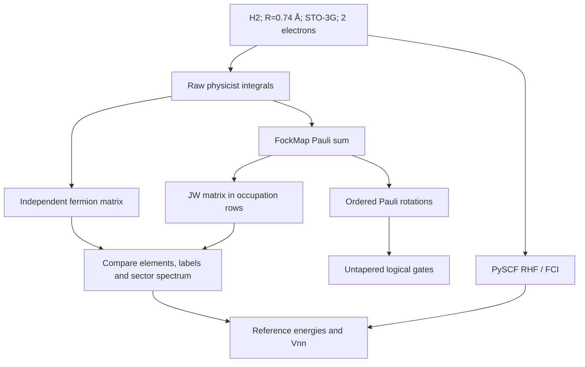
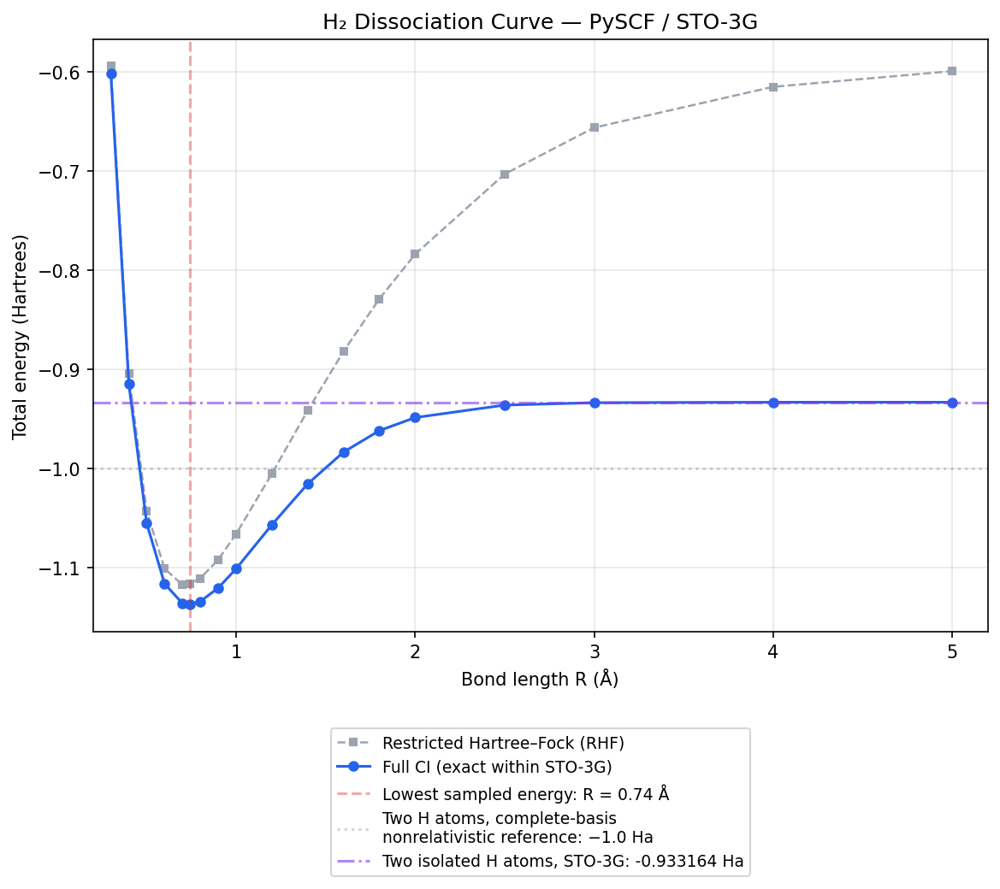

# Chapter 18: The Question We Can Now Answer

_We have the ingredients. Time to follow the implemented calculation from its input file to its output circuit — and keep the energy reference in view._

## In This Chapter

- **What you'll learn:** The implemented untapered H₂ path from molecular
  integrals to logical circuit, its independent classical energy reference,
  and the checkpoints connecting them.
- **Why this matters:** This is the capstone for operator construction.
  Following both data tracks makes clear what a generated circuit proves
  and what still belongs to an energy-estimation algorithm.
- **Prerequisites:** All of the preceding stages (Chapters 1–17).

---

## The Payoff

Look back at what we've built.

In Chapter 1, we started with a molecule and asked: *what is its ground-state energy?* That question led us through electronic structure (the integrals), second quantization (the ladder operators), encoding (the Pauli strings), tapering (removing redundant qubits), Trotterization (turning operators into gates), and cost analysis (counting the CNOTs). At each stage we introduced one mathematical transformation, implemented it, and tested it on H₂.

Now we run the implemented chain. The script takes H₂ molecular
integrals and produces untapered logical circuits in six encodings.
It does not silently select a tapering sector, prepare a ground state,
or turn a logical gate list into a hardware-ready job. Those are
important stages, but this script would teach the wrong lesson if
it pretended to execute them.

> **Two executable tracks:** `code/ch18-pipeline.fsx` uses FockMap to construct
> encoded Hamiltonians and logical circuits. `code/ch18-dissociation-scan.py`
> independently uses PySCF HF and FCI to produce the reference energy curve.
> `code/ch09-verify-h2.py` connects the tracks at 0.74 Å by comparing a direct
> fermionic matrix with the derived JW Pauli matrix. The F# companion does not
> infer a ground-state energy from a circuit coefficient.

## The Input Contract

The canonical checkpoint is H₂ at $R=0.74$ Å in STO-3G,
with two electrons and four interleaved spin-orbitals. The raw
single-bar physicist tensor contains four nonzero one-body entries
and thirty-two two-body entries. These are tensor entries, not
thirty-six distinct terms in the final qubit Hamiltonian.

The independent provenance record identifies the research source
commit `66ebdfe255c0cc6ba25a6d1b76b58401aee3ab06`
and the source file SHA-256. Grouped here into two 32-character
halves for readability, with no space in the actual hash:

```text
6539afb30a1c03ec89202a2960a06c65
80a91afaebf13a6cadbcfd32c2d71812
```
The FockMap package is 0.9.0, built from `96320a5`.
A geometry label alone is not this contract: two files both called
"H₂ integrals" may differ in basis, orbital order, tensor convention
or coefficient prefactors.

The labelled-state convention is equally explicit. Displayed HF
occupation `1100` has modes 0 and 1 occupied, giving integer row
$1+2=3$. A displayed Pauli signature $P_0P_1P_2P_3$ becomes the
dense tensor $P_3\otimes P_2\otimes P_1\otimes P_0$ in this
row convention. The state and operator must cross this boundary
together.

### Checkpoints rather than one final number

| Checkpoint | Object | Concrete question |
|:---|:---|:---|
| Molecular specification | Geometry, basis, charge, spin counts | Are both tracks solving the same finite-basis problem? |
| Integral input | Raw tensor and provenance | Is the builder receiving raw rather than preweighted coefficients? |
| Encoded operator | Collected Pauli sum | Does JW have 15 nonzero terms and the expected labelled matrix elements? |
| Reference matrix | Occupation-space Hamiltonian | Does the intended sector reproduce its eigenvalues and states? |
| Product formula | Ordered rotation list | Are its angles $c_k\Delta t$, with identity handled separately? |
| Circuit | Ordered gate array | Does it implement that list, rather than merely contain plausible gates? |
| Reference energy | HF/FCI output | Is the reported value electronic or total, and from which solver? |



The arrows into the comparison mean a check, not that the check
computes the PySCF result. The circuit branch ends at a gate
description. Chapter 20 supplies the missing algorithmic reasoning
between gates, prepared states and energy estimates.

---

## The Script

The following **contextual excerpt** shows the main construction loop.
The complete entry point, including input and sentinel checks, is
`dotnet fsi code/ch18-pipeline.fsx`; do not substitute this shorter
listing for those checks.

```fsharp
#load "code/ch03-spin-orbitals.fsx"

open System.Numerics
open Encodings
open Encodings.BravyiKitaev
open Encodings.CircuitOutput
open Encodings.Hamiltonian
open Encodings.JordanWigner
open Encodings.MajoranaEncoding
open Encodings.TreeEncoding
open Encodings.Trotterization

// ═══════════════════════════════════════════════════════════════
//  The canonical generated integrals (from Chapter 3)
// ═══════════════════════════════════════════════════════════════

let Vnn = 0.7151043391  // Nuclear repulsion energy (Hartrees)
let rawPhysicistFactory =
    ``Ch03-spin-orbitals``.h2RawPhysicistFactory

// ═══════════════════════════════════════════════════════════════
//  All six encodings, one loop
// ═════════════════════════════════════════════════════════════

let encoders = [
    ("Jordan-Wigner",  jordanWignerTerms)
    ("Bravyi-Kitaev",  bravyiKitaevTerms)
    ("Parity",         parityTerms)
    ("Binary Tree",    balancedBinaryTreeTerms)
    ("Ternary Tree",   ternaryTreeTerms)
    ("Vlasov Tree",    vlasovTreeTerms)
]

let pruneZeroTerms (hamiltonian : PauliRegisterSequence) =
    hamiltonian.DistributeCoefficient.SummandTerms
    |> Array.filter (fun term -> Complex.Abs term.Coefficient > 1e-12)
    |> PauliRegisterSequence

for (name, encoder) in encoders do
    // Step 1: Build the qubit Hamiltonian
    let ham =
        computeHamiltonianWith
            encoder rawPhysicistFactory 4u
        |> pruneZeroTerms

    // Step 2: Trotterize the verified untapered Hamiltonian
    let step = firstOrderTrotter 0.1 ham
    let stats = trotterStepStats step

    // Step 3: Export to OpenQASM
    let gates = decomposeTrotterStep step
    let qasm = toOpenQasm defaultOpenQasmOptions 4 gates

    printfn "%-15s  %d qubits  %d terms  %d CNOTs  %d total gates"
        name
        4
        (ham.DistributeCoefficient.SummandTerms.Length)
        stats.CnotCount
        stats.TotalGates
```

One loop constructs six logical circuits from the same integral
factory. The common input matters more than the shortness of the loop.

---

## What Each Line Does

Let's trace one iteration — Jordan–Wigner — including the types
that connect one call to the next:

**`computeHamiltonianWith encoder rawPhysicistFactory 4u`** — Takes the encoder
and the raw single-bar physicist integrals, applies the documented prefactor and
annihilator order internally, and builds a 4-qubit Pauli Hamiltonian. This is
Chapter 6: the one-body and two-body integrals are paired with encoded ladder
operators and summed into a `PauliRegisterSequence`. For JW, we get the 15-term
Hamiltonian we first met in Chapter 3.

**Why this script does not taper by default** — Tapering is valid only after the
implementation selects a mutually commuting generator set, maps the
two-electron singlet quantum numbers to generator eigenvalues, and passes
untapered-sector versus tapered-spectrum tests. The audited source
implementation places the H₂ ground state in a non-default sector, so an
implicit positive sector would compile the wrong subspace.

**`firstOrderTrotter 0.1 ham`** — Decomposes the verified untapered
Hamiltonian into Pauli rotations (Chapter 14). Each term $c_kP_k$ becomes
$e^{-ic_k\Delta tP_k}$. FockMap's `Rz` convention is
$R_z(\theta)=e^{-i\theta Z/2}$, so the gate parameter is
$\theta=2c_k\Delta t$.

**`decomposeTrotterStep step`** — Converts each Pauli rotation into concrete gates via the CNOT staircase (Chapter 16). A weight-$w$ rotation becomes $2(w-1)$ CNOTs plus single-qubit gates.

**`toOpenQasm defaultOpenQasmOptions numQubits gates`** — Serialises the
gate sequence using OpenQASM 3.0 syntax. Importer version, supported
subset and numerical angle precision are separate checks in Chapter 21.

**`trotterStepStats step`** — Counts everything: rotations, CNOTs, single-qubit gates, total gates (Chapter 17).

The main values are not interchangeable:

| F# value | Meaning | What it does not contain |
|:---|:---|:---|
| `rawPhysicistFactory` | A key-to-optional-complex-integral function | A prepared quantum state |
| `ham` | A `PauliRegisterSequence` with combined coefficients | A ground-state energy result |
| `step.Rotations` | Ordered exponent-angle/operator records | A measurement schedule |
| `gates` | Elementary logical `Gate` values | A device placement or noise model |
| `qasm` | Text describing the gate sequence | Evidence of execution |

`pruneZeroTerms` first distributes and combines coefficients through
the Hamiltonian representation, then keeps terms whose complex
magnitude exceeds $10^{-12}$. Pruning individual contributions
before collection can destroy cancellation or keep duplicate terms.
Conversely, a threshold appropriate for this small H₂ example is
not automatically an acceptable energy error for a large model.
Chapter 15 gives a coefficient-sum bound for that decision.

### The electronic and total energy ledger

At the canonical geometry the independent reference gives:

| Quantity | Value (Ha) | Source/interpretation |
|:---|---:|:---|
| Identity coefficient $c_I$ | -0.8121706072 | Trace of the electronic matrix divided by 16 |
| HF electronic energy | -1.8318636465 | Matrix element at occupation row 3 |
| FCI electronic energy | -1.8523881736 | Lowest eigenvalue in the physical two-electron sector |
| Nuclear repulsion $V_{nn}$ | 0.7151043391 | Classical nuclear geometry |
| HF total energy | -1.1167593074 | HF electronic + $V_{nn}$ |
| FCI total energy | -1.1372838345 | FCI electronic + $V_{nn}$ |

The identity coefficient is an average over the full Fock-space
matrix, not an eigenvalue. Adding nuclear repulsion to it gives
neither HF nor FCI. Likewise, running the time-evolution circuit
on the HF determinant does not lower its energy: exact evolution
preserves the input state's expectation.

The correlation energy is $E_{\mathrm{FCI}}-E_{\mathrm{HF}}=-0.0205245271$
Ha. It is the same difference whether we use electronic or total
energies, because the same nuclear offset cancels. Across *different*
geometries, however, $V_{nn}$ changes and must not be discarded
from a potential energy curve.

---

## The Acceptance Table

The executable script is intentionally fail-closed. Before it reports any
circuit cost, the live FockMap Hamiltonian must reproduce the independent
15-term JW sentinels from Chapter 6. It reports untapered circuits. Tapered
counts remain a separate evidence gate: each result must name the encoding,
symmetry generators, method, and physical sector and match that untapered
sector's spectrum.

Only then should the script generate a table of qubits, nonzero terms, CNOTs,
and total gates. A six-row table is evidence of generated counts, not by itself
evidence of matrix or physical-sector correctness. Chapter 17
gives the scoped untapered ledger; the matrix and sector checks
remain separately identified.

---

## A Closer Look at the Output

The verified untapered Jordan–Wigner Hamiltonian can be Trotterized and
exported without making a sector assumption:

```fsharp
let jwHam =
    computeHamiltonian
        rawPhysicistFactory 4u
            |> pruneZeroTerms
let jwStep = firstOrderTrotter 0.1 jwHam
let jwGates = decomposeTrotterStep jwStep
let qasm = toOpenQasm defaultOpenQasmOptions 4 jwGates

printfn "%s" qasm
```

The output uses QASM 3.0 syntax — qubit declarations followed by `h`,
`cx`, `rz`, `s`, and `sdg` instructions. On a simulator, verify that its
statevector or unitary matches the intended ordered product of Pauli
exponentials. Time evolution alone does not prepare the ground state or produce
the FCI energy; Chapter 20 separates that circuit primitive from the VQE and QPE
workflows that estimate energy.

---

## Extra Credit: The H₂ Dissociation Curve

The pipeline runs at one geometry — but there's nothing stopping us from running it at *many* geometries. If we vary the bond length $R$ and plot the energy, we get the **dissociation curve**: the potential energy surface of H₂ as the two atoms are pulled apart.

This is a classic test of quantum chemistry methods. Restricted Hartree–Fock
breaks down as the bond stretches because one determinant cannot describe two
separated open-shell atoms. The committed reference curve is computed directly
by PySCF FCI.

### The Skeleton API

At every bond length, the mode count and encoding are fixed while coefficients
and numerical zero patterns can change. FockMap's skeleton API precomputes the
operator expansions, then applies each raw tensor through the pinned
raw-coefficient interface:

```fsharp
// Precompute the Pauli structure once
let skeleton = computeHamiltonianSkeleton jordanWignerTerms 4u

// Then, for each bond length, plug in the integrals and measure circuit cost
let circuitCostAt (integrals : Map<string, Complex>) =
    let rawFactory key = integrals |> Map.tryFind key
    let ham = applyCoefficients skeleton rawFactory |> pruneZeroTerms
    let step = firstOrderTrotter 0.1 ham
    ham.DistributeCoefficient.SummandTerms.Length,
    (trotterStepStats step).CnotCount
```

`computeHamiltonianSkeleton` performs the encoding algebra once;
`applyCoefficients` then applies each geometry's integrals. The companion writes
these derived term and CNOT counts to ignored
`_build/data/h2_circuit_costs.csv`. Any speedup must be measured for the pinned
implementation rather than assumed to equal the number of geometries.

There is a useful equivalence to check at every scan point:

$$H_{\mathrm{direct}}(R)=H_{\mathrm{skeleton}}(R).$$

The left side encodes the raw tensor afresh. The right side
reuses symbolic operator expansions and supplies the coefficients
for that geometry. Compare their *collected coefficient maps*,
not just their term counts. Two wrong maps can both have fifteen
entries. The skeleton avoids repeated algebra; it neither solves
the Schrödinger equation nor licenses reusing old coefficients.

Reusing a mode ordering requires care. Orbital phases can change
between independent SCF calculations, and orbitals can exchange
order near crossings. The corresponding integrals and operator
labels must describe a coherent convention at each geometry.
An energy curve may remain smooth even when a sign-sensitive
matrix comparison does not, because spectra ignore basis phases.
That is a reason to record the representation, not a reason to
discard the matrix comparison.

### The Scan

Regenerate both evidence tracks from the repository root:

```bash
python3 code/ch18-generate-h2-integrals.py
python3 code/ch18-dissociation-scan.py
dotnet fsi code/ch18-pipeline.fsx
make verify-data
```

The integral generator writes `h2_dissociation_integrals.json`; the F# script
reads that file for circuit construction. The PySCF scan separately writes
`h2_dissociation.csv` and the plot. Keeping distinct output paths prevents a
circuit-cost script from overwriting the trusted energy reference.

The canonical 0.74 Å fixture is an acceptance target, not a file
for the circuit-cost program to "refresh". Generated scans and
derived cost CSVs have their own destinations. When new reference
chemistry is intentionally generated, record its software versions
and hashes and compare the overlapping geometry with the canonical
checkpoint before accepting the new dataset.

### The Result

The PySCF output is a table of bond lengths and FCI energies — a slice through
the STO-3G potential energy surface:

| $R$ (Å) | $E_\text{FCI}$ (Ha) | | $R$ (Å) | $E_\text{FCI}$ (Ha) |
|:---:|:---:|:---:|:---:|:---:|
| 0.30 | −0.601804 | | 1.20 | −1.056741 |
| 0.40 | −0.914150 | | 1.40 | −1.015468 |
| 0.50 | −1.055160 | | 1.60 | −0.983473 |
| 0.60 | −1.116286 | | 1.80 | −0.961817 |
| 0.70 | −1.136189 | | 2.00 | −0.948641 |
| **0.74** | **−1.137284** | | 2.50 | −0.936055 |
| 0.80 | −1.134148 | | 3.00 | −0.933632 |
| 0.90 | −1.120560 | | 4.00 | −0.933171 |
| 1.00 | −1.101150 | | 5.00 | −0.933164 |

The energy drops steeply as the atoms approach from infinity, reaches its
lowest sampled value at **0.74 Å**, then rises sharply as nuclear repulsion
takes over at close range. This is the classic Morse-like dissociation curve. At large separations the energy converges to **−0.933 Ha** — two isolated hydrogen atoms, each at −0.4666 Ha in the STO-3G basis.

Notice how Hartree–Fock and FCI agree near equilibrium but diverge at large $R$: HF wrongly forces the two electrons to stay paired (giving −0.599 Ha at $R = 5$ Å, far too high), while FCI correctly dissociates into two independent atoms. This is the **static correlation** problem that motivated quantum simulation in the first place.

The companion script `code/ch18-dissociation-scan.py` generates the data and a publication-quality plot saved to `manuscript/figures/h2_dissociation.png`.



Chapter 19 changes the scanned coordinate from a bond length to an angle, but
its committed energies also come directly from PySCF. FockMap circuit
construction remains a separate track until geometry-by-geometry matrix parity
is demonstrated.

### What the Curve Tells You

The dissociation curve encodes several physical observables:

- **Equilibrium bond length** ($R_e$): the location of the minimum
- **Dissociation energy** ($D_e$): the positive well depth (asymptotic energy minus minimum energy)
- **Vibrational frequency** ($\omega_e$): proportional to the square root of the curvature at the minimum

All three are experimentally measurable, but this coarse grid directly
establishes only the sampled minimum and energy differences. The lowest sampled
point is 0.74 Å, close to the experimental 0.741 Å. A fitted minimum and
curvature would be needed for a precise $R_e$ or vibrational frequency. The
sampled well depth is about $0.204$ Ha (5.6 eV), compared with an experimental
dissociation energy around 4.75 eV; the minimal basis overbinds.

Here $D_e$ measures from the bottom of the electronic potential well.
The dissociation energy $D_0$ measured from the lowest vibrational
level is smaller by that level's zero-point energy. A coarse
electronic curve supplies neither a vibrational solution nor its
zero-point correction. Do not compare the calculated $D_e$
with an experimental $D_0$ as if they were the same observable.

The STO-3G asymptote matters too. Two hydrogen atoms in this basis
approach approximately $2(-0.4666)=-0.9332$ Ha, rather than
the complete-basis nonrelativistic value of $-1$ Ha. FCI is
exact within its chosen orbital space, not independent of that
choice. An accurate electronic eigensolver cannot manufacture
radial flexibility missing from the basis.

---

## What Generalizes

The data flow generalizes: generate integrals for each geometry, construct the
encoded Hamiltonian, validate it against an independent reference while that is
classically possible, and then compile the operator needed by the chosen
algorithm. Larger molecules also require explicit active spaces, physical
sector selection, state preparation, and resource models; changing only the
integrals and qubit count is not enough.

In the next chapter, we carry the reference-chemistry track to water:
we scan an angle with PySCF, not a completed per-geometry quantum
energy-estimation workflow.

---

## Key Takeaways

- FockMap constructs encoded Hamiltonians and logical circuits; PySCF supplies
  the committed HF/FCI dissociation reference.
- The skeleton API separates Pauli structure from geometry-dependent
  coefficients and reports circuit costs without pretending to solve for energy.
- `make verify-data` connects the two tracks at 0.74 Å through an independent
  direct-matrix and sector-spectrum check.
- Larger systems require active-space, sector, state-preparation, algorithm, and
  resource decisions beyond swapping integrals.

## Exercises

1. **An energy ledger.** Using the six values in this chapter's energy
   table, recover the FCI total energy and the correlation energy.
   Explain why the identity coefficient plus $V_{nn}$ is not a
   ground-state energy.
2. **Protect the reference.** A proposed circuit-cost script overwrites
   `code/h2_dissociation.csv` with the identity coefficient at each
   geometry. Identify both mistakes and name the correct derived
   circuit-cost destination and energy-generating companion.
3. **Well depth.** Using the sampled FCI values at 0.74 Å and
   5.00 Å, calculate an approximate positive $D_e$ in Ha.
   State why this is not a fitted equilibrium result or a value of
   $D_0$.

## Further Reading

- McArdle, S., Endo, S., Aspuru-Guzik, A., Benjamin, S. C., and Yuan, X. "Quantum computational chemistry." *Rev. Mod. Phys.* 92, 015003 (2020). Comprehensive review of the quantum chemistry simulation pipeline from problem specification to circuit execution.
- Bauer, B., Bravyi, S., Motta, M., and Chan, G. K.-L. "Quantum Algorithms for Quantum Chemistry and Quantum Materials Science." *Chem. Rev.* 120, 12685 (2020). Surveys algorithmic building blocks and resource estimates for end-to-end quantum simulation.

---

**Previous:** [Chapter 17 — Cost Analysis](17-cost-analysis.html)

**Next:** [Chapter 19 — A Fixed-Bond Water Angle Scan](19-bond-angle.html)
