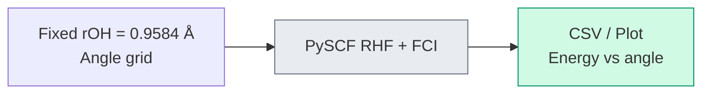
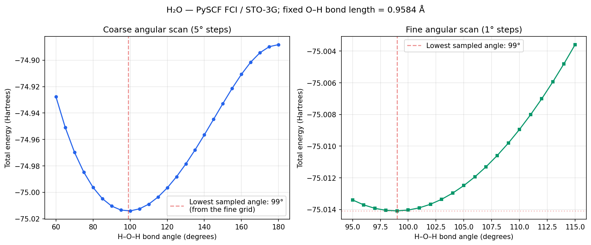

# Chapter 19: A Fixed-Bond Water Angle Scan

_We built the translation layer. Now we examine a classical FCI reference calculation that asks how water's energy changes as the molecule bends._

## In This Chapter

- **What you'll learn:** How to scan one coordinate of a potential energy surface, how to read a conditional minimum, and how to separate a classical chemistry reference from circuit construction.
- **Why this matters:** Geometry scans are the workload that a future quantum energy estimator would have to repeat. Credibility starts by stating which coordinates are fixed, which backend computes the energy, and which parts of the quantum pipeline actually run.
- **Prerequisites:** Chapter 18 (the complete H₂ pipeline).

---

## The Question

The gas-phase equilibrium angle of water is approximately 104.5° (Hoy &
Bunker, 1979). The oxygen atom sits at the vertex, the two hydrogen atoms at the
arms. VSEPR theory offers a qualitative explanation — two bonding pairs and two
lone pairs around oxygen arrange themselves to minimise repulsion — but it
doesn't predict the actual number.

Quantum mechanics does better. A full equilibrium geometry minimises the total
energy over all internal coordinates. If the O–H distance is held fixed and only
the angle varies, the minimum gives the best angle **along that one-dimensional
cut**, not a complete geometry optimisation.

Write the constrained energy as $E(\vartheta;r_0,r_0)$, where
$\vartheta$ is the H–O–H angle and $r_0=0.9584$ Å. Minimising
with respect to $\vartheta$ holds both bond lengths fixed:

$$\left.\frac{\partial E}{\partial\vartheta}\right|_{r_1=r_2=r_0}=0.$$

A full geometry minimum additionally requires the derivatives with
respect to both bond lengths to vanish. Nothing in a one-dimensional
scan tests those two conditions.

The committed calculation fixes $r_{\mathrm{OH}}=0.9584$ Å, the experimental
bond length, and scans only the H–O–H angle. It therefore contains empirical
geometric input. Its value is still substantial: every energy is an ab initio
RHF/FCI result in a declared basis, and the calculation is reproducible.

---

## The Strategy: A Potential Energy Surface Scan

The approach is simple:

1. **Fix the O–H distance.** We use $0.9584$ Å at every point.
2. **Pick a range of angles.** We scan 60° to 180° in 5° steps, then 95° to 115° in 1° steps.
3. **At each angle, run RHF and FCI in PySCF.** FCI is exact within the selected STO-3G orbital space and electron/spin sector.
4. **Write the energies and plot the curve.**
5. **Report the lowest sampled angle.** This is the conditional minimum on the fixed-bond grid.

---

## Separate the Reference from the Circuit

`code/ch19-bond-angle-scan.py` computes the energies directly with PySCF. It
does not export per-geometry FockMap JSON, invoke an encoding, taper qubits, or
diagonalise a FockMap matrix. The two tracks have different outputs:

- **PySCF track:** reproducible RHF/FCI reference energies, CSV files, and plot.
- **FockMap track:** encoded Hamiltonians and circuit costs, once
  geometry-by-geometry matrix parity and physical-sector selection are tested.

Every sampled angle reruns RHF and FCI. No precomputed FockMap
skeleton contributes to the timing or the energies reported here.

---

## The Integrals

The canonical H₂ raw tensor has four nonzero one-body and thirty-two
two-body spin-orbital entries. Water in STO-3G has seven spatial
orbitals, or fourteen spin-orbitals. That means $14^2=196$
one-body tensor slots and $14^4=38416$ two-body slots *before*
spin selection, symmetry and numerical zeros. Storage slots are
not a count of nonzero molecular terms.

> **Active space and frozen core:** H₂O has 10 electrons. This STO-3G scan
> includes all 7 spatial orbitals (14 spin-orbitals). Larger-basis studies often
> freeze the oxygen 1s core and treat its contribution as an offset, but that is
> an approximation whose effect must be checked for the target property. PySCF's
> `mc.CASCI`/`mc.CASSCF` interfaces can define an explicit active space.

The following is a self-contained **single-geometry example** using
the same PySCF calculation as the scan. It returns energies; it
does not create FockMap input:

```python
from pyscf import fci, gto, scf
import numpy as np

def h2o_energy(angle_degrees, bond_length=0.9584):
    angle_rad = np.radians(angle_degrees)
    hx = bond_length * np.sin(angle_rad / 2)
    hz = bond_length * np.cos(angle_rad / 2)
    mol = gto.M(
        atom=f'O 0 0 0; H {hx} 0 {hz}; H {-hx} 0 {hz}',
        basis='sto-3g',
        unit='Angstrom',
        charge=0,
        spin=0,
        symmetry=False,
        verbose=0,
    )
    mf = scf.RHF(mol)
    mf.kernel()
    if not mf.converged:
        raise RuntimeError("RHF did not converge")
    solver = fci.FCI(mf)
    e_fci, _ = solver.kernel()
    if not solver.converged:
        raise RuntimeError("FCI did not converge")
    return mol.energy_nuc(), mf.e_tot, e_fci

vnn, e_hf, e_fci = h2o_energy(99.0)
print(vnn, e_hf, e_fci)
```

### Geometry before objects

The oxygen is at $(0,0,0)$. The hydrogens are at

$$(r_0\sin(\vartheta/2),0,r_0\cos(\vartheta/2)),\qquad
(-r_0\sin(\vartheta/2),0,r_0\cos(\vartheta/2)).$$

The norm of each O–H vector is $r_0$, and their dot product is
$r_0^2\cos\vartheta$. These coordinates therefore set exactly the
angle requested, without moving the molecule's vertex. At
$\vartheta=180^\circ$, both hydrogens lie on the x axis; decreasing
the angle brings them towards the positive z direction.

The H–H separation is $2r_0\sin(\vartheta/2)$. It changes even
though both O–H distances stay fixed. In bohr units, the nuclear
repulsion is

$$V_{nn}(\vartheta)=\frac{16}{r_0}
+\frac{1}{2r_0\sin(\vartheta/2)}\quad\text{Ha}.$$

The first term is the two O–H nuclear pairs, with charge products
$8\times1$ each; the second is H–H. The $r_0$ in this expression
must first be converted from Å to bohr. PySCF does that conversion
from the declared `unit`. A narrowing angle increases H–H
nuclear repulsion; the electronic energy must change enough in
the opposite direction to make bending favourable.

```mermaid
flowchart LR
    A["Angle in degrees"] --> RAD["Convert to radians; divide by 2"]
    RAD --> XY["hx = r sin(angle/2); hz = r cos(angle/2)"]
    XY --> POS["O=(0,0,0); H=(±hx,0,hz)"]
    POS --> MOL["gto.M: basis, charges, spin counts"]
    MOL --> RHF["RHF.kernel: optimise occupied orbitals"]
    RHF --> FCI["FCI.kernel: optimise configuration coefficients"]
    FCI --> OUT["Return Vnn, total HF, total FCI"]
```



### The Python objects are stages of the calculation

`np.radians`, `np.sin` and `np.cos` are numerical functions.
`mol` is a PySCF molecule object holding the nuclear geometry,
basis and electronic counts, not a quantum state. With neutral
water, `spin=0` specifies $N_\alpha-N_\beta=0$, hence five
alpha and five beta electrons. Equal spin counts are not by
themselves a proof that every state in the solver's space is a
singlet.

`scf.RHF(mol)` creates a restricted Hartree–Fock solver.
Calling `.kernel()` runs its self-consistent-field iteration:
the molecular orbitals are adjusted until the occupied orbitals
and the mean-field operator agree. The name `mf` refers to that
solver and its results. `mf.e_tot` includes nuclear repulsion;
`mf.mo_coeff` is a matrix whose columns express molecular
orbitals as combinations of atomic basis functions.

`fci.FCI(mf)` creates an FCI solver using those molecular orbitals.
Its `.kernel()` returns an energy and a configuration-coefficient
array. The assignment `e_fci, _` keeps the energy and deliberately
does not use that array. In this wrapper the returned energy is
**total** energy: adding `vnn` again would count nuclear repulsion
twice. The explicit convergence checks distinguish a completed
calculation from a solver that stopped without meeting its target.

The molecular-orbital matrix also connects this code to the
integrals used earlier in the book. For real orbitals with
coefficient matrix $C$,
$h_{\mathrm{MO}}=C^\mathsf{T}h_{\mathrm{AO}}C$ transforms the one-electron
operator from the atomic-orbital basis. PySCF exposes
$h_{\mathrm{AO}}$ as `mf.get_hcore()`. A two-electron transformation
has four orbital indices and also requires the chemist-to-physicist
and spin-index conventions from Chapters 2–3 before it can become
our raw factory. None of those transformations is performed by
serialising `e_fci`.

### What "all-electron FCI" means here

The seven STO-3G spatial orbitals give
$\binom75\binom75=441$ determinants with five alpha and five
beta electrons. The full fourteen-mode Fock space would contain
$2^{14}=16384$ occupation states, most of them irrelevant to
neutral water. PySCF works in the specified electron-count
space; it does not have to store a dense full-Fock-space matrix.

The oxygen core orbital remains part of this calculation.
Freezing it would remove its allowed excitations and introduce
effective one-electron terms and a constant offset. That would
be a different model, not merely a faster way to obtain these
same all-electron FCI energies.

The companion script `code/ch19-bond-angle-scan.py` constructs each molecule,
runs RHF and FCI, writes the coarse and fine CSV files, and produces the plot.
Its PySCF backend is documented by Sun et al. (2020). Its data path is:



The method, basis, fixed coordinate, and energy backend are therefore visible
in the exact script that writes the published data.

---

## The Scan

The executable entry point is:

```bash
python3 code/ch19-bond-angle-scan.py
```

It writes `h2o_bond_angle_coarse.csv`, `h2o_bond_angle_fine.csv`, and
`h2o_bond_angle.png`. `make data` regenerates these outputs together with the
H₂ references.

---

## The Result: Coarse Scan

The coarse scan produces FCI energies at each geometry:

| Angle (°) | $E$ (Ha) | Angle (°) | $E$ (Ha) |
|:---:|:---:|:---:|:---:|
| 60 | −74.9277 | 110 | −75.0089 |
| 70 | −74.9697 | 120 | −74.9966 |
| 80 | −74.9963 | 130 | −74.9785 |
| 90 | −75.0104 | 150 | −74.9328 |
| 100 | −75.0140 | 180 | −74.8882 |
| 105 | −75.0125 | | |

The minimum is near **100°**, with energy rising away from it on both sides. The coarse scan tells us *where to look* — but the minimum could be anywhere between 95° and 105°. This is exactly how a computational chemist works: coarse grid first, then refine.

---

## Zooming In: Fine Scan

We rerun RHF and FCI from 95° to 115° in 1° steps. The narrower
grid improves the angular sampling; every point is still a fresh
electronic-structure calculation:

| Angle (°) | $E$ (Ha) | Angle (°) | $E$ (Ha) |
|:---:|:---:|:---:|:---:|
| 95 | −75.013394 | 106 | −75.011934 |
| 96 | −75.013706 | 107 | −75.011301 |
| 97 | −75.013924 | 108 | −75.010591 |
| 98 | −75.014051 | 109 | −75.009805 |
| **99** | **−75.014087** | 110 | −75.008946 |
| 100 | −75.014034 | 112 | −75.007011 |
| 101 | −75.013893 | 114 | −75.004798 |
| 103 | −75.013356 | 115 | −75.003590 |
| 105 | −75.012488 | | |

The lowest sampled point is **99°** with energy **−75.0141 Ha** for
$r_{\mathrm{OH}}=0.9584$ Å. The energy changes by only about 0.00005 Ha
between 98° and 100°, so a fitted or finer scan would be needed to quote a
sub-degree minimum.

### A sampled minimum is not a fitted minimum

The CSV gives the three neighbouring FCI totals:

$$E(98^\circ)=-75.0140506756,\quad
E(99^\circ)=-75.0140865447,\quad
E(100^\circ)=-75.0140335106\quad\text{Ha}.$$

Relative to 99°, the neighbours are higher by 0.0358691 and
0.0530341 mHa. This is a very shallow local energy difference.
An energy tolerance suitable for one task may be too loose to
locate a minimum in another.

For illustration, fit a parabola to these *three samples only*.
With $h=1^\circ$, its vertex is at

$$\vartheta_{\mathrm{fit}}=99^\circ+
\frac{h\,[E(98^\circ)-E(100^\circ)]}
{2[E(98^\circ)-2E(99^\circ)+E(100^\circ)]}
\simeq98.9035^\circ.$$

That is an interpolation result, not a newly computed geometry.
It assumes the curve is locally quadratic and does not estimate
the error from neglected higher powers. The committed numerical
claim remains: **99° is the lowest sampled FCI angle**.

The second finite difference is
$8.89032\times10^{-5}$ Ha/degree². To express a derivative
with respect to radians, multiply by $(180/\pi)^2$, giving
about 0.29185 Ha/radian². Forgetting this factor would severely
misstate an angular force constant while leaving the energy
table itself untouched.



---

## What Do the Numbers Mean?

The conditional minimum at **99°** in STO-3G is about 5° below the experimental
equilibrium angle of 104.52°. The comparison is not like-for-like because the
scan fixes the O–H length, but the minimal basis is also too inflexible,
especially because it lacks polarization functions.

A careful reader will notice something surprising: Hartree–Fock in STO-3G predicts **101°** — *closer* to the experimental 104.52° than our FCI result of 99°. Does this mean correlation makes things worse?

No. FCI lowers the variational energy at each geometry in the same
basis. That statement does not require its minimum to be closer
to the minimum of a *different*, more accurate model. Basis error,
the fixed-bond constraint and the shape of the correlation-energy
correction all affect the location. A more accurate eigensolver
within STO-3G does not make STO-3G a more flexible basis.

This is the same distinction as the H₂ dissociation asymptote:
minimal-basis FCI approaches two minimal-basis atoms, not two
complete-basis atoms. Improving configuration coefficients and
improving orbital space are separate convergence studies.

Larger bases and different correlation spaces can move the conditional minimum,
but this book does not quote cc-pVDZ/cc-pVTZ HF, MP2, or CASCI minima without a
committed record of orbital selection, frozen core, active space, state
symmetry, scan grid, software version, and output. The defensible conclusion
from the present data is narrower: in this fixed-bond STO-3G model, FCI shifts
the sampled minimum from the HF value of 101° to 99°.

The point is the method and its limits: the calculation explores an angular
energy landscape and finds a bent minimum without fitting the angle, while the
O–H distance remains fixed to experiment. A full geometry prediction would
optimize both bond lengths and the angle.

---

## Why Does Water Bend?

The energy curve tells us *that* water bends. But what drives the bend?

The bend is already present at the Hartree–Fock level. HF uses
a single Slater determinant and is the reference against which
correlation energy is defined. Its minimum on this cut is about
101°. Occupied orbitals can relax as the molecule bends, changing
kinetic, electron–nuclear, electron–electron and nuclear terms.
The total mean-field balance already favours a bent geometry.
The scan alone does not decompose that balance into a unique
"lone-pair repulsion" contribution.

What correlation adds is a quantitative correction. The FCI minimum occurs at
99° — shifted by about 2° from the HF minimum. Correlation also deepens the
energy well (the stated FCI bending energy from 180° to 99° is about 0.126 Ha,
compared with about 0.113 Ha at HF). Thus HF accounts for about
90% of this particular linear-to-bent energy difference. Correlation
does not *cause* the bend in this calculation.

This distinction matters: it illustrates what quantum simulation adds and what it doesn't. The *qualitative* prediction (water bends) comes from mean-field theory, which any laptop can compute. The *quantitative* refinement (exactly how much it bends, the precise curvature of the potential energy surface, the vibrational frequencies) is where correlated methods — and ultimately quantum simulation — earn their keep.

---

## What This Scan Says About Encoding

Nothing by itself. The PySCF FCI energies are independent of a
fermion-to-qubit map. An encoding comparison requires a committed H₂O integral
artifact, a declared active space and orbital order, direct-matrix parity,
physical-sector tapering, and generated term/weight/CNOT tables. Until that
artifact exists, molecule-specific encoding ratios belong in the benchmark
backlog rather than in this chemistry result.

---

## The Greenhouse Connection

Water's bent equilibrium structure gives the molecule a permanent electric
dipole and a rich rotational spectrum. Its vibrational modes, including the
bending mode near 1595 cm$^{-1}$, change the molecular dipole and can absorb
infrared radiation (Shimanouchi, 1972; Shostak, Ebenstein & Muenter, 1991).

A permanent dipole is not required for greenhouse activity: linear CO₂ has no
permanent dipole but has IR-active vibrations because its dipole changes during
those modes. Water's geometry contributes to its spectrum, while atmospheric
abundance, temperature, line strengths, and spectral overlap determine its
climate effect and water-vapour feedback (NASA Earth Observatory). The bond
angle is therefore one part of the causal chain, not the sole reason Earth has
a habitable temperature.

The scan supplies a constrained angular curvature, not a molecular
vibrational frequency. A frequency also needs the kinetic-energy
or mass metric for the coordinate. A full harmonic calculation
starts at an appropriate stationary geometry, builds the Cartesian
**Hessian** (the matrix of second energy derivatives), mass-weights
it, and separates translations and rotations from internal modes.
For nonlinear water, three vibrational modes remain.

Allowing the bond lengths to relax couples angle and stretching
coordinates. The curvature along our fixed-bond line is not
automatically the bending normal-mode eigenvalue of that full
problem. Moreover, IR intensities need dipole derivatives and
Raman intensities need polarisability derivatives; an energy
Hessian alone does not supply them. These are natural extensions,
but they are additional calculations rather than results hidden
inside this plot.

---

## Key Takeaways

- The committed result is a **PySCF FCI angular scan at fixed experimental
  $r_{\mathrm{OH}}=0.9584$ Å**, not a full geometry optimisation.
- The lowest sampled STO-3G point is **99°**; HF gives about 101° on the same
  cut, so bending is already a mean-field effect and correlation shifts the
  conditional minimum.
- FockMap does not produce the committed energies; geometry-by-geometry
  encoding and circuit benchmarks require separate parity artifacts.
- Bent water has a permanent dipole, while greenhouse absorption follows the
  more general rule that a vibration must change the dipole moment.

## Exercises

1. **Coordinate contract.** Starting from the two hydrogen positions
   given above, prove that both O–H lengths are $r_0$ and that
   the H–H distance is $2r_0\sin(\vartheta/2)$. Which nuclear
   repulsion term varies during this scan?
2. **Resolve the minimum.** Use the three supplied energies at 98°,
   99° and 100° to calculate the two energy gaps and the
   three-point parabolic vertex. Distinguish the sampled result
   from the interpolation assumption.
3. **From curvature to frequency.** Calculate the second finite
   difference in Ha/degree² and convert it to Ha/radian².
   Identify the additional information needed before reporting
   a molecular bending frequency.

## Further Reading

- Szabo, A. and Ostlund, N. S. *Modern Quantum Chemistry: Introduction to Advanced Electronic Structure Theory.* Dover, 1996. The standard reference for potential energy surface scans and the Hartree–Fock method used in this chapter.
- Hehre, W. J., Radom, L., Schleyer, P. v. R., and Pople, J. A. *Ab Initio Molecular Orbital Theory.* Wiley, 1986. Definitive source for STO-3G basis set benchmarks and molecular geometry optimisation.

---

**Previous:** [Chapter 18 — The Question We Can Now Answer](18-complete-pipeline.html)

**Next:** [Chapter 20 — Algorithms: VQE and QPE](20-algorithms.html)
