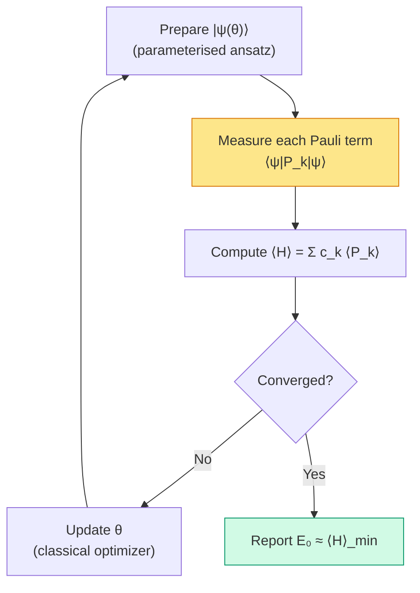

# Chapter 20: Algorithms — VQE and QPE

_The previous chapter produced a fixed-bond PySCF reference scan. Now we ask what a complete quantum energy-estimation workflow would require._

## In This Chapter

- **What you'll learn:** How the two major quantum chemistry algorithms — VQE (variational, near-term) and QPE (phase estimation, fault-tolerant) — consume the encoded Hamiltonian, and what measurement infrastructure they require.
- **Why this matters:** FockMap produces the *input* to these algorithms. Understanding what the algorithms need helps you make better encoding and tapering choices — and understand why the CNOT counts from Chapter 17 matter so much.
- **Prerequisites:** Chapters 17–19 (cost analysis, pipeline, bond angle scan).

---

## From Exact Diagonalisation to Quantum Hardware

Chapter 19 used PySCF RHF/FCI to produce a classical energy reference along one
angular coordinate at fixed O–H length. It did not run FockMap, taper a
14-qubit Hamiltonian, or prepare a quantum state. A quantum replacement would
need to reproduce the same electron/spin sector and energy at every geometry,
including state preparation, Hamiltonian measurement or controlled evolution,
and a complete error budget.

Classical validation remains useful well beyond these toy molecules.
For fourteen electrons in twenty spin-orbitals, the $M_s=0$
determinant space has only $\binom{10}{7}^2=14400$ states,
not the full $2^{20}$ Fock-space dimension. Classical solvers
also exploit sparsity and matrix-vector products rather than
necessarily storing a dense matrix. Chapter 22 separates these
resource categories. At sufficiently large active spaces,
however, exact classical treatment becomes prohibitive. We then
need a different way to extract energy from the encoded operator.

Quantum algorithms take a different route. Instead of building the exponentially large matrix, a quantum computer prepares the state directly in $n$ qubits and extracts the energy through measurement. Everything we built — the encoding, the tapering, the Trotter decomposition, the circuit export — feeds directly into these algorithms.

There are two main approaches, and they make very different demands on the hardware.

**VQE** (Variational Quantum Eigensolver) uses short circuits and many measurements. It's designed for *near-term* quantum computers — noisy devices with limited circuit depth but reasonable qubit counts. The quantum computer prepares a trial state and measures Pauli expectation values; a classical computer optimises the state parameters.

**QPE** (Quantum Phase Estimation) uses coherent controlled
evolution, typically requiring fault-tolerant hardware for
chemically useful instances. Error correction makes long circuits
possible; it does not make their depth, runtime or resource cost
disappear. QPE estimates an eigenvalue sampled according to the
input state's overlaps, not automatically the ground-state energy.

Both algorithms consume the same object: a Pauli Hamiltonian $\hat{H} = \sum_k c_k P_k$ — exactly what our pipeline produces.

---

## VQE: The Near-Term Algorithm

### Choose a state family before choosing an optimiser

An **ansatz** is a parameterised family of normalised trial
states. It defines which states the optimiser can search. The
variational principle says

$$E(\boldsymbol\theta)
=\langle\psi(\boldsymbol\theta)|H|\psi(\boldsymbol\theta)\rangle
\geq E_0$$

when $E_0$ is the lowest eigenvalue in the space containing the
trial states. To estimate a particular molecular sector's ground
state, keep the ansatz in that sector or explicitly enforce its
constraints. Searching a wrong charge sector can give a lower
number without answering the molecular question.

For the canonical JW H₂ example, use the two closed-shell
configurations from Chapter 6:

$$|g\rangle=|1100\rangle,\qquad |u\rangle=|0011\rangle.$$

They are occupation rows 3 and 12. The real block of the
electronic Hamiltonian in this ordered basis is

$$H_{\mathrm{closed}}=
\begin{pmatrix}A&g\\g&D\end{pmatrix}
=\begin{pmatrix}
-1.8318636465&0.1812104620\\
0.1812104620&-0.2524861931
\end{pmatrix}\quad\text{Ha}.$$

Here $g$ in the matrix is a coupling coefficient, not the ket
label $|g\rangle$. Define one real parameter $a$:

$$|\psi(a)\rangle=\cos a\,|g\rangle+\sin a\,|u\rangle.$$

Normalisation follows from $\cos^2a+\sin^2a=1$, and both
configurations have two electrons with one alpha and one beta.
For this particular minimal-basis H₂ model the ground state
lies in this closed-shell block. That useful reduction is not
a general claim that two determinants solve a molecule.

The ansatz gives an energy curve we can derive before running
any optimiser:

$$E(a)=A\cos^2a+D\sin^2a+2g\sin a\cos a$$
$$=\frac{A+D}{2}+\frac{A-D}{2}\cos(2a)+g\sin(2a).$$

At $a=0$ this is the HF energy $A$. Its derivative there is
$2g>0$, so a small *negative* angle lowers the energy.
The minimum connected to the HF state is

$$a_*=-\frac12\arctan\!\left(\frac{2g}{D-A}\right)
\simeq-0.112782834.$$

The resulting amplitudes are approximately 0.993646755 and
$-0.112543887$. The negative relative sign makes the
off-diagonal contribution lower the energy:

| $a$ (radians) | Electronic expectation (Ha) |
|---:|---:|
| 0 | -1.8318636465 |
| -0.05 | -1.8460093517 |
| -0.10 | -1.8521234089 |
| -0.112782834 | -1.8523881736 |
| -0.20 | -1.8400930811 |

Moving further in a useful direction eventually overshoots.
An optimiser has to locate a minimum, not merely make the
parameter large. Adding $V_{nn}=0.7151043391$ Ha converts
every row to total energy without changing the optimum.

### A preparation circuit for this teaching state

The state family above is not just notation. Define
$R_y(\beta)=e^{-i\beta Y/2}$. Use this direct preparation from `0000`:
apply $R_y(2a)$ to qubit 0, CNOT 0→1, CNOT 0→2,
CNOT 0→3, then X on qubits 0 and 1. The intermediate
superposition is
$\cos a|0000\rangle+\sin a|1111\rangle$;
the final Xs give exactly
$\cos a|1100\rangle+\sin a|0011\rangle$.
This is an analytical state-preparation circuit for the small
example, not a FockMap Hamiltonian-evolution output. Its
intermediate states need not preserve particle number; its
prepared output does.

### The Loop

VQE is fundamentally an optimisation loop. The quantum computer serves as a function evaluator — it takes parameters $\boldsymbol{\theta}$ and returns an energy estimate $\langle\hat{H}\rangle_\theta$. The classical computer adjusts $\boldsymbol{\theta}$ to minimise the energy.



The measurement box consumes the Pauli coefficients and a fresh
copy of the trial state for every shot. A Pauli term can be
measured in its local basis without the evolution staircase
(Chapter 14). Several terms may share a measurement circuit.

### Measurement Grouping

Not every Pauli term needs its own circuit. Two Pauli operators can share
a product of local measurement bases if they **qubit-wise commute** — that is, if they commute on every individual qubit position. For example, $ZI$ and $ZZ$ qubit-wise commute (both have $Z$ or $I$ at each position), so a single $Z$-basis measurement of all qubits yields both expectation values.

For a declared **qubit-wise-commuting** (QWC) strategy, every group must use one
compatible local basis on each qubit. Any grouping API must state whether it
uses QWC or the broader notion of general commutation (Yen, Verteletskyi &
Izmaylov, 2020).

The canonical 15-term H₂ Hamiltonian has a simple five-basis QWC partition: all
10 non-identity Z-only terms share the computational basis, while each of the
four full-support X/Y strings needs its own local basis. The identity needs no
shots and may be assigned to any group for bookkeeping.

Qubit-wise commutation is stricter than ordinary commutation.
For example, XX and YY commute globally because their local
anticommutations occur twice. They are not QWC: no single-qubit
basis measures both X and Y on either qubit. A common
eigenbasis can measure such a commuting set, but generally
requires an entangling basis transformation.

Fewer basis settings can reduce preparation and scheduling
overheads. It does not prove fewer total shots: the variance
and covariance of the grouped outcomes determine that.

### From outcomes to uncertainty

One Pauli measurement gives a random variable $p\in\{+1,-1\}$.
Its **mean** is $\mu=\mathbb E[p]=\langle P\rangle$.
Its **variance**, the mean squared deviation from its mean, is

$$\sigma^2=\mathbb E[(p-\mu)^2]=\mathbb E[p^2]-\mu^2
=1-\mu^2.$$

For $N$ independent, identically distributed shots, the sample
mean $\bar p=N^{-1}\sum_s p_s$ is unbiased and has variance
$\sigma^2/N$. Its **standard error** is the square root,
$\sigma/\sqrt N$. This is uncertainty in the estimated mean,
not a claim that each individual outcome becomes less random.

Suppose ten shots give seven pluses and three minuses. Then
$\bar p=0.4$. The unbiased sample variance is
$s^2=N(1-\bar p^2)/(N-1)=0.9333\ldots$, and the estimated
standard error is $\sqrt{s^2/N}\simeq0.3055$.
Ten shots are a very noisy estimate, despite the tidy decimal 0.4.
For a coefficient of 0.2 Ha, this contributes an estimated
energy of 0.08 Ha with estimated standard error about 0.0611 Ha.

A **confidence interval** requires an additional probability
statement. Under the independent-shot model, Hoeffding's
inequality for bounded $\pm1$ outcomes gives

$$\Pr(|\bar p-\mu|\geq h)\leq2e^{-Nh^2/2}.$$

Thus $h=\sqrt{2\log(2/\alpha)/N}$ gives coverage at least
$1-\alpha$; intersect the resulting interval with $[-1,1]$.
At $N=1000$ and $\alpha=0.05$, the half-width is about
0.0859. This conservative finite-sample statement differs from
a large-sample normal approximation such as "roughly two
standard errors". Neither corrects device bias or correlated
shots.

The familiar $1/\delta^2$ scaling comes from asking for a
standard error of order $\delta$. Its constant and confidence
level still need to be stated.

### Independent-term allocation

**The energy estimator.** The identity coefficient is known
exactly. For each non-identity term, estimate $\langle P_k\rangle$
from a separate batch of $N_k$ independent shots, giving
$\hat m_k$ with variance at most $1/N_k$. Then
$\hat E=c_I+\sum_{k\ne I}c_k\hat m_k$.

**Error propagation.** The variance of the total energy estimate is:

$$\text{Var}(\hat{E}) = \sum_{k\ne I}c_k^2
\,\text{Var}(\hat{m}_k)\leq\sum_{k\ne I}\frac{c_k^2}{N_k}.$$

**Coefficient-only allocation.** For a budget
$N_{\mathrm{total}}=\sum_{k\ne I}N_k$, minimise the upper
bound $\sum_{k\ne I}c_k^2/N_k$, not an unknown actual
variance. A Lagrange multiplier $\nu$ gives
$-c_k^2/N_k^2+\nu=0$, hence $N_k\propto|c_k|$.
Substituting this continuous allocation back gives:

$$\text{Var}(\hat{E}) \leq \frac{1}{N_\text{total}} \left(\sum_{k\ne I} |c_k|\right)^2.$$

**Setting the target.** For energy precision $\epsilon$ (meaning standard
deviation $\leq\epsilon$), the condition
$\operatorname{Var}(\hat E)\leq\epsilon^2$ is guaranteed by:

$$N_\text{total} \geq \frac{1}{\epsilon^2}
\left(\sum_{k\ne I}\lvert c_k\rvert\right)^2.$$

This is a **sufficient worst-case allocation bound**, not a
necessary lower bound on every experiment. It minimises the
coefficient-only upper bound by pretending every Pauli outcome
has variance one. A state that is already an eigenstate of a
measured Pauli has zero variance for that term.

If the individual variances $\sigma_k^2$ are known, the
variance-informed allocation is instead
$N_k\propto|c_k|\sigma_k$, with optimum variance
$(\sum_k|c_k|\sigma_k)^2/N_{\mathrm{total}}$ in the continuous
allocation relaxation. Real shot counts are integers, so
round allocations upwards and recompute the achieved bound.
These formulas concern independent term datasets, not a
grouped measurement that reuses the same shots.

The identity coefficient is known exactly and contributes no sampling variance,
so omit it from the measurement norm. Tapering can change the term list and
coefficients, but it does not guarantee that this 1-norm decreases; compute it
for the actual physical sector.

```fsharp
let epsilon = 0.0016
let measurementNorm = 1.8871072169
let independentTermBound =
    ceil (measurementNorm * measurementNorm / (epsilon * epsilon))
```

For the canonical, untapered H₂ Hamiltonian,
$\lambda_{\mathrm{meas}}=\sum_{k\ne I}|c_k|=1.8871072169$ Ha. The full
coefficient 1-norm is
$\lambda_{\mathrm{coeff}}=2.6992778241$ Ha when the known identity term is
included. The independent-term bound uses $\lambda_{\mathrm{meas}}$ and gives
about $1.39\times10^6$ shots at $\epsilon=1.6$ mHa. This is a worst-case
variance bound under the stated measurement model, not a prediction of the
shots required by every estimator. Neither quantity is the commutator sum
$\Lambda_{\mathrm{comm}}=0.2861997180$ Ha$^2$ from Chapter 15.

### Grouping changes the random variable

For one QWC group $G$, each shot supplies compatible signs
$p_k$ from the *same* bitstring. Form its energy contribution

$$X_G=\sum_{k\in G}c_kp_k.$$

The group variance is

$$v_G=\operatorname{Var}(X_G)
=\sum_{k\in G}c_k^2(1-\mu_k^2)
+2\sum_{\substack{j<k\\j,k\in G}}c_jc_k\operatorname{Cov}(p_j,p_k),$$

where $\operatorname{Cov}(p_j,p_k)=\mathbb E[p_jp_k]-\mu_j\mu_k$.
With independent shot batches for different groups,

$$\operatorname{Var}(\hat E)=\sum_G\frac{v_G}{N_G}.$$

Use $N_G\propto\sqrt{v_G}$ if the group variances are known.
They can be estimated from pilot shots or bounded conservatively.
The identity adds a known constant to $X_G$ and has zero
variance and zero covariance with every other term.

For a concrete counterexample, measure $Z_0$ and $Z_1$ on
a Bell state $(|00\rangle+|11\rangle)/\sqrt2$.
Both means vanish, both variances are one, and the covariance
is one because their signs always agree. For
$H_+=Z_0+Z_1$, a grouped shot is either $+2$ or $-2$,
with variance four. Ignoring covariance would report two and
understate the uncertainty. For $H_-=Z_0-Z_1$, every grouped
shot is exactly zero, with zero variance; independent term
measurements would miss this cancellation.

At a fixed total budget $N$, independent measurements of the
two terms, half allocated to each, give variance $4/N$
for either sum or difference. Grouping gives $4/N$ for
$H_+$ and zero for $H_-$. One shared basis setting is
useful, but its shot saving depends on the estimator.

### Tracing a VQE Iteration for H₂

For H₂, a VQE iteration has the following structure:

1. **Prepare** a sector-appropriate trial state $\lvert\psi(\boldsymbol{\theta})\rangle$
2. **Measure** the Hamiltonian in the five QWC bases above, allocating shots according to the chosen estimator
3. **Compute** $\langle H \rangle = \sum_k c_k \langle P_k \rangle$ from the measurement results.
4. **Update** $\theta$ using a classical optimizer (e.g., COBYLA).
5. **Repeat** until a stopping rule accounting for statistical uncertainty
   is met; a small observed $|\Delta E|$ alone is not a proof of accuracy.

The number of optimiser iterations is ansatz-, optimiser-, noise-, and
initialisation-dependent; there is no universal iteration-count guarantee.
FockMap can provide the Hamiltonian and circuit primitives, while an execution
framework runs state preparation, sampling, and optimisation.

Our two-configuration example separates three possible failures.
An ansatz restricted to $a=0$ cannot recover correlation
regardless of shot budget: that is ansatz bias. A search that
stops at $a=-0.05$ has not found this family's minimum:
that is optimisation error. A noisy estimate at the correct
$a_*$ can still fluctuate above or below the true energy:
that is sampling uncertainty. The variational lower bound
applies to the exact expectation of the state, not to every
finite-sample estimate printed by the optimiser.

### Where FockMap Fits

The confirmed FockMap contribution to VQE is before the measurement loop:

1. **The Hamiltonian** $\{c_k, P_k\}$ — the list of Pauli terms and coefficients
2. **Pauli-rotation circuits** — possible building blocks for state preparation
3. **Circuit export** — a bridge to the execution framework

The companion `code/ch20-measurement-groups.fsx` checks
the pinned `groupCommutingTerms` result against an independent
QWC test, verifies coverage of every term, and writes
`_build/data/h2_measurement_groups.json`. Its five groups
agree with the local-basis partition taught here. This
does not make the coefficient-only shot proxy an exact
grouped variance calculation.

The actual VQE loop — parameter optimisation, circuit execution, shot collection — is handled by execution frameworks like Qiskit, Cirq, or Quokka. FockMap produces the input they consume.

---

## QPE: The Fault-Tolerant Algorithm

### The Idea

QPE does not optimise a variational objective. Given controlled time evolution
and an input state with overlap on an eigenstate, phase kickback estimates that
eigenstate's energy. It returns the ground-state energy only to the extent that
the prepared state overlaps the ground state and the resulting phase is selected
(Kitaev, 1995; Reiher et al., 2017).

One way to implement the required controlled evolution is a product formula
using the Pauli rotations from Chapter 15. Qubitization and other Hamiltonian-
simulation methods are alternatives; QPE requires controlled evolution, not
Trotterization specifically.

### The Circuit

First see where the phase becomes observable. Prepare a single
control in $|+\rangle=(|0\rangle+|1\rangle)/\sqrt2$ and
the system in an eigenstate of $U$ with eigenvalue
$e^{2\pi i\phi}$. Controlled-U produces

$$\frac{|0\rangle|E\rangle+|1\rangle U|E\rangle}{\sqrt2}
=\frac{|0\rangle+e^{2\pi i\phi}|1\rangle}{\sqrt2}|E\rangle.$$

The eigenstate is unchanged; the phase has appeared on the
control. This is **phase kickback**. Applying H to the
control then gives outcome zero with probability
$[1+\cos(2\pi\phi)]/2$. One control alone does not resolve
an arbitrary phase: different phases can have the same cosine.
QPE uses several controlled powers to encode more information.

Choose a reference shift $E_{\mathrm{shift}}$, an evolution time $t_0$, and
a known energy interval narrow enough that its width $W$ satisfies
$Wt_0<2\pi$. Define

$$U=e^{-i(\hat H-E_{\mathrm{shift}})t_0}.$$

For an eigenstate $\lvert E\rangle$,

$$U|E\rangle=e^{2\pi i\phi}|E\rangle,\qquad
\phi=-\frac{(E-E_{\mathrm{shift}})t_0}{2\pi}\pmod 1.$$

The QPE circuit has an ancilla register and a system register holding a trial
state $\lvert\psi\rangle=\sum_E a_E\lvert E\rangle$:

1. Ancilla qubit $j$ controls an approximation to $U^{2^j}$.
2. After all controlled operations, an inverse QFT on the ancilla register converts the accumulated phases into a binary representation of the energy eigenvalue.
3. Measuring the ancilla register yields an $m$-bit phase estimate associated
   with eigenvalue $E$ with probability approximately $\lvert a_E\rvert^2$, before
   finite-precision and simulation errors.

A naive implementation repeats a base circuit $2^j$ times for $U^{2^j}$;
more advanced simulation methods organize the long-time evolution differently.
Either way, the largest controlled evolution drives the precision cost.

### What the inverse QFT does: two bits

For a register of $m$ bits, let $M=2^m$. Its integer basis
$|x\rangle$ uses $x=\sum_j b_j2^j$. The **quantum
Fourier transform** is the unitary

$$F_M|y\rangle=\frac1{\sqrt M}\sum_{x=0}^{M-1}
e^{2\pi ixy/M}|x\rangle.$$

Its inverse conjugates the phase in the sum. It is a quantum
circuit, not a classical post-processing step. Preparing
uniform controls and applying controlled-$U^{2^j}$ gives,
for an eigenstate, the control state

$$\frac1{\sqrt M}\sum_{x=0}^{M-1}e^{2\pi ix\phi}|x\rangle.$$

For two bits and $\phi=1/4$, this is

$$\tfrac12(|0\rangle+i|1\rangle-|2\rangle-i|3\rangle)
=F_4|1\rangle.$$

Applying $F_4^\dagger$ returns integer 1 with certainty
under exact operations. In ordinary most-significant-bit
binary notation that integer is `01`; in our q0-leftmost
display it is `10`. These are the same two physical bits
with different text ordering.

To verify the cancellation directly, the amplitude at output
$y$ is

$$\frac14\sum_{x=0}^{3}e^{2\pi ix(1-y)/4}.$$

For $y=1$ all four terms are one. For every other $y$
they cancel around the unit circle. QPE is using
interference to turn a phase pattern into a labelled integer.

When $M\phi$ is not an integer, no output has probability
one. The exact ideal distribution is

$$p(y)=\frac1{M^2}\left|
\sum_{x=0}^{M-1}e^{2\pi ix(\phi-y/M)}
\right|^2.$$

It concentrates near the phase grid points closest to
$\phi$, with tails. Rounding a phase on paper identifies
a representative bin; it does not prove that one run will
return that bin.

### H₂: from energy to a twelve-bit result and back

Use the *electronic* Hamiltonian. Declare a containing energy
interval $[-2,0.25]$ Ha, reference shift
$E_{\mathrm{shift}}=0.5$ Ha, and $t_0=1$ atomic time unit.
Its interval width is 2.25 Ha, and $Wt_0<2\pi$.
With this choice

$$\phi=\frac{0.5-E}{2\pi}$$

lies between 0.0397887 and 0.3978874 on the chosen
branch. There is no wrap through zero within the interval.
The canonical ground energy gives

$$E=-1.8523881736\ {\mathrm{Ha}}
\longrightarrow\phi=0.3743942059
\longrightarrow 4096\phi=1533.5186673.$$

The nearest twelve-bit phase integer is $y=1534$,
conventionally written `010111111110` from most to least
significant bit. Decode it on the declared branch:

$$E_{\mathrm{decoded}}=0.5-\frac{2\pi(1534)}{4096}
=-1.8531265286\ {\mathrm{Ha}}.$$

The discrepancy from the exact electronic ground energy is
about $-0.0007383550$ Ha. The grid spacing is

$$\Delta E_{\mathrm{bin}}=\frac{2\pi}{4096}
=0.0015339808\ {\mathrm{Ha}}.$$

This nearest-bin example is within half a bin. An actual QPE
sample can fall in a neighbouring bin, so a resolution
calculation is not a confidence calculation. Add nuclear
repulsion *after* decoding if total energy is wanted, giving
about $-1.1380221895$ Ha for this particular bin.

If the simulation circuit omits $c_I I$, its controlled
version must account for both offsets:

$$U=e^{-i(c_I-E_{\mathrm{shift}})t_0}\,e^{-i(H-c_I I)t_0}.$$

The scalar factor in this expression becomes a relative
phase under control. Alternatively, declare and decode the
shifted Hamiltonian actually simulated. A correct integer
read with the wrong offset gives a wrong energy.

The cost is dominated by controlled Hamiltonian simulation at exponentially
increasing times. A controlled Pauli rotation is not obtained by universally
"doubling the CNOT count"; the overhead depends on the decomposition, controls,
ancilla strategy, target gate set, and error budget.

### Resource Estimation

For target energy resolution $\epsilon$, ignoring confidence overhead:

- **System qubits**: $n$ (from the encoding, after tapering)
- **Resolution qubits**:
  $m\ge\left\lceil\log_2\!\left(2\pi/(\epsilon t_0)\right)\right\rceil$
- **Additional repetitions or ancillas**: enough to reach the stated confidence
- **Controlled-simulation accuracy**: budgeted so phase-estimation error,
  Hamiltonian-simulation error, and state-preparation error meet the final
  energy target

For H₂ with $t_0=1$ atomic unit and $\epsilon=1.6$ mHa, the formula gives
12 resolution qubits before confidence overhead. This arithmetic is
meaningful only after specifying an energy shift and range that prevent
aliasing. The book does not quote a total controlled-gate count for H₂ or H₂O
until a complete, reproducible simulation and confidence model is provided.

Four independent parts of this calculation should remain visible:

| Quantity | Canonical example | What it controls |
|:---|:---|:---|
| Energy interval and shift | $[-2,0.25]$ Ha; shift 0.5 Ha | Unambiguous phase branch |
| Phase-register resolution | 12 bits at $t_0=1$ | 1.534 mHa grid spacing |
| Input-state overlap | HF ground overlap squared $\simeq0.9873339$ | Probability of selecting the ground eigenphase |
| Simulation and readout accuracy | Separately budgeted | Distortion and confidence of the phase sample |

The ideal HF overlap does not become better when we add phase
bits. Conversely, a nearly perfect ground state does not remove
finite phase resolution. Ignoring readout and simulation errors,
the probability that no trial selected the ground eigencomponent
in $r$ independent runs is $(1-p_0)^r$, with
$p_0\simeq0.9873339$. This addresses overlap alone, not whether
the returned phase lies within the desired energy interval.

For a base-circuit implementation with twelve controls, the
controlled powers require evolution times $1,2,\ldots,2048$
atomic units and total time 4095. A Trotter step count
certified only for time 1 cannot be reused at time 2048
without checking the error. Assign simulation tolerances to
the controlled operations and bound their accumulated effect.
The twelve phase qubits are not a complete resource estimate.

### Run the small algorithmic examples

The companion `code/ch20-vqe-qpe.py` evaluates the
closed-shell energy curve and the ideal phase-estimation
distribution for the shift used here:

```bash
python3 code/ch20-vqe-qpe.py
dotnet fsi code/ch20-measurement-groups.fsx
```

These are classical teaching calculations: the first
uses small matrices to expose preparation and phase
decoding, and the second checks the QWC groups returned
by the pinned FockMap API. They do not submit a VQE
or fault-tolerant QPE job to hardware.

For the exact ground eigenstate, the twelve-bit
distribution assigns approximately 0.435828 probability
to the nearest bin 1534. That is the peak, not a
certainty; the ideal phase lies almost halfway
between two bins. This is a useful numerical
reminder that resolution and confidence are
different quantities.

FockMap's `qpeResources` helper supplies an
uncontrolled product-formula cost proxy, not a
generated controlled-QPE gate count. The analytical
phase decode and this helper therefore do not
establish a complete physical resource estimate.

---

## VQE vs QPE: A Summary

| | VQE | QPE |
|:---|:---|:---|
| **Hardware** | Near-term (noisy) | Fault-tolerant |
| **Circuit depth** | Ansatz-dependent | Deep controlled evolution |
| **Measurements** | Many (estimator-dependent) | Repeated phase samples for confidence and state-overlap filtering |
| **Classical cost** | Optimisation and statistical processing | Decode phase branch and combine repetitions |
| **Bottleneck** | Shot count, barren plateaus | Circuit depth, error correction |
| **FockMap provides** | Hamiltonian and possible preparation primitives | Hamiltonian and uncontrolled product-formula primitives |

Chapter 19 uses PySCF FCI to supply a classical reference energy at each point
of a fixed-bond angular scan. Replacing that backend with VQE or QPE would
require a sector-appropriate state-preparation and error budget at every
geometry; it is not a drop-in substitution of one function call.

---

## The Measurement Program in Practice

Let's look at the QWC measurement infrastructure for the canonical direct H₂
Hamiltonian in detail.

A valid QWC grouping for the canonical H₂ Hamiltonian is:

| Group | Terms | Measurement basis |
|:---:|:---:|:---|
| 1 | 10 non-identity Z terms (+ optional identity) | ZZZZ (computational basis) |
| 2 | 1 | XXYY |
| 3 | 1 | XYYX |
| 4 | 1 | YXXY |
| 5 | 1 | YYXX |

Group 1 contains all Z-only terms. Each full-support X/Y string requires its own
local basis under QWC grouping. A general-commuting strategy may combine terms
differently but needs an entangling measurement circuit and must be labelled as
such.

This is the bridge between FockMap's algebraic output and the experimental reality of a quantum computer: each group becomes a circuit variant, each circuit runs thousands of times, and the statistics are combined to estimate the energy.

---

## What FockMap Does — and What It Doesn't

FockMap's scope ends at circuit generation. It is important to be clear about what lies *outside* that scope:

- **Ansatz design**: VQE requires a parameterised circuit (ansatz). FockMap does not design ansätze — it provides Trotter circuits and Pauli operator pools that downstream tools (Qiskit, tket, PennyLane) can use as building blocks.
- **Classical optimisation**: the VQE optimisation loop (choosing $\boldsymbol{\theta}$, handling barren plateaus, selecting an optimizer like L-BFGS or COBYLA) is handled by the execution framework, not FockMap.
- **Hardware execution**: submitting circuits to real devices, managing job queues, handling device calibration — all downstream.
- **Error mitigation**: ZNE, PEC, symmetry verification — these operate on measurement outcomes and are handled by execution frameworks. (FockMap's tapering symmetries are useful *inputs* to symmetry verification, but FockMap doesn't implement the mitigation itself.)
- **Noise modelling**: hardware noise interacts with both Trotter error and measurement error. FockMap's cost estimates are for *ideal* (noiseless) circuits; real performance depends on device characteristics.

> **Barren plateaus**, briefly: some ansatz, cost and initialisation
> choices produce energy gradients whose variance decreases
> exponentially with system size. This can make optimisation
> statistically expensive. It is a property to analyse, not a
> theorem that every large VQE has a flat landscape or that
> every adaptive ansatz avoids one.

---

## Key Takeaways

- **VQE** requires a state family, a measurement estimator and an
  optimiser. Its statistical error is distinct from ansatz and
  optimisation errors.
- **QPE** requires controlled evolution, a declared phase branch,
  eigenstate overlap and a confidence budget. Product-formula
  circuits supply a primitive, not the complete algorithm.
- **Measurement grouping** reduces basis settings; covariance
  determines its shot cost. Tapering does not guarantee a lower
  measurement coefficient norm.
- Both algorithms consume the same input — the Pauli Hamiltonian — but make different demands on the hardware. Encoding and tapering choices help both.

## Exercises

1. **One-parameter H₂.** Using the supplied $A,D,g$, calculate
   $E(0)$, $E(-0.10)$ and the minimising angle $a_*$.
   Explain why the negative relative amplitude lowers the energy,
   and why exact time evolution from HF would not do the same job.
2. **Statistics and covariance.** Ten Pauli shots contain seven
   pluses and three minuses. Calculate the mean, unbiased sample
   variance and estimated standard error. Then calculate the
   grouped-shot variances of $Z_0+Z_1$ and $Z_0-Z_1$
   on the Bell state given above.
3. **Phase decode.** For $E_{\mathrm{shift}}=0.5$ Ha,
   $t_0=1$ and the interval $[-2,0.25]$ Ha, decode
   twelve-bit integer 1534 and calculate the energy-bin spacing.
   Explain why this resolution does not establish ground-state
   overlap, simulation accuracy or a confidence level.

## Further Reading

- Peruzzo, A., McClean, J., Shadbolt, P., Yung, M.-H., Zhou, X.-Q., Love, P. J., Aspuru-Guzik, A., and O'Brien, J. L. "A variational eigenvalue solver on a photonic quantum processor." *Nat. Commun.* 5, 4213 (2014). The original VQE paper.
- Kitaev, A. Yu. "Quantum measurements and the Abelian Stabilizer Problem." arXiv:quant-ph/9511026 (1995). Introduces quantum phase estimation, the foundation of QPE-based chemistry algorithms.
- Hoeffding, W. "Probability Inequalities for Sums of Bounded Random
  Variables." *Journal of the American Statistical Association* 58,
  13–30 (1963). DOI: 10.1080/01621459.1963.10500830.

---

**Previous:** [Chapter 19 — A Fixed-Bond Water Angle Scan](19-bond-angle.html)

**Next:** [Chapter 21 — Speaking the Hardware's Language](21-circuit-export.html)
