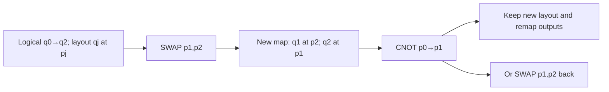

# Chapter 21: Speaking the Hardware's Language

_The circuit exists in FockMap's type system. To run it on real hardware, we need to speak the machine's language._

## In This Chapter

- **What you'll learn:** How to export FockMap gate sequences as
  OpenQASM, Q# or JSON, import a declared subset with a versioned
  toolchain, and keep qubit order, phase and ownership intact.
- **Why this matters:** Export makes a circuit available to another
  program. It becomes an experiment only after a driver prepares
  inputs, executes the circuit and collects the intended outputs.
- **Prerequisites:** Chapter 18 (the circuit-construction pipeline).

---

## Three Formats, One Circuit

FockMap's Trotter decomposition (Chapter 16) produces a concrete gate sequence — an array of `Gate` values representing Hadamard, S, CNOT, and Rz operations. That array is a platform-independent description of the circuit. But to execute it, you need to express it in a format that a quantum platform understands.

The three main targets:

| Format | Ecosystem | Platforms |
|:---|:---|:---|
| **OpenQASM 2 or 3** | Quantum assembly language | A named importer supporting that version and gate subset |
| **Q#** | Quantum Development Kit | A caller-provided register and an appropriate execution target |
| **Circuit JSON** | FockMap interchange schema | An explicit adapter into a chosen SDK |

FockMap can export to all three from the same gate array. The structure is always the same: take the Trotter step, decompose it to gates, export.

### The ordering boundary

Numeric gate operands keep their index: FockMap qubit 0 exports as `q[0]`.
String labels need separate treatment. FockMap displays a Pauli signature as
$P_0P_1\ldots$, while Qiskit-style Pauli labels display qubit 0
at the rightmost character. Reverse the signature when crossing that API
boundary, and test the resulting matrix on labelled basis states. Equal
eigenvalues do not prove that amplitudes or occupations use the right order.

---

## OpenQASM: A Versioned Interface

OpenQASM is an assembly-language specification with multiple
versions. Version 3 includes qubit declarations, standard gates,
parameterised rotations and classical control, but supporting
the language does not imply that an importer supports every
feature. Nor does a device's Python SDK necessarily accept
an arbitrary QASM file directly.

The book's export route needs only H, S, Sdg, CNOT and Rz,
with numeric angles and no measurements or dynamic control.
That small subset is a useful interoperability contract.

The F# snippets in this chapter are contextual excerpts:
they assume the imports, Hamiltonian and register width
from the complete export companion described below.

```fsharp
let step = firstOrderTrotter 0.1 hamiltonian
let gates = decomposeTrotterStep step
let qasm = toOpenQasm defaultOpenQasmOptions numQubits gates
printfn "%s" qasm
```

The following **analytical two-qubit example** illustrates
the syntax; it is an XZ rotation, not the canonical
four-qubit molecular Hamiltonian:

```
OPENQASM 3.0;
include "stdgates.inc";

qubit[2] q;

h q[0];
cx q[0], q[1];
rz(0.01234567) q[1];
cx q[0], q[1];
h q[0];
```

Each Pauli rotation from Chapter 16 becomes a CNOT staircase bracketed by basis-change gates. The angle in `rz()` is the rotation parameter — OpenQASM's `rz(θ)` implements $e^{-i\theta Z/2}$, so FockMap passes $\theta = 2 c_k \Delta t$ to produce the intended rotation $e^{-i c_k \Delta t Z}$.

### Gate Mapping

| FockMap Gate | OpenQASM |
|:---|:---|
| `Gate.H i` | `h q[i];` |
| `Gate.S i` | `s q[i];` |
| `Gate.Sdg i` | `sdg q[i];` |
| `Gate.CNOT (c, t)` | `cx q[c], q[t];` |
| `Gate.Rz (i, θ)` | `rz(θ) q[i];` |

### Configuration

```fsharp
type OpenQasmOptions =
    { IncludeHeader : bool      // "OPENQASM 3.0;" + include
      QubitName     : string    // default: "q"
      Precision     : int       // decimal places for angles
      Version       : QasmVersion }  // V2 or V3

// Select the syntax required by the chosen importer.
let qasm2 = toOpenQasm defaultOpenQasm2Options numQubits gates
```

QASM 2.0 differs in syntax (e.g., `qreg q[2];` instead of `qubit[2] q;`) but the gate names are identical. Use V2 when the target platform doesn't yet support V3.

### Decimal precision is part of the contract

FockMap's default angle precision is six decimal places.
That may be suitable for displaying a circuit, but it is
not a lossless interchange setting. The companion
`code/ch21-export-check.fsx` uses fifteen decimal places
and invariant-culture formatting so the decimal point
does not depend on the machine's locale.

For one Rz angle changed by $\delta\gamma$, the
operator difference satisfies

$$\|R_z(\gamma+\delta\gamma)-R_z(\gamma)\|
=2|\sin(\delta\gamma/4)|\leq|\delta\gamma|/2.$$

Round $r$ rotation angles to six decimal places and
each has error at most $0.5\times10^{-6}$ radians.
A telescoping bound gives a circuit discrepancy at
most $r(0.25\times10^{-6})$, before floating-point
evaluation effects. For fourteen rotations that is
$3.5\times10^{-6}$. A comparison tolerance of
$10^{-12}$ would therefore be unjustified for the
six-decimal serialisation, even if the exporter were
otherwise perfect.

The rotation angle's printed precision is separate
from product-formula error. Printing more digits
does not make a first-order formula more accurate
at a large time step.

---

## Q#: Azure Quantum

Q# is Microsoft's quantum programming language, designed from
the ground up for expressing quantum algorithms.[^qsharp]
FockMap generates a namespace and an operation containing
gate calls. The operation accepts an existing qubit array:
it does **not** allocate that array or choose an input state.

[^qsharp]: The author was part of the team at Microsoft that created Q#.

```fsharp
let qsharp = toQSharp defaultQSharpOptions numQubits gates
printfn "%s" qsharp
```

The output:

```qsharp
namespace FockMap.Generated {
    open Microsoft.Quantum.Intrinsic;

    operation TrotterStep(qs : Qubit[]) : Unit is Adj + Ctl {
        H(qs[0]);
        CNOT(qs[0], qs[1]);
        Rz(0.01234567, qs[1]);
        CNOT(qs[0], qs[1]);
        H(qs[0]);
    }
}
```

### Configuration

```fsharp
type QSharpOptions =
    { Namespace     : string    // default: "FockMap.Generated"
      OperationName : string    // default: "TrotterStep"
      Precision     : int }     // decimal places for angles
```

The generated operation is a pure gate sequence — no measurement, no classical control, no qubit allocation. The calling code (your VQE or QPE driver) allocates the qubits, calls `TrotterStep(qubits)`, and handles measurement.

`Adj + Ctl` declares support for the adjoint and controlled
forms of the operation. It does not allocate a control
register, add the omitted molecular identity phase, or
build a phase-estimation algorithm. The namespace syntax
above is the raw output of FockMap 0.9.0, accepted by
the pinned Q# compiler in the import route below.

That ownership boundary matters. The generated operation
cannot reset its input register at the end merely to make
a standalone example tidy: its caller may need the coherent
output as input to another operation. A standalone driver
can allocate four qubits, prepare a chosen input, call
`FockMap.Generated.TrotterStep`, measure the required
observable, and reset or release resources according to
the runtime's requirements.

A simulator harness may also call the generated operation
and then an independently supplied inverse to test a
round trip. Returning the register to zero in such a
test is a property of the *harness*, not a new reset
instruction in the exported molecular circuit.

---

## JSON: The Python Bridge

Python can parse JSON, but a quantum SDK does not automatically
understand FockMap's schema. We need a small adapter that
assigns a meaning to each gate record. This short example
constructs the analytical XZ rotation explicitly, using
the circuit-output imports from the complete companion:

```fsharp
let toyGates = [|
    Gate.H 0
    Gate.CNOT (0, 1)
    Gate.Rz (1, 0.01234567)
    Gate.CNOT (0, 1)
    Gate.H 0
|]
let metadata = Map [
    ("example", "analytical-XZ-rotation")
    ("angle_units", "radians")
]
let json = toCircuitJson 2 metadata toyGates
System.IO.File.WriteAllText("toy_circuit.json", json)
```

The JSON schema:

```json
{
  "numQubits": 2,
  "gateCount": 5,
  "metadata": {
    "example": "analytical-XZ-rotation",
    "angle_units": "radians"
  },
  "gates": [
    { "gate": "H", "qubit": 0 },
    { "gate": "CNOT", "control": 0, "target": 1 },
    { "gate": "Rz", "qubit": 1, "angle": 0.01234567 },
    { "gate": "CNOT", "control": 0, "target": 1 },
    { "gate": "H", "qubit": 0 }
  ]
}
```

The field names and gate discriminator are case-sensitive.
`metadata` contains descriptive strings; it does not change
gate semantics. `numQubits` is the register width,
`gateCount` must equal the length of `gates`, and every
qubit operand must be an integer in range. For CNOT the
control and target must differ. Rz angles must be finite
real numbers in radians.

On the Python side, this **adapter excerpt** assumes those
schema checks have already passed. It demonstrates the
actual gate dispatch into Qiskit, including a hard failure
for an unsupported gate:

```python
import json
from qiskit import QuantumCircuit

with open("_build/data/export/h2.circuit.json") as f:
    data = json.load(f)

qc = QuantumCircuit(data["numQubits"])
for g in data["gates"]:
    if g["gate"] == "H":
        qc.h(g["qubit"])
    elif g["gate"] == "CNOT":
        qc.cx(g["control"], g["target"])
    elif g["gate"] == "Rz":
        qc.rz(g["angle"], g["qubit"])
    elif g["gate"] == "S":
        qc.s(g["qubit"])
    elif g["gate"] == "Sdg":
        qc.sdg(g["qubit"])
    else:
        raise ValueError(f"Unsupported gate: {g['gate']}")
```

Ignoring an unrecognised gate would produce a shorter,
wrong circuit that might still execute successfully.
An adapter should reject malformed fields and unsupported
operations, not quietly do its best.

---

## Same Verified Circuit, Three Formats

The complete export companion uses the untapered canonical
H₂ circuit. This contextual construction shows the same
operation; the complete companion also writes the ordered
rotation contract for independent comparison:

```fsharp
let ham =
    computeHamiltonianWith
        jordanWignerTerms rawPhysicistFactory 4u
let nonzeroHam =
    ham.DistributeCoefficient.SummandTerms
    |> Array.filter (fun term -> Complex.Abs term.Coefficient > 1e-12)
    |> PauliRegisterSequence
let step = firstOrderTrotter 0.1 nonzeroHam
let gates = decomposeTrotterStep step
let n = 4
let outputDir = "_build/data/export"
System.IO.Directory.CreateDirectory(outputDir) |> ignore

// OpenQASM 3.0
let qasm = toOpenQasm { defaultOpenQasmOptions with Precision = 15 } n gates
System.IO.File.WriteAllText(System.IO.Path.Combine(outputDir, "h2.qasm3"), qasm)

// Q#
let qs = toQSharp { defaultQSharpOptions with Precision = 15 } n gates
System.IO.File.WriteAllText(System.IO.Path.Combine(outputDir, "h2.qs"), qs)

// JSON (for Python/Qiskit)
let json = toCircuitJson n Map.empty gates
System.IO.File.WriteAllText(System.IO.Path.Combine(outputDir, "h2.circuit.json"), json)

printfn "Exported %d gates to 3 formats" gates.Length
```

The gate array is the same in all three cases. Only the serialisation differs.

The Hamiltonian builder takes an unsigned mode count,
`4u`, whereas the circuit-output functions take an
ordinary integer width, `4`. These are API types, not
different physical qubit counts. The complete executable
also supplies imports and the raw factory omitted from
this excerpt.

---

## One Actual Import Route

The reproducible route uses FockMap 0.9.0,
Qiskit 2.2.3, `qiskit-qasm3-import` 0.6.0 and
Q#'s `qsharp` Python package 1.22.0. The dependency
file is `scripts/requirements-import.txt`. From
the repository root, set up that isolated environment
and run the two companions:

```bash
python3 -m venv .venv-import
.venv-import/bin/python -m pip install -r scripts/requirements-import.txt
dotnet fsi code/ch21-export-check.fsx
.venv-import/bin/python code/ch21-import-check.py
```

The exporter writes these derived artifacts beneath
`_build/data/export/`:

| File | Content |
|:---|:---|
| `h2.qasm2` | OpenQASM 2 gate sequence |
| `h2.qasm3` | OpenQASM 3 gate sequence |
| `h2.qs` | Unmodified generated Q# operation |
| `h2.circuit.json` | Actual FockMap circuit schema |
| `h2.contract.json` | Ordered Pauli rotations, angles and comparison metadata |

The real OpenQASM import is not a home-made parser.
Its central operations are:

```python
from pathlib import Path
from qiskit import qasm2, qasm3
from qiskit.quantum_info import Operator

root = Path("_build/data/export")
qc2 = qasm2.loads((root / "h2.qasm2").read_text())
qc3 = qasm3.loads((root / "h2.qasm3").read_text())
u2 = Operator(qc2).data
u3 = Operator(qc3).data
```

These calls turn the imported programs into dense
unitaries for this four-qubit example. The complete
Python companion builds an independent reference from
the contract's *ordered* rotations, dispatches the
strict JSON schema, compares every labelled basis
column and checks a transpiled representation.

The Q# route compiles the raw generated operation
with `qsharp` 1.22.0 and uses a caller that allocates
the register, prepares each of the sixteen basis
inputs and obtains the simulated output. Q# dump
labels require an explicit bit-order conversion
before comparison with occupation-integer rows.
The harness then cleans up its own register.
No allocation or reset is inserted into the
exported `TrotterStep`.

In the recorded run of this pinned four-qubit case, imported-circuit
discrepancies are below $5\times10^{-15}$ in maximum
matrix-entry magnitude, using a declared tolerance
of $10^{-11}$. That includes QASM 2, QASM 3,
the JSON adapter, Q# basis-state simulation and
the tested transpilation. It demonstrates these
routes and this gate subset, not arbitrary
OpenQASM 3 dynamic control or universal backend
compatibility.

The same run reports a product-formula operator
error of approximately $1.430\times10^{-3}$ at
$\Delta t=0.1$, comparing with exact evolution
under the non-identity Hamiltonian. That is many
orders of magnitude larger than the import
discrepancy. The importer is faithfully preserving
an approximation; faithful export does not make
the approximation exact.

## When to Use Which

Use **OpenQASM** when the receiving tool declares support
for the required version and subset. Use **Q#** when
the circuit belongs inside a Q# caller or simulator
workflow. Use **JSON** when an explicit adapter gives
you a useful data boundary in Python.

The algebraic Pauli structure can be manipulated
symbolically while its coefficients and gate angles
remain numerical. Exporting from F# rather than
Python does not make floating-point numbers exact.

---

## What Export Does Not Solve

FockMap's circuit export produces *logical* circuits — abstract
sequences of ideal gates. Before a logical circuit can run on
hardware, it needs target-specific compilation. A resource
estimator models cost under assumptions; it is not itself
a hardware lowering pass:

- **Native gate lowering**: hardware devices implement a small native gate set (e.g., $\{\sqrt{X}, R_z, \text{CZ}\}$ for IBM, $\{R_{xx}, GPI, GPI2\}$ for IonQ). The logical gates must be decomposed into the native set.
- **Qubit routing**: physical qubits have limited connectivity. SWAPs or native routing operations may be needed to bring non-adjacent logical qubits together; the overhead is device- and circuit-dependent.
- **Circuit optimisation**: transpilers cancel redundant gates, commute operations to reduce depth, and apply target-specific identities. Measure the result for the pinned compiler rather than assuming a generic percentage.
- **Verification after import**: hardware compilers may reorder or decompose gates. Always verify that the transpiled circuit still produces the correct expectation values on a simulator before submitting to hardware.

### A routing example with the map left visible

Suppose physical qubits form the line $p_0-p_1-p_2$,
with no direct $p_0-p_2$ connection. Initially logical
qubit $q_j$ is stored at $p_j$. We want CNOT
$q_0\to q_2$. One route swaps the states at $p_1$
and $p_2$, then applies the now-local CNOT $p_0\to p_1$.

| Stage | Location of $q_0$ | Location of $q_1$ | Location of $q_2$ |
|:---|:---|:---|:---|
| Initial layout | $p_0$ | $p_1$ | $p_2$ |
| After SWAP$(p_1,p_2)$ | $p_0$ | $p_2$ | $p_1$ |
| After CNOT$(p_0,p_1)$ | $p_0$ | $p_2$ | $p_1$ |

For arbitrary logical bits $(a,b,c)$, the physical
bits become $(a,c,b)$ after the SWAP and
$(a,c\oplus a,b)$ after the CNOT. Read using the
*new map*, and the logical output is
$(a,b,c\oplus a)$, exactly as desired.

If SWAP is decomposed into three CNOTs, this route
uses four CNOTs including the logical operation.
Restoring the original layout adds a second SWAP,
raising the count to seven. A compiler can instead
retain the changed layout for later operations.
Consequently, comparing a routed physical state
vector directly with the original logical state
vector, without applying the output permutation,
can falsely report a unitary error.



This is an instructional route, not an optimality
claim for a particular compiler or device. Native
gate directionality and alternative interactions
can change the best implementation.

---

## Verification Checklist

Whichever format you choose, verify the output end-to-end:

1. **Import** the circuit into the target platform (Qiskit, Q#, Cirq)
2. **Construct** the intended product-formula unitary from the same ordered Pauli rotations
3. **Compare** the imported circuit unitary (or its action on a complete labelled test basis) with that product, including the declared $R_z$ convention and Pauli-label reversal
4. **Compare** the product formula with $e^{-iHt}$ separately; this measures Trotter error rather than serialization error
5. **Transpile** to a declared target gate set and repeat the
   unitary comparison, accounting for initial and final qubit layouts
6. **Only then** use the circuit inside an explicit state-preparation, VQE, or QPE workflow

For the canonical H₂ reference, the exact electronic FCI energy is
$-1.8523881736$ Ha and the total is $-1.1372838345$ Ha after adding
$V_{nn}=0.7151043391$ Ha. A time-evolution circuit should not be expected to
return either value from an arbitrary input state: exact evolution preserves the
input state's energy expectation. Energy validation requires a prepared trial
state plus Hamiltonian measurements (VQE) or eigenstate overlap plus controlled
evolution and phase decoding (QPE).

### Four gates of evidence

There are four different acceptance questions:

| Gate | Comparison | What passing it establishes |
|:---|:---|:---|
| Serialisation | File schema and real importer | The target understands the emitted subset |
| Circuit semantics | Imported unitary versus ordered rotation product | The imported program implements that product |
| Simulation | Rotation product versus exact $e^{-iHt}$ | The chosen product formula's error |
| Energy algorithm | Prepared state and measurements/phase decode versus reference | The estimator answers the declared energy question |

The second comparison must use the *actual returned*
rotation order. Sorting signatures for a prettier
table can change a non-commuting product. The
reference dense matrices use the book's reversed
tensor-factor convention, while numeric gate
indices remain unchanged.

For an uncontrolled circuit, two unitaries differing
only by a scalar phase have the same observable
action. Under control, that phase becomes relative.
The export contract therefore tracks the omitted
identity coefficient and compares the emitted
non-identity rotation product phase-sensitively.
It does not hide a mismatch by independently
realigning each test state's phase.

A useful negative control changes one Y basis
sequence from Sdg,H to S,H. Another halves an
Rz angle. A third reverses a displayed signature
without making the matching matrix-order conversion.
The checker should reject these changed unitaries.
Successful parsing of each file is expected and
does not weaken the negative controls: all three
mistakes describe syntactically valid circuits.

---

## Key Takeaways

- FockMap exports the same gate array as versioned OpenQASM,
  a caller-owned-register Q# operation, or a documented JSON schema.
- The gate sequence is platform-independent; only the serialisation differs.
- **OpenQASM** for portability, **Q#** for Azure integration, **JSON** for Python workflows.
- Verify serialization against the intended unitary; verify energies only inside a complete VQE or QPE workflow.

## Exercises

1. **Schema and angle.** The JSON example contains five gates
   and one Rz angle 0.01234567. State its register width,
   gate discriminator field, represented Pauli string and
   exponent angle $\theta$. Explain why an unknown gate
   record must cause an error.
2. **Route without losing the state.** For the three-qubit
   line example, give the logical-to-physical map after
   the SWAP and the raw CNOT totals with and without
   restoring the original layout. Explain how to compare
   the retained-layout output with a logical reference.
3. **Which check failed?** A QASM file imports successfully,
   but every Rz parameter has been halved. Identify which
   evidence gate should reject it. Explain why neither a
   smaller Trotter time step nor an energy measurement on
   an arbitrary input repairs this serialisation error.

## Further Reading

- Svore, K. M. et al. "Q#: Enabling Scalable Quantum Computing and Development with a High-level DSL." arXiv:1803.00652 (2018). The design paper for Q#.
- Cross, A. W. et al. "OpenQASM 3: A Broader and Deeper Quantum Assembly Language." ACM Transactions on Quantum Computing 3(3), 1–50 (2022). The QASM 3.0 specification.

---

**Previous:** [Chapter 20 — Algorithms: VQE and QPE](20-algorithms.html)

**Next:** [Chapter 22 — Scaling — From H₂ to FeMo-co](22-scaling.html)
