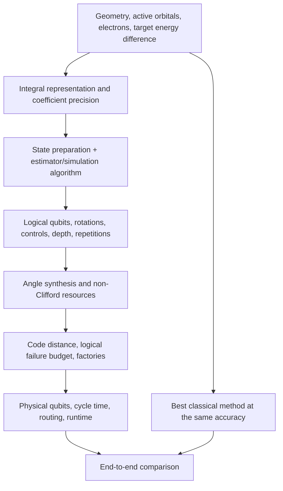

# Chapter 22: Scaling — From H₂ to FeMo-co

_H₂ let us inspect the translation. H₂O supplied a larger reference-chemistry problem. Now we look at how the costs grow — and which costs we are actually counting._

## In This Chapter

- **What you'll learn:** How register size, determinant spaces,
  Hamiltonian storage and algorithmic resources scale, without
  mistaking one for another.
- **Why this matters:** A claim of quantum advantage needs a
  problem, accuracy target and classical comparator. An active-space
  size alone supplies none of the last two.
- **Prerequisites:** Chapters 17–19 (cost analysis, pipeline, bond angle scan).

---

## The Scaling Landscape

Several quantities grow with the number of spin-orbitals $n$, but they are not
interchangeable:

- a direct occupation encoding uses $n$ system qubits before tapering;
- the two-electron tensor has $O(n^4)$ index combinations before symmetry and
  sparsity are exploited;
- the fixed-particle-number determinant space has
  $\binom{n}{n_e}$ basis states; and
- encoded Pauli weight depends on the mapping and orbital ordering.

A quantum register avoids storing every determinant amplitude explicitly. The
difficulty moves into state preparation, Hamiltonian simulation, precision, and
measurement; compact representation alone is not an efficient ground-state
algorithm.

## One Nitrogen Model, Three Memory Questions

Consider a minimal-basis model of N₂ with fourteen electrons
in ten spatial orbitals, hence twenty spin-orbitals. This is
a dimension-counting example, not a generated N₂ circuit
benchmark.

A full Fock-space state vector has $2^{20}=1048576$ complex
amplitudes. At sixteen bytes per complex double, that is
$2^{24}$ bytes, or **16 MiB**. A dense full-space operator
has $(2^{20})^2$ complex entries, requiring
$2^{44}$ bytes, or **16 TiB**. Confusing these two quantities
changes the memory estimate by a factor of a million.

Fixing fourteen electrons leaves
$\binom{20}{14}=38760$ determinants. For $M_s=0$, there
are seven alpha and seven beta electrons, so the spin-resolved
space is smaller again:

$$D_{M_s=0}=\binom{10}{7}\binom{10}{7}=120^2=14400.$$

A complex vector in that space uses $14400\times16=230400$
bytes, about 225 KiB. Even its dense complex matrix uses
about 3.09 GiB, rather than 16 TiB. A real-valued
representation uses half as much per entry when justified.

| Representation | Dimension | Complex-vector memory | Dense complex-matrix memory |
|:---|---:|---:|---:|
| Full 20-mode Fock space | 1048576 | 16 MiB | 16 TiB |
| Fixed $N_\alpha=N_\beta=7$ | 14400 | 225 KiB | About 3.09 GiB |

More importantly, FCI solvers need not form either dense
matrix. An iterative eigensolver repeatedly applies $H$ to
trial vectors, using the structured one- and two-electron
terms to generate connected configurations. It still faces
rapidly growing determinant spaces, but "the dense full
Fock matrix is large" is not a proof that this molecule is
beyond classical computation.

The $M_s=0$ label fixes spin projection, not total spin.
Its determinant basis can represent several total-spin
sectors. A singlet target needs the appropriate solver
or state identification; the count 14400 must not be
described as the number of singlet eigenstates.

---

## The Reproducible Encoding-Level Result

The companion script measures the maximum creation-operator weight directly
from the pinned package:

| $n$ | JW weight | BK weight | Ternary weight | Standard staircase CNOTs (JW / BK / TT) |
|:---:|:---:|:---:|:---:|:---:|
| 4 | 4 | 3 | 2 | 6 / 4 / 2 |
| 8 | 8 | 4 | 3 | 14 / 6 / 4 |
| 16 | 16 | 5 | 4 | 30 / 8 / 6 |
| 32 | 32 | 6 | 5 | 62 / 10 / 8 |
| 64 | 64 | 7 | 6 | 126 / 12 / 10 |

Both tree families are $\Theta(\log n)$; ternary branching improves a
constant, not the asymptotic class. At $n=64$, the standard single-rotation
staircase comparison is $126/10=12.6$, not 16.

This is an **operator-level** result. A molecular Hamiltonian contains a
distribution of terms and weights, with cancellations, symmetries, tapering,
and compiler interactions. The table does not imply a 12.6-fold reduction for
an entire molecule.

---

## From Operator Weight to a Molecular Benchmark

A reproducible molecule-level comparison needs committed geometry, basis,
active space, electron/spin sector, orbital order, encoding version, Pauli
lists, tapering generators, product order, and logical-connectivity assumptions.
The book supplies the canonical H₂ logical ledger, not
molecule-specific CNOT totals for H₂O, LiH, N₂ or FeMo-co.

Tapering must also be measured rather than assumed: each reduced spectrum must
match one identified untapered physical sector. A qubit reduction does not by
itself establish a term-count, coefficient-norm, or end-to-end depth reduction.

---

## FeMo-co: What the Active Space Tells Us

Reiher et al. use a representative active-space model with 54 electrons
in 54 spatial orbitals (108 spin-orbitals). The corresponding determinant count
is roughly $\binom{108}{54}\approx2.5\times10^{31}$, which explains why
explicit Full CI is not an option.

That active-space size does **not** determine a quantum resource estimate.
Logical qubits, Hamiltonian representation, state preparation, precision,
simulation algorithm, error-correction code, and hardware assumptions all
enter. Until a versioned resource model is committed, this book does not quote
total T gates/CNOTs, logical qubits, physical qubits, or runtime for FeMo-co.

The 108 spin-orbitals describe the chosen active model, not
the entire catalyst and its environment. Frozen orbitals,
embedding, geometry and orbital optimisation still affect
the Hamiltonian. Even within that model, resolving a
small energy difference may require several geometries
or electronic states rather than one ground-state energy.

A statement such as "108 modes" gives the untapered direct
occupation-register width. It omits phase registers,
Hamiltonian-simulation workspaces, state-preparation
ancillas and error-correction overhead. It also does not
tell us that this is the best register representation for
every algorithm.

## Read a Resource Estimate from the Inside Out

A resource estimate is a stack of conditional calculations:

**Logical qubits** are the ideal qubits on which the
algorithm is specified. **Physical qubits** are the noisy
hardware constituents used to realise them. A code's
overhead is not a universal multiplier: it depends on
the physical error model, circuit size and allowed total
failure probability.

In many fault-tolerant cost models, Clifford operations
are less expensive than non-Clifford resources. A
**T gate** is the phase gate
$T=\operatorname{diag}(1,e^{i\pi/4})$. Arbitrary Rz
angles generally require approximation by an allowed
fault-tolerant gate set or another suitable resource.
Some architectures supply non-Clifford operations using
prepared auxiliary states; the facilities producing them
are often called **magic-state factories**. Counting
logical CNOTs alone does not count that work.

**Depth** is the number of sequential layers after
parallelisable operations are scheduled. **Runtime**
also includes gate or error-correction cycle durations,
repetitions, classical feedback and resource supply.
Equal gate counts need not mean equal depth, and equal
depth need not mean equal elapsed time on different
architectures.

As a deliberately simple illustration, suppose a
logical circuit has $G$ operations and each has failure
probability at most $p_L$. The union bound gives total
failure probability at most $Gp_L$ without assuming
independence. To certify at most $\beta$ failure with
this bound, require $p_L\leq\beta/G$. For hypothetical
$G=10^8$ and $\beta=0.01$, that is $p_L\leq10^{-10}$.
This arithmetic does not select a code distance or
predict a device. It demonstrates why a logical error
rate must be chosen against the *whole computation*,
not quoted in isolation.

---

## Where Classical Methods Still Win

Classical methods remain formidable:

- Conventional Kohn-Sham DFT implementations are often dominated by a cubic
  diagonalisation step, while linear-scaling variants exploit locality and
  sparsity under additional conditions (Bowler & Miyazaki, 2010).
- Canonical single-reference CCSD(T) has an $O(N^7)$ perturbative-triples
  step and is reliable primarily when a single-reference description is
  appropriate; local and reduced-scaling variants change the practical cost
  (Bartlett & Musial, 2007).
- DMRG is exceptionally effective for low-entanglement one-dimensional and
  quasi-one-dimensional structure, with efficiency degrading as entanglement
  grows (White, 1992; Schollwock, 2011).

Strongly correlated transition-metal complexes, open-shell systems, and
conical intersections are candidate quantum targets because standard
single-reference methods can struggle there. Advantage remains an
instance-specific comparison against the best classical workflow.

The acronyms label different approximations. **DFT**
uses the electronic density as its basic variable and
an approximate exchange-correlation functional in
practical calculations. **CCSD(T)** adds coupled-cluster
single and double excitations with a perturbative
triples correction to a reference state. **DMRG**, the
density-matrix renormalisation group, represents states
through a structured tensor-network approximation.
Their errors depend on the problem, basis and
convergence choices; a polynomial formal cost is not
a blanket accuracy guarantee.

A fair comparison asks for the same observable and
uncertainty. A quantum calculation with a 1 mHa
simulation budget is not automatically more accurate
than a classical calculation if both share a much
larger active-space error. Conversely, a classical
approximation's small energy difference on one
geometry is not proof that it remains reliable
along an entire reaction path.

The useful research question is therefore concrete:
which instances resist the best available classical
workflow at the required accuracy, and what full
quantum workflow reaches that accuracy with stated
resources? This book builds one necessary part of
that investigation. It does not establish a universal
orbital count at which the advantage changes hands.

---

## Key Takeaways

- The reproduced **operator-level** census separates JW's linear maximum weight
  from BK/ternary logarithmic weight; it does not predict a full molecular cost.
- At $n=64$, the standard worst-case single-rotation comparison is 126 CNOTs
  for JW, 12 for BK, and 10 for the tested ternary mapping.
- Tapering benefits must be measured in an identified physical sector; qubit,
  term, coefficient-norm, and circuit reductions are distinct quantities.
- FeMo-co motivates large active spaces, but active-space size alone is not a
  logical/physical qubit or runtime estimate.
- Chemistry method, state preparation, algorithms, software validation, error
  correction, and hardware are all potential bottlenecks.

## Exercises

1. **Count the right space.** For fourteen electrons in ten spatial
   orbitals with seven alpha and seven beta electrons, calculate
   the determinant count and complex-vector storage at sixteen
   bytes per amplitude. Compare it with the full twenty-mode
   Fock-space vector.
2. **Audit a claim.** A report says "FeMo-co needs 108 physical
   qubits because its model has 54 spatial orbitals." Explain
   what the number 108 actually establishes and list the
   resource categories it leaves unspecified.
3. **A failure budget.** A hypothetical circuit has $10^8$
   logical operations. Use the union bound to find a sufficient
   per-operation failure probability for a total bound of
   0.01. Explain why this is not a physical-qubit estimate.

## Further Reading

- Reiher, M., Wiebe, N., Svore, K. M., Wecker, D., and Troyer, M. "Elucidating Reaction Mechanisms on Quantum Computers." *PNAS* 114, 7555 (2017). The landmark resource estimate for simulating FeMo-co on a fault-tolerant quantum computer.
- Lee, J., Berry, D. W., Gidney, C., Huggins, W. J., McClean, J. R., Wiebe, N., and Babbush, R. "Even More Efficient Quantum Computations of Chemistry Through Tensor Hypercontraction." *PRX Quantum* 2, 030305 (2021). Dramatically reduces the resource estimates for large-molecule simulation using tensor factorisation techniques.

---

**Previous:** [Chapter 21 — Speaking the Hardware's Language](21-circuit-export.html)

**Next:** [Chapter 23 — What Comes Next](23-whats-next.html)
