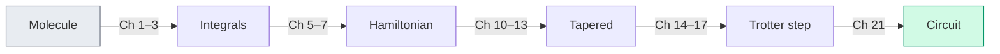

# Chapter 23: What Comes Next

_The translation layer is assembled. The book is almost over. The algorithms and hardware story is not._

## In This Chapter

- **What you'll learn:** What lies beyond this book — the extensions, open problems, and emerging directions that build on the foundation we've laid.
- **Why this matters:** A pipeline is only as useful as the questions it can answer. This chapter maps out where those questions lead.
- **Prerequisites:** The whole book (but especially Chapters 18–22).

---

## What We Built

Let's take a final inventory. Over twenty-three chapters, we constructed the
translation and circuit-compilation layer:

The canonical H₂ example supplies generated integrals, an independently
checked JW matrix, encoding comparisons and untapered product-formula
circuits. The tapering chapters treat physical-sector selection as an
additional calculation, not an automatic step in the capstone.
FockMap's operator and circuit library is published on NuGet.

The chemistry input and reference energies come from PySCF, not
FockMap. The H₂ dissociation curve and water's fixed-bond angular
scan are classical RHF/FCI references. The water scan does not
implement every arrow in the figure. Chapter 20 works through
state preparation, measurement statistics and phase decoding;
it does not turn those reference scans into hardware experiments.

But a pipeline is an instrument, not a destination. Here's where the instrument gets used.

---

## Near-Term Extensions

### Circuit Optimisation

FockMap currently produces *unoptimised* gate sequences — each Pauli rotation becomes a CNOT staircase exactly as described in Chapter 16. Real quantum compilers (Qiskit's transpiler, Quantinuum's TKET/pytket, BQSKit) apply additional transformations:

- **Gate cancellation**: adjacent CNOT pairs cancel. Identity-equivalent sequences are removed.
- **Commutation-based reordering**: Pauli rotations that commute can be reordered to bring cancellable gates adjacent.
- **Template matching**: known circuit identities replace expensive subcircuits with cheaper equivalents.
- **Hardware-aware routing**: map logical qubits to physical qubits, inserting SWAP gates as needed for limited connectivity.

The saving depends on the actual gate sequence, compiler settings
and target connectivity. Routing can add gates while cancellation
removes them; report both the input and output ledger. No generic
percentage can stand in for this compilation.

There is one small optimisation we can understand without a
compiler. In the symmetric product formula, the central pair
$e^{-i\theta P/2}e^{-i\theta P/2}$ equals
$e^{-i\theta P}$. Merging it removes one complete Pauli
rotation before decomposition. The reason is the identical
generator, not a general permission to reorder non-commuting
rotations. Chapter 15's raw costs intentionally count the
unmerged list.

### Error Mitigation

Near-term quantum computers are noisy. Error mitigation techniques extract better estimates from noisy circuits without the overhead of full error correction:

- **Zero-noise extrapolation (ZNE)**: run the circuit at several artificial noise levels, then extrapolate to the zero-noise limit.
- **Probabilistic error cancellation (PEC)**: represent the ideal circuit as a linear combination of noisy circuits and sample the combination.
- **Symmetry verification**: post-select on measurement outcomes that satisfy known symmetries of the Hamiltonian (our tapering symmetries from Chapter 11 are ideal for this).

FockMap's symmetry information can help design such checks,
but the check must match the prepared state's physical sector
and a compatible measurement strategy. Post-selection consumes
shots and can bias an estimate if its assumptions fail. ZNE
and PEC also trade additional sampling and modelling assumptions
for reduced bias; they do not provide error correction's
protection of an arbitrary long coherent computation.

### Adaptive Ansätze

VQE (Chapter 20) uses a fixed ansatz — a predetermined circuit structure with adjustable parameters. Adaptive methods grow the ansatz one operator at a time:

- **ADAPT-VQE** in its original molecular form starts from a
  specified pool of fermionic excitation generators. It measures
  energy gradients for candidate additions, selects a direction,
  grows the circuit and reoptimises its parameters (Grimsley
  et al., 2019).
- **Qubit-ADAPT-VQE** uses pools formulated directly as qubit
  operators, including Pauli strings. These are not restricted
  by definition to one- and two-qubit operators; pool completeness
  and construction are substantive choices (Tang et al., 2021).

The Hamiltonian terms are not automatically a useful or complete
ansatz pool. To see why, write a candidate extension as
$|\psi(\theta)\rangle=e^{-i\theta A}|\psi\rangle$ for a
Hermitian generator $A$. Its gradient at zero is

$$\left.\frac{dE}{d\theta}\right|_0=i\langle\psi|[A,H]|\psi\rangle.$$

Consider the analytical one-qubit example
$H=Z+0.2X$ Ha and $|\psi\rangle=|0\rangle$.
Choosing $A=Z$ gives zero gradient. Choosing $A=X$
also gives zero gradient: both commutators have zero
expectation on this state. The Hamiltonian-term pool would
therefore offer no first-order descent direction.

Choosing $A=Y$, however, gives
$i\langle[Y,H]\rangle=0.4$ Ha per unit parameter.
A small negative $\theta$ lowers the energy. All three
candidate strings have weight one. Their usefulness is
different because of the state, Hamiltonian and commutator,
not their cost.

Encoding can change a candidate's implementation cost and
symmetry behaviour. A lighter string may be cheaper to
implement but a worse search direction. A usable adaptive
workflow must specify its pool, gradient estimator,
selection rule, stopping tolerance and symmetry constraints.
FockMap provides operator algebra and possible gate
primitives, not that entire optimisation strategy.

---

## Bosonic Simulation

FockMap already supports bosonic ladder operators and three bosonic-to-qubit encodings (unary, binary, Gray code — see the API documentation). The natural extension is **vibronic simulation**: mixed electron-phonon systems where both fermions and bosons are present.

Applications include:
- **Molecular vibrations**: Chapter 19 supplies a constrained
  angular energy curve, not an equilibrium geometry or normal-mode
  analysis. Harmonic modes need a suitable stationary geometry,
  a mass-weighted Hessian and removal of rigid motions. Spectral
  intensities need additional property derivatives.
- **Polaron physics**: electron-phonon coupling in materials science, where an electron "dressed" by lattice distortions has different effective mass and mobility.
- **Photochemistry**: conical intersections and non-adiabatic dynamics, where nuclear and electronic motion couple strongly.

The encoding pipeline for bosonic modes parallels the fermionic
one: ladder operators → Pauli strings → Hamiltonian assembly.
The important new approximation is a finite occupation cutoff.

Choose $d$ to mean the **number of retained levels**,
$|0\rangle,\ldots,|d-1\rangle$. Thus maximum occupation
is $d-1$, not $d$. The truncated lowering and raising
operators are

$$a_d=\sum_{n=1}^{d-1}\sqrt n\,|n-1\rangle\langle n|,
\qquad a_d^\dagger=\sum_{n=1}^{d-1}\sqrt n\,|n\rangle\langle n-1|.$$

They give the familiar $\sqrt n$ factors below the
cutoff, but $a_d^\dagger|d-1\rangle=0$.
Consequently,

$$[a_d,a_d^\dagger]=I-d|d-1\rangle\langle d-1|.$$

For every retained level except the highest, the
commutator acts as identity. On the highest it acts
as $1-d$. This boundary defect is unavoidable: a
finite-dimensional commutator has trace zero, whereas
the identity has trace $d$. No finite qubit register
exactly reproduces an unbounded oscillator's algebra.

With this convention, one-hot **unary** encoding
uses $d$ qubits and represents only states with one
of them excited. **Binary** and **Gray-code** encodings
use $\lceil\log_2d\rceil$ qubits, with unused
computational states when $d$ is not a power of two.
A Gray labelling makes adjacent occupation labels
differ in one bit; it does not make every oscillator
Hamiltonian a one-gate operation.

For $d=3$, $a_3^\dagger|1\rangle=\sqrt2|2\rangle$
but $a_3^\dagger|2\rangle=0$, and the commutator
has diagonal $(1,1,-2)$. Increasing the cutoff and
checking the target observables is part of validating
a bosonic simulation. Checking only the fermionic
encoding algebra does not control this new error.

---

## Lattice Models

The second-quantised framework isn't limited to molecules. Lattice models in condensed matter physics use the same operator algebra:

- **Hubbard model**: electrons hopping on a lattice with on-site repulsion. The same ladder operators, the same encodings, the same tapering — different integrals.
- **Heisenberg model**: spin-spin interactions on a lattice. Already expressed in Pauli operators — no encoding step needed.
- **Fermi-Hubbard at half-filling**: a testing ground for quantum advantage, where classical methods (DMRG, QMC) have known limitations in 2D.

The same algebraic infrastructure can represent these models.
Their geometry, symmetries, boundary conditions, filling and
chosen observables still require explicit input. A Hubbard
model is not difficult merely because it has many sites:
dimensionality, interaction regime and entanglement structure
affect both classical and quantum approaches.

---

## The Deepest Connection

We'll end with the most surprising insight of all.

The tapering machinery from Chapters 10–13 is, at its core, stabiliser theory: finding commuting Pauli operators that generate a symmetry group, and using Clifford rotations to diagonalise them. This is precisely the mathematical framework of quantum error-correcting codes.

- **Stabiliser codes** (surface code, Steane code, etc.) encode logical qubits into physical qubits using a stabiliser group — a set of commuting Pauli operators whose simultaneous eigenspace defines the code space.
- **Syndrome measurement** physically measures stabilisers to
  detect departures from an error-correcting code space.
  Our offline tapering calculation does not perform such a
  measurement; it chooses known symmetry eigenvalues and
  constructs a smaller operator.
- **Logical operators** act within the code space, just as our tapered Hamiltonian acts within the symmetry sector.

The shared algebra is useful, but the procedures are different: tapering exploits physical symmetries to reduce qubit count, while error correction engineers artificial symmetries to detect and correct errors. A reader who has understood Chapters 10–13 has already learned the algebraic foundation — the stabiliser formalism — that quantum error correction builds upon.

The Clifford gates, binary Pauli representation and commuting
sector algebra will therefore look familiar in QEC literature.
Code distance, noise channels, fault-tolerant syndrome circuits
and decoding are additional subjects. Recognising the
stabiliser algebra is a useful beginning, not a complete
education in error correction.

For example, suppose a known physical symmetry becomes
$Z_2$ after a Clifford transformation and the desired
eigenvalue is $-1$. Offline tapering substitutes $Z_2=-1$
and removes that fixed qubit from the operator description.
No hardware has been touched. A hardware syndrome circuit,
by contrast, couples data to ancillas, measures, and uses
the outcomes to diagnose errors. The same Pauli symbol
appears in both calculations; the actions are not the same.

---

## Open Problems

Some questions to carry beyond this book:

1. **Optimal encoding**: is there a provably optimal encoding for a given Hamiltonian? Binary and ternary tree constructions both have $\Theta(\log n)$ worst-case weight, with different constants and finite-size bounds. The best encoding may depend on the Hamiltonian's sparsity, symmetry, orbital ordering, and hardware connectivity rather than on $n$ alone.

2. **More symmetry-aware representations**: particle-number
   U(1) and total-spin SU(2) structure can support specialised
   bases or compact encodings. These are not merely the same
   Pauli-Z₂ tapering routine with a harder Clifford synthesis.
   What operators, preparation circuits and transitions does
   a proposed compact representation support?

3. **Trotter error bounds**: how many Trotter steps do you actually need? Tight error bounds for product formulas are an active area of research. Tighter applicable bounds can reduce the certified circuit budget;
advantage still requires an end-to-end classical comparison.

4. **Classical simulation limits**: where exactly does classical simulation become infeasible? DMRG and tensor network methods keep improving. The crossover point — where quantum simulation beats the best classical method — shifts with every algorithmic advance on both sides.

---

## What the Pipeline Provides

We'll end where we began. Chapter 1 asked: *given a molecule, what is its ground-state energy?* The machinery in this book addresses the translation layer: molecular integrals become encoded Pauli Hamiltonians, symmetry reductions, product-formula circuits, and portable circuit descriptions. That toolchain does not by itself prepare a molecular ground state or guarantee an efficient energy estimate; those tasks still require a validated VQE, QPE, or other state-preparation and measurement workflow.

Small systems such as H₂ let us validate each translation against direct matrices and classical reference energies. Larger systems expose the real costs: state overlap, circuit depth, measurement, error correction, and comparison with improving classical methods.

The H₂ reference data in Chapter 18 test the construction at a scale where every matrix element can be checked. The water calculation in Chapter 19 is a PySCF angular scan at fixed O–H length; it shows how geometry changes the electronic problem without pretending that circuit construction alone solved the molecular structure. With validated algorithms and sufficient hardware, the same translation machinery could support studies of catalysts, photoactive molecules, and strongly correlated reaction mechanisms.

The translation layer is necessary. It is not the whole computation.

---

## Key Takeaways

- **Circuit optimisation**, **error mitigation**, and **adaptive ansätze** build directly on FockMap's output.
- **Bosonic simulation** extends the same pipeline to electron-phonon systems, vibrations, and photochemistry.
- **Lattice models** use the same operator algebra and encoding infrastructure.
- **Quantum error correction** shares stabiliser algebra with tapering,
  but physical syndrome measurement is not offline sector substitution.
- Scaling requires more than adding qubits: state preparation, algorithms, software validation, and hardware all remain bottlenecks.

## Exercises

1. **A useful adaptive direction.** For $H=Z+0.2X$ Ha and
   input $|0\rangle$, compute $i\langle[A,H]\rangle$
   for $A=X,Y,Z$. Which sign of a small Y-generated
   parameter lowers the energy? Explain why weight alone
   cannot choose the direction.
2. **Three oscillator levels.** For $d=3$ retained levels,
   write $a_3$ and $[a_3,a_3^\dagger]$ as matrices.
   Give the unary and binary qubit counts and identify
   the boundary at which the infinite-oscillator algebra fails.
3. **Same algebra, different operation.** A Clifford-transformed
   molecular symmetry is $Z_2$ with known eigenvalue $-1$.
   Describe its offline tapering substitution and contrast it
   with a hardware syndrome measurement. Name one book
   deliverable that belongs to the FockMap track and one
   that belongs to the PySCF reference track.

## Further Reading

- Gottesman, D. "Stabilizer Codes and Quantum Error Correction." PhD thesis, California Institute of Technology (1997). The stabiliser formalism that underpins both tapering and quantum error correction.
- Campbell, E. T. "Early fault-tolerant simulations of the Hubbard model." *Quantum Sci. Technol.* 7, 015007 (2022). Explores the bridge between NISQ-era techniques and early fault-tolerant quantum simulation.
- Grimsley, H. R., Economou, S. E., Barnes, E., and Mayhall, N. J.
  "An adaptive variational algorithm for exact molecular simulations
  on a quantum computer." *Nature Communications* 10, 3007 (2019).
  DOI: 10.1038/s41467-019-10988-2.
- Tang, H. L., Shkolnikov, V. O., Barron, G. S., Grimsley, H. R.,
  Mayhall, N. J., Barnes, E., and Economou, S. E.
  "Qubit-ADAPT-VQE: An Adaptive Algorithm for Constructing
  Hardware-Efficient Ansätze on a Quantum Processor."
  *PRX Quantum* 2, 020310 (2021).
  DOI: 10.1103/PRXQuantum.2.020310.

---

**Previous:** [Chapter 22 — Scaling — From H₂ to FeMo-co](22-scaling.html)

**Back to:** [Table of Contents](foreword.html)
